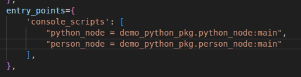

# Linux 的 ros 笔记


# 第一章 启程
apt = Advanced Package Tool  
dpkg -i xxx.deb   # 安装  -i = i-install  
dpkg -l           # 列出已装包  
这种安装方式只能安装已经有的deb安装包，不能处理已经依赖关系等，不会更新软件源，不会联网。  
sudo apt install xxx 这种会联网从软件源下载(这就涉及到了我们最开始的linux换源)，apt可以管理软件源的升级，更新，实际上其底层还是调用的dpkg -i这种。   
```bash
apt update        # 更新源信息    
apt install git   # 安装并自动解决依赖    
apt upgrade       # 升级所有包  
```
nano xxx.txt 可以使用linux自带的文本编辑器进行文本编辑，当然还有gedit等。  
cat /xxx 可以用于查看当前文件的内容，会在终端中进行显示  
cmake .是编译当前目录下的文件， cmake ..是上一级  
---
写最简单的代码进行调试：如果是python的话，随便写点，然后在终端相应目录使用python3 xxx.py即可运行，python3是linux22.04安装会自带的版本。是解释语言，也不用像c和cpp一样需要编译。不过这样也导致了效率没有c和cpp高。  
cpp的话则需要在对应目录终端使用g++ xxx.cpp进行编译，编译成可执行文件运行。一般后缀是a.out (linux) 运行的话是./a.out  
这种是最传统的编写方式，针对单文件来说当然可以，但如果文件一旦多起来，需要相互串联，那么就很复杂，一般是g++ a.cpp b.cpp c.cpp -o qss
这种就会生成一个qss.out的文件，使用./qss.out就可以进行输出。
想带调试信息就是 g++ -g a.cpp ...    -g代表着gdb，方便打断点调试  
g++ -Wall ... 则是显示所有警告  

因此这样做是不太好的，于是引入了makefile文件来做这个事情，将所有的命令通过makefile文件及其语法写好，然后使用make指令，就可以编译了，make指令调用的就是makefile文件，makefile文件里都是跟我们刚才说的g++ 类似的有关的语法，展开就形成了g++命令进行文件编译。

但makefile编写人们觉得还是很麻烦，很困难，因此在考虑有没有更简便的工具，于是就有了cmake工具，cmake工具可以使用cmake . 在当前目录下寻找指导其生成makefile文件的CMakeLists.txt，然后生成对应的makefile，最后再make就可以编译啦，cmakelist的相关语法自行进行查阅。

紧接着，make 可以在后面加入-j24 -j12等，启用多核编译，但人们还是觉得大型工程编译慢，后续又推出了cmake生成build-ninja，再ninja工具进行编译的工具，自行进行查阅。

---
ros2 中的ament前缀是有渊源的，ros1中是catkin ros2中是ament  
catkin 这个名字，有明确的官方来源和三层「深意」，不是随便取的。
ROS 文档与社区明确说明：
> The name catkin comes from the tail-shaped flower cluster found on willow trees — a reference to Willow Garage where catkin was created.
> （catkin 名字来自柳树上的尾状花簇 —— 致敬创造它的公司 **Willow Garage**）

- **Willow Garage**：ROS 1 的诞生地（“柳树车库”）
- **Catkin**：柳树的柔荑花序/柳絮/柳花

直接关联：柳树（Willow）→ 柳絮（Catkin）

---

### 二、词源深意（小彩蛋）
`catkin` 词源本身也很巧：
- 源自中古荷兰语 **katteken** = **little cat（小猫咪）**
- 因为柳絮柔软、毛茸茸、像**小猫尾巴**

**双关**：
- 表面：柳树的花（致敬 Willow Garage）
- 深层：**小猫尾巴** → 可爱、轻量、灵活（隐喻构建系统的设计哲学）

---

### 三、技术隐喻（架构深意）
catkin 作为构建系统，名字也暗合设计理念：
- **一串多花**：一个 catkin 花序 = 很多小花 → 对应 **一个工作空间 = 很多功能包**
- **有序下垂、结构清晰**：对应 **包依赖拓扑、有序编译、层次分明**
- **随风传播、易于扩散**：对应 **ROS 包生态、易于分发、跨平台**

---

### 四、和 ament 的呼应
- **catkin**：柳树的柔荑花序（ROS 1）
- **ament**：**同义词**，也是柔荑花序（ROS 2）

**寓意**：
- 一脉相承（构建系统思想）
- 全新独立（不冲突、不混淆）
- 植物学小彩蛋贯穿 ROS 两代

---
**catkin = 柳树的柳絮 → 致敬 Willow Garage；词源是“小猫尾巴”（可爱轻量）；隐喻多包有序、生态扩散。**

colcon build 构建命令 colcon: col + con  
col = collective  集体的 一起的
con = construction 构建

在ros1里 用的是 catkin_make catkin_build 分开的 现在被合并了

ament 定义包怎么写，例如cmakelists.txt package.xml
colcon 负责编译

ros2在安装过程中，会将自身需要的环境变量加入到AMENT_PREFIX_PATH中，因此用ros2 run 的时候会在该系统环境变量下找相应的路径或者资源。 为什么在后续运行节点的时候 需要先进行source install/setup.bash ，就是ros2为你写好了一个一键执行的bash指令，从而把colcon build生成的可执行文件等路径添加到系统变量中。

***ros2为什么能通过修改环境变量rcutils console修改输出的日志格式：***   
ROS 2 能通过 **RCUTILS_CONSOLE_OUTPUT_FORMAT** 等环境变量改日志格式，核心是：**日志系统底层是 rcutils，启动时主动读环境变量 → 全局格式化模板 → 所有日志宏共用 → 一设全进程生效**。

### 1. 架构：谁负责日志？
- **rcutils**：ROS 2 的底层 C 工具库，**提供最基础的日志宏与格式化引擎**
  - `RCUTILS_LOG_INFO` / `RCUTILS_LOG_ERROR` 等
  - 所有上层（`rcl`/`rclcpp`/`rclpy`）都基于它
- **全局单例**：进程内只有一套日志配置，**所有节点共享**

### 2. 环境变量如何生效（关键流程）
1. **进程启动 → 日志系统初始化**
   - `rcutils_logging_initialize()` 自动执行
   - 内部调用：**读取环境变量**
     - `RCUTILS_CONSOLE_OUTPUT_FORMAT`
     - `RCUTILS_COLORIZED_OUTPUT`
     - `RCUTILS_LOGGING_USE_STDOUT` 等

2. **解析格式字符串 → 生成模板**
   - 把 `[{severity}] [{time}] {message}` 这类字符串
   - 解析成**可替换的字段模板**
     - `{severity}` / `{time}` / `{name}` / `{message}` / `{function_name}` / `{file_name}` / `{line_number}`

3. **全局生效：所有日志都用这个模板**
   - 每次 `RCLCPP_INFO` / `RCLCPP_ERROR` 时
   - 底层调用 rcutils：**按模板拼接字符串 → 输出到控制台**

### 3. 为什么用环境变量（设计意图）
- **无需改代码、无需重新编译**
  - 调试时临时改格式：`export RCUTILS_CONSOLE_OUTPUT_FORMAT="..."`
  - 运行时生效，适合调试/部署/CI
- **进程全局、统一风格**
  - 一个设置影响**当前进程所有节点**
  - 避免每个节点单独配置
- **跨语言一致**
  - C++/Python/Java 都用同一套 rcutils 底层
  - 环境变量对所有语言节点有效

### 4. 极简原理一句话
**rcutils 在初始化时读取 RCUTILS_* 环境变量 → 保存全局格式模板 → 每条日志都按这个模板格式化 → 一设全进程生效。**

### 常用变量速查
- `RCUTILS_CONSOLE_OUTPUT_FORMAT`：格式字符串
- `RCUTILS_COLORIZED_OUTPUT`：0/1 强制关/开颜色
- `RCUTILS_LOGGING_USE_STDOUT`：1 改输出到 stdout
- `RCUTILS_LOG_LEVEL`：全局日志级别（DEBUG/INFO/WARN/ERROR/FATAL）
 


# 第二章 节点

# 2.1 编写你的第一个节点
## 2.1.1 Python
`node.get_logger().info('xxxxxx')`这个代码应理解为，node这个对象，调用其成员函数get_logger() 这个成员函数的返回值又是一个对象，然后再.info，调用返回值对象的成员函数，该成员函数就是日志打印。 
## 2.1.2 C++
```cpp
#define RCLCPP_INFO(logger, ...) \
  logger->log(INFO, __FILE__, __LINE__, __VA_ARGS__)

  RCLCPP_INFO(node->get_logger(), "hello"); //我们使用的

  node->get_logger()->log(
    rcutils_log_severity_t::RCUTILS_LOG_SEVERITY_INFO,
    __FILE__,  // 自动帮你加文件名
    __LINE__,  // 自动帮你加行号
    "hello"
); //编译器实际看到的
宏展开时，编译器会将__FILE__自动替换成当前文件名，__LINE__自动替换成当前行。 跟if else这种一样，编译器天生就认识。
```
---
`int main(int argc, char **argv)`
其中的参数 一个是Argument Count = argc  参数的数量
还一个参数是 Argument vector = argv     参数的具体内容(字符串数组)  
argc 是一个整数，表示你在命令行输入的时候，一共敲了多少个单词，程序名本身也算一个  
argv 是一个字符串数组，存入的是你在命令行输入的每一个单词  
你在终端运行：
```bash
./my_app 123 hello world
```
argc = 4因为有 4 个单词：./my_app、123、hello、world  
argv 是这样的：
``` bash
argv[0] = "./my_app"
argv[1] = "123"
argv[2] = "hello"
argv[3] = "world"
```
在cmake中  
使用find_package(xxx REQUIRED)找依赖，还会嵌套找xxx所需的依赖  
使用target_include_directories(文件名，头文件路径)  
target_link_libraries(文件名 库路径)进行头文件和库文件的依赖添加  
在vscode里的标红只是插件的报错，并不代表着编译会不通过，插件和编译库这俩是分开的，可以编译插件的includepath进行添加报错文件的路径进行添加  

# 2.2 使用功能包组织Python节点
colcon build会生成三个文件夹，其中 build是构建过程中产生的中间文件，install是放置构建结果的，log则是生成的日志信息等。  
为什么要使用setup.bash修改环境变量？  
因为我们写的代码经colcon build编译后，生成的功能包，节点等代码文件，其目录都在install目录下，而ros2 run只会通过AMENT_PREFIX_PATH的路径查找功能包和节点，因此需要修改该环境变量的值来查找功能包，所以就要运行setup.bash。该命令是ros2官方为我们写好了，colcon build的时候会自动生成。 使用`source install/setup.bash`即可更改。  

包含__init__.py的文件夹，表示该文件夹是python的一个功能包.该文件默认为空。
resource文件夹提供功能包标识，可以不用管  
test用于存放代码单元测试的文件  
lincense是协议许可  
package.xml是功能包清单，声明了功能包名称，构建类型，依赖等信息，需要在里面添加依赖，在后续可以在创建包命令里填写  
```bash
 ros2 pkg create demo_python_topic --build-type ament_python --dependencies rclpy example_interfaces --license Apache-2.0
```
在创建包的时候就添加  
setup.cfg是普通的文本文件，就放包的配置选项，这些配置在构建的时候会被读取和处理。  
setup.py则是python包的构建脚本文件，其中包含一个setup()函数，用于指定如何构建和安装python包，有点类似cmakelist.txt

# 2.3 C++
同理 使用ros2 pkg create demo_cpp_pkg --build-type ament_cmake --license Apache-2.0 进行功能包的构建，也可以加入--denpendencies 无非是这个依赖被自动加入到了cmakelists和package.xml中。  
生成的目录和python差不多，代码我们一般写在src中  
构建类型是ament_cmake 其是cmake的超集，又加入了一些更方便的指令，因此我们可以不用麻烦的target添加头文件库文件路径，转而使用ament_target_dependencies(xxx 依赖文件路径)进行直接添加，然后再在install里写入最终生成的路径  
添加完毕之后需要在xml中加入rclcpp的声明。  


## 2.4 多功能包的最佳实践 Workspace

一般在总文件夹里创建一个新的两级文件夹，然后把包mv进这些文件夹中，再进行colcon build。如果有多个包，他们之间有依赖关系，需要在package.yml里写depend
```bash
mkdir -p ws/src
mv demo_cpp_pkg/ chapt2_ws/src/
mv demo_python_pkg/chapt2_ws/src/
```

## 2.5 ROS2基础之编程学习

### 2.5.1 面向对象编程

#### Python

```python
class PersonNode:
    def __init__(self,name_value:str,age_value:int) -> None:
        print("personnode __init__被调用了,添加了两个属性,分别是name和age")
        self.name = name_value
        self.age = age_value

    def eat(self,food_name:str):
        """
        定义一个方法，表示吃东西
        """
        print(f"{self.name},{self.age}正在吃{food_name}")


def main():
    person_node = PersonNode('张三', 25)
    person_node1 = PersonNode('李四', 30)
    person_node.eat('苹果')
    person_node1.eat('香蕉')
```
 在src的对应的python_pkg创建文件，并编写，编写完毕后，在src下的setup.py中填写自己的路径（填写在entry_points）中
 第一个名字是后续colcon生成的节点名字，后面的是路径，：代表要运行的函数
注意，colcon build 命令的使用会产生三个文件，最好在ws的文件夹的这个目录下进行colcon build
关于继承等方面的，python的话建议去chapt2自行查看源码
注意，继承是没办法继承import的文件的，还是得import一下。

#### C++

include <rclcpp/rclcpp.hpp>的原因是在opt/ros/humble/include下，rclcpp.hpp中嵌套了其他的例如node的文件，都在include这个文件夹下，因此如果把路径配置成include/rclcpp，这样确实可以只写 #include <rclcpp.hpp>，但其调用其他文件时会找不到嵌套依赖，仍然会报错。

```Cpp
#include <rclcpp/rclcpp.hpp>

class PersonNode : public rclcpp::Node
{
private:
    // 声明
    std::string name_;
    int age_;

public:
    PersonNode(const std::string &node_name, const std::string &name, const int &age)
        : Node(node_name) // 调用父类的构造函数,传递节点的名字作为参数。等同于python中的super.__init__()
    {
        this->name_ = name;
        this->age_ = age;
    };

    void eat(const std::string &food)
    {
        RCLCPP_INFO(this->get_logger(), "%s , %d age , is eating %s", this->name_.c_str(), this->age_, food.c_str());
    };
};

int main(int argc, char *argv[])
{
    rclcpp::init(argc, argv);
    auto person_node = std::make_shared<PersonNode>("person_node", "Tom", 18);
    person_node->eat("apple");
    rclcpp::spin(person_node);
    rclcpp::shutdown();
    return 0;
}  

```
说一下流程：
1. 首先在src下的demo_cpp_pkg下的src中新建cpp，然后写代码，这个写的就是节点。
2. 然后在cpp里导入rclcpp/rclcpp.hpp的库，写代码。
3. 写完后因为要使用colcon build命令，而colcon build涉及到cmakelist，因此先去cmakelist.txt添加编译的东西这里find_pkg找工具包和核心库，然后添加可执行文件，意味着将把那些带cpp文件生成名字为前面的可执行文件，因为生成的这些可执行文件需要跟ros2链接起来(要用ros2的相关功能)，将生成后的可执行文件与rclcpp相链接，链接完之后把这些编译好的程序安装到install下，这个目录是ros2执行时能找到的路径。
4. 成功后再source install/setup.bash，这步骤是在配置ros2的运行环境，例如将colcon build后的需要的环境变量添加到系统，使得ros2在执行的时候可以找到
5. 最后 ros2 run 找demo_cpp_pkg 再找节点名字进行运行即可。(有必要去回顾一下前面的关于用cmake生成，再用make的流程，这俩被colcon build合并了) 

### 2.5.2 用得到的C++新特性

1. 自动类型推导：智能指针代替了new和delete，防止内存泄漏，智能管理内存。
```cpp
#include <iostream>

int main()
{
    auto x = 5;     // x is deduced to be of type int
    auto y = 3.14f; // y is deduced to be of type float
    auto z = 'a';   // z is deduced to be of type char

    std::cout << "x: " << x << ", y: " << y << ", z: " << z << std::endl;
    return 0;
}
```
2. 智能指针
```cpp
#include <iostream>
#include <memory>

int main()
{
    auto p1 = std::make_shared<std::string>("Hello, World!");                                    // std::make_shared<数据类型/类>(参数) 返回值，
                                                                                // 对应类的共享指针 std::shared_ptr<std::string>  可以直接写成auto
    std::cout << "p1的引用计数" << p1.use_count() << ",指向的内存地址" << p1.get() << std::endl; // 输出p1的引用计数 1

    auto p2 = p1;                                                                                // 共享指针p2指向与p1相同的内存地址
    std::cout << "p1的引用计数" << p1.use_count() << ",指向的内存地址" << p1.get() << std::endl; // 输出p1的引用计数 2
    std::cout << "p2的引用计数" << p2.use_count() << ",指向的内存地址" << p2.get() << std::endl; // 输出p2的引用计数 2

    p1.reset();                                                                                  // 释放p1指向的内存，p1不再指向任何对象
    std::cout << "p1的引用计数" << p1.use_count() << ",指向的内存地址" << p1.get() << std::endl; // 输出p1的引用计数 0
    std::cout << "p2的引用计数" << p2.use_count() << ",指向的内存地址" << p2.get() << std::endl; // 输出p2的引用计数 1
    std::cout <<"p2指向的内存地址数据" << p2->c_str() << std::endl; // 输出p2指向的内存地址数据
    return 0;
}
```
3. Lambda 主要用来简化回调函数
```cpp
#include <iostream>
#include <algorithm>

int main()
{
    auto add = [](int a, int b) -> int
    { return a + b; };      // 定义一个lambda表达式，参数为两个整数，返回它们的和
    int sum = add(200, 50); // 调用lambda表达式，传入200和50，得到结果250
    auto print_sum = [sum]() -> void
    { std::cout << "The sum is: " << sum << std::endl; }; // 定义一个lambda表达式，捕获sum变量，打印结果
    print_sum();                                          // 调用lambda表达式，打印结果
    return 0;
}
```
函数分为自由函数 成员函数(定义到类的内部，也叫做实现方法，如果要调用，得用对应的对象，加上.函数名(参数))   和Lambda函数


4. 函数包装器 可以统一函数的调用方式
```cpp
#include <iostream>
#include <functional> //函数包装器头文件

// 自由函数

void save_with_free_fun(const std::string &filename)
{
    std::cout << "自由函数: " << filename << std::endl;
}

// 成员函数

class FileSave
{
private:
    /* data */
public:

    void save_with_member_fun(const std::string &filename)
    {
        std::cout << "成员函数: " << filename << std::endl;
    }
};

int main()
{
    FileSave file_save; // 创建FileSave对象

    // Lambda函数

    auto save_with_lambda = [](const std::string &filename) -> void
    {
        std::cout << "Lambda函数: " << filename << std::endl;
    };

    save_with_free_fun("1.txt");             // 调用自由函数
    file_save.save_with_member_fun("3.txt"); // 调用成员函数
    save_with_lambda("2.txt");

    std::function<void(const std::string &)> save2 = save_with_lambda; // 将Lambda函数赋值给函数包装器
    std::function<void(const std::string &)> save1 = save_with_free_fun; // 将自由函数赋值给函数包装器
    std::function<void(const std::string &)> save3 = std::bind(&FileSave::save_with_member_fun, &file_save, std::placeholders::_1); // 将成员函数赋值给函数包装器
    
    save1("a.txt"); // 调用函数包装器，实际调用的是自由函数
    save2("b.txt"); // 调用函数包装器，实际调用的是Lambda函数
    save3("c.txt"); // 调用函数包装器，实际调用的是成员函数
    return 0;
}
```
函数包装器可以将成员函数单独进行包装，其他地方在调用成员函数时可以直接使用，不用将对象传递，一般都用在回调函数里 类似于C里的函数指针进行回调。
	成员函数用std::bind包装的原因：是因为成员函数自带一个this指针，但cpp自动隐藏了，在进行函数包装的时候必须要求接口严格匹配，这样就会导致函数包装不成功，因此需要通过bind将this指针提前绑定好，将函数接口抹平一致 例如原函数是void (A*,int)，bind后就变成了void(int)。 

例如上文中的save3的绑定，第一个传参传的是class成员函数的地址，不是普通的函数指针，而是成员函数指针，类型为 :

 void (FileSave::*)(int) 他不能单独调用，必须要搭配一个对象(this)才能调用，因此第二个参数传递一个实际的对象地址，此时就会将这个对象地址当作this传递给FileSave::save_with_member_fun。第三个则是占位符，表示还没确定的参数，留到以后等调用的时候再进行传递。  

#### 2.5.3 多线程与回调函数
1. Python

Python写好后 记得添加到 setup.py里,然后colcon build 再soruce改变环境变量
这里是打开服务器并下载其中内容的方法，类似于爬虫

```python
import threading
import requests
class download:
    def download(self,url,callback_word_count):
        print(f"线程{threading.get_ident()}开始下载:{url}")
        """
        模拟下载，实际是请求url并获取文本内容
        """
        response = requests.get(url)
        response.encoding = 'utf-8'
        callback_word_count(url,response.text)

    def start_download(self,url,callback_word_count):
        thread = threading.Thread(target=self.download,args=(url,callback_word_count))
        thread.start()


def world_count(url,result):
    """
    普通函数，后续用于回调
    """
    print(f"{url}:{len(result)}->{result[:]}")

def main():
    downloader = download()
    downloader.start_download("http://0.0.0.0:8000/novel1.txt", world_count)
    downloader.start_download("http://0.0.0.0:8000/novel2.txt", world_count)
    downloader.start_download("http://0.0.0.0:8000/novel3.txt", world_count)
```
git clone https://gitee.com/fishros/cpp-httplib.git
这个是cpp的http库 用法在其readme里
函数包装器的声明是&，不用写具体变量名，是一种声明
使用额外的头文件，需要在cmakelist里添加，使用include_directories(/路径)来进行添加。 在这里我们把git的库放在include下，include与cmakelist并级，那就直接填include_directories(/include)即可,这个库只要头文件就可以用，因此没有传统的库文件

```cpp
#include <iostream>
#include <thread>                //多线程
#include <chrono>                //时间 计时的 adj. 类似于time.h
#include <functional>            //函数包装器
#include <cpp-httplib/httplib.h> //HTTP库

class Download
{
private:
    /* data */
public:
    void download(const std::string &host, const std::string &path, const std::function<void(const std::string &, const std::string &)> &callback)
    {

        std::cout << "线程" << std::this_thread::get_id() << std::endl;
        httplib::Client client(host);
        auto response = client.Get(path);
        if (response && response->status == 200)
        {
            std::cout << "下载成功！" << std::endl;
            callback(path, response->body);
        }
        else
        {
            std::cout << "下载失败！" << std::endl;
        }
        // httplib::Client cli(host.c_str());
        // auto res = cli.Get(path.c_str());
        // if(res && res->status == 200)
        // {
        //     std::cout << "下载成功！" << std::endl;
        //     std::cout << "内容：" << res->body << std::endl;
        // }
        // else
        // {
        //     std::cout << "下载失败！" << std::endl;
        // }
    };
    void start_download(const std::string &host, const std::string &path, const std::function<void(const std::string &, const std::string &)> &callback) {
        // std::thread t(&Download::download, this, host, path, callback);
        // t.detach(); //分离线程
        auto download_fun = std::bind(&Download::download, this, std::placeholders::_1, std::placeholders::_2, std::placeholders::_3); //绑定成员函数和参数
        std::thread thread(download_fun,host,path,callback);
        thread.detach();
    };
};

int main()
{
    auto d = Download();
    auto word_count = [](const std::string &path, const std::string &result) -> void
    {
        std::cout << "下载完成" << path << ':' << result.length() << "->" << result.substr() << std::endl;
    };
    d.start_download("http://0.0.0.0:8000", "/novel1.txt", word_count);
    d.start_download("http://0.0.0.0:8000", "/novel2.txt", word_count);
    d.start_download("http://0.0.0.0:8000", "/novel3.txt", word_count);

    std::this_thread::sleep_for(std::chrono::seconds(5)); // 主线程等待5秒
}
```

这里创建线程要分离的原因是因为，这个成员函数在运行完毕之后会被销毁，如果不分离detach，则线程也会没跑完就被跟着销毁了，因此需要分离线程，但这个线程被叫做子线程的原因是因为这是主线程运行下产生的线程，实际上还是向操作系统申请的新线程，他们和主线程的等级是并列的，但确实依托主线程的存活时间，主线程一结束，函数运行完毕，整个代码就会结束，此时子线程会被强制结束，因此需要主线程等待一段时间，等待子线程运行完毕后再结束。

 detach的原因则是函数内运行完毕后会类似栈直接销毁，析构的时候发现线程还在运行的话会报错，加入detach则是当析构的时候不报错，让线程继续运行。

join则是让主线程等待子线程运行完毕。理论上如果子线程是在main里没有被析构，运行时间远小于主线程，其实不写也可以，只是因为 C++ 这样规定，所以必须 join 或 detach，防呆，保证线程的绝对安全。

# 第三章 话题

# 3.1 话题通信介绍

```bash
ros2 run turtlesim turtlesim_node
```
创建一个小海龟节点
```bash
ros2 node list 
```
打印当前节点
当前节点名字会出现 /turtlesim
得分清 turtlesim是功能包名 turtlesim_node 是功能包下被编译出来的的可执行程序文件名 /turtlesim是该程序源码里定义的名字
```bash
ros2 node info /turtlesim
```
可以看见/turtlesim这个节点里的信息

其中  /turtle1/cmd_vel: geometry_msgs/msg/Twist 是话题名称和话题接口 用于控制小海龟的

/turtle1/pose: turtlesim/msg/Pose 是小海龟的实时位置信息
```bash
ros2 topic -h
```
 可以查看命令帮助 关于topic的
 
```bash
ros2 topic echo /turtle1/pose
```
可以输出该话题的内容


theta是弧度制,是前向角度

```bash
rps2 topic info /turtle1/cmd_vel
```
可以查看该话题的接口类型


```bash
ros2 interface show /xxx
```
可以查看消息接口的详细信息,/xxx即是消息接口的名字


ros2的坐标系是右手坐标系,x轴朝上,y轴朝左 z朝屏幕向外  (二维平面下)

---
```bash
ros2 topic pub /turtle1/cmd_vel geometry_msgs/msg/Twist "{linear: {x: 1.0 , y: 0.0} , angular: {z: -1.0} }"
```
该命令是进行命令的pub发送 第四个参数是节点名称 第五个参数是节点接口 
请注意Yaml的严格发布格式,冒号后有空格等,默认发布频率是1Hz,可以使用ros2 pub --help 查看相关命令 例如 ros2 topic --r N 可以改变频率 

## 3.2 Python话题的订阅与发布
### 3.2.1 通过话题发布小说
```bash
 ros2 pkg create demo_python_topic --build-type ament_python --dependencies rclpy example_interfaces --license Apache-2.0
```
1. ros2 pkg create

    作用：ROS 2 官方提供的创建功能包工具
    含义：我要新建一个 ROS 2 包
    相当于：mkdir + 自动生成CMakeLists/package.xml + 模板代码

2. demo_python_topic

    这是自定义的【功能包名字】
    可以随便取，比如：my_talker, robot_comm, test_pkg
    这里取名 demo_python_topic 意思是：
        demo：示例
        python：用 Python 写
        topic：用于话题通信

3. --build-type ament_python

    --build-type：指定编译类型
    ament_python：表示这是 Python 版 ROS 2 包
>   ament_python = Python 项目
>
>   ament_cmake = C++ 项目

4. --dependencies rclpy example_interfaces 

自动给功能包添加依赖库 这里实际上就是自动将依赖填写进入package.xml里,跟以前手动写是一样的

interface:接口的意思

① rclpy

    ROS 2 Python 核心库
    所有 Python 节点必须依赖它
    相当于：import rclpy 

② example_interfaces

    ROS 2 官方提供的示例接口（消息 / 服务）
    里面有常用的：
        String 字符串消息
        AddTwoInts 加法服务
    做话题 / 服务通信一定会用到   到时候需要使用string

1. --license Apache-2.0

    指定代码开源许可证
    Apache-2.0 是 ROS 2 默认许可证
    不影响功能，只是代码规范

创建完功能包后,在工作空间进行colcon build,完毕后就可以在/src/demo_python_topic里写代码了

代码写完,记住先去setup.py里添加路径,然后source环境变量,再ros2 run 找相应的节点运行.

```python
import rclpy
from rclpy.node import Node
import requests
from example_interfaces.msg import String   
from queue import Queue


class NovelPubNode(Node):
    def __init__(self,node_name): 
        super().__init__(node_name)
        self.get_logger().info(f'{node_name} was created')
        self.novel_queue_ = Queue()  #创建队列
        self.novel_publisher_ = self.create_publisher(String, 'novel', 10)
        self.create_timer(5.0, self.timer_callback)

    def timer_callback(self):
        if not self.novel_queue_.empty():
            line = self.novel_queue_.get()
            msg = String()
            msg.data = line
            self.novel_publisher_.publish(msg)
            self.get_logger().info(f'Novel content published: {msg.data}')

    def download(self,url):
            response = requests.get(url)
            response.encoding = 'utf-8'
            text = response.text
            self.get_logger().info(f'Novel content:{text}')
            for line in text.splitlines( ): 
                self.novel_queue_.put(line)  #将每行文本放入队列
            self.get_logger().info('Novel download completed')  


def main():
    rclpy.init()
    node = NovelPubNode('novel_pub')
    node.download("http://0.0.0.0:8000/novel2.txt")
    rclpy.spin(node)
    node.destroy_node()
    rclpy.shutdown()
```
打开服务器的命令:python3 -m http.server
可以拆分终端,输入ros2 topic list -v 查看当前话题是否有我们注册的
也可以使用 ros2 topic echo /novel 查看实时话题内容
还有 ros2 topic hz /novel 来查看当前发送频率(我们这里是5s发送一次)

### 3.2.2 订阅小说并合成语音
需要安装:
sudo apt install python3-pip -y 安装包管理工具 
pip3 install espeakng  这是python的一个包
sudo apt install espeak-ng 安装这个
都安装好
```python
import espeakng
import rclpy
from rclpy.node import Node
from example_interfaces.msg import String   
from queue import Queue
import threading
import time 

class NovelSubNode(Node):
    def __init__(self,node_name): 
        super().__init__(node_name)
        self.get_logger().info(f'{node_name} was created')
        self.noevels_queue_ = Queue()  #创建队列
        self.novel_subscriber = self.create_subscription(String, 'novel', self.novel_callback, 10)
        self.speech_thread_ = threading.Thread(target=self.speak_thread)
        self.speech_thread_.start()
    def novel_callback(self, msg):
        self.noevels_queue_.put(msg.data)  #将接收到的消息放入队列
    def speak_thread(self):
        speaker = espeakng.Speaker()
        speaker.voice = 'zh'
        while rclpy.ok(): # 检测当前ros上下文是否ok
            if not self.noevels_queue_.empty():
                text = self.noevels_queue_.get()
                self.get_logger().info(f'Novel content received: {text}')
                speaker.say(text)  # 使用espeak-ng库进行文本转语音
                speaker.wait()  # 等待语音播放完成
            else:
                time.sleep(1)  # 如果队列为空，稍微休眠一下，避免CPU占用过高
                # rclpy.sleep(0.1)  # 如果队列为空，稍微休眠一下，避免CPU占用过高


def main():
    rclpy.init()
    node = NovelSubNode('novel_sub')
    rclpy.spin(node)
    node.destroy_node()
    rclpy.shutdown()
```
写完代码之后 去setup.py 添加路径 然后colcon build 
source 改变环境变量
再ros2 run 即可

