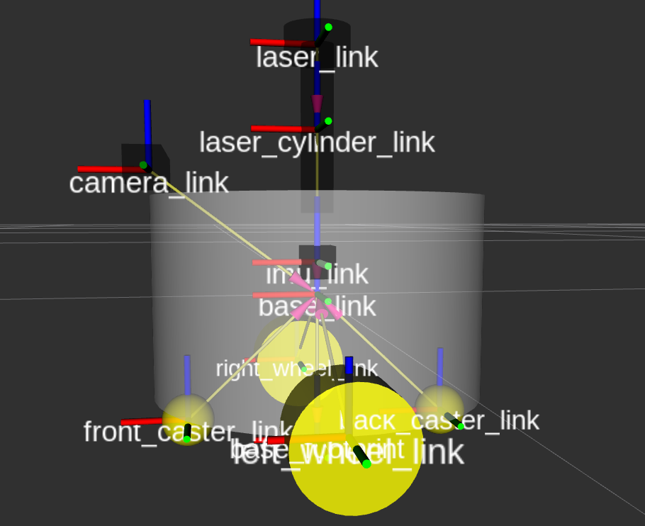
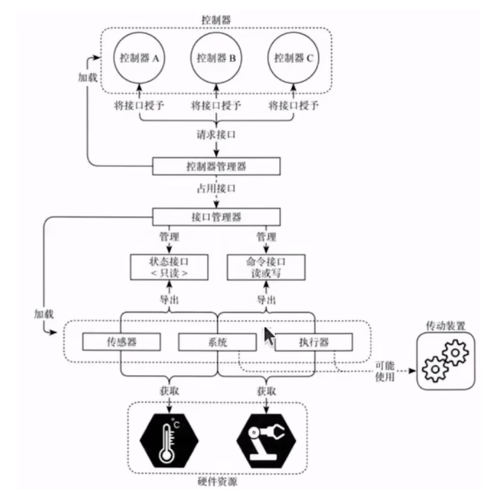
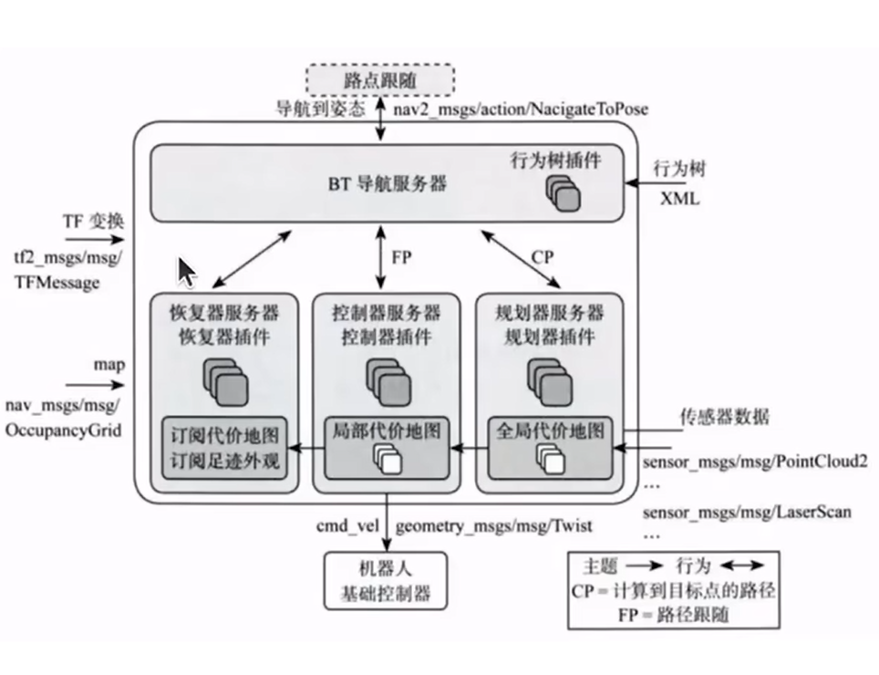
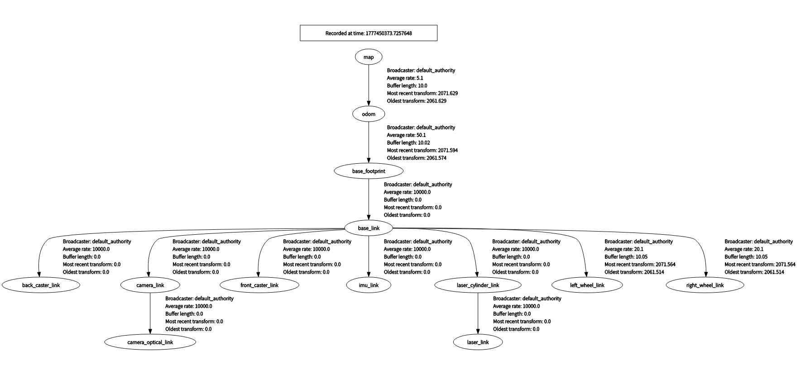
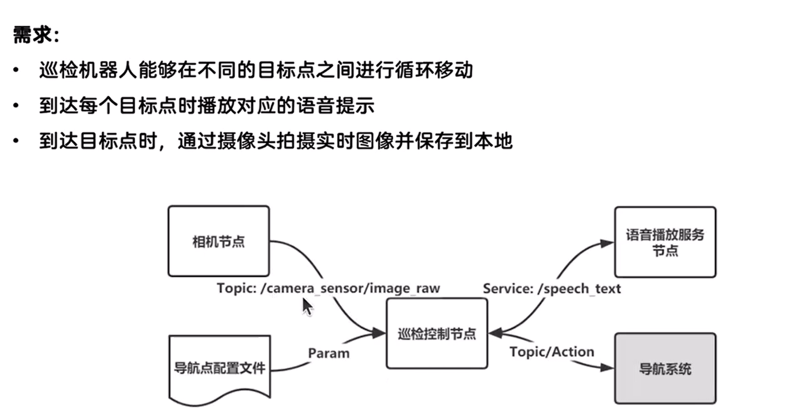

# Linux 的 ros 笔记


# 第一章 启程
apt = Advanced Package Tool  
dpkg -i xxx.deb   # 安装  -i = i-install  
dpkg -l           # 列出已装包  
这种安装方式只能安装已经有的deb安装包，不能处理已经依赖关系等，不会更新软件源，不会联网。  
sudo apt install xxx 这种会联网从软件源下载(这就涉及到了我们最开始的linux换源)，apt可以管理软件源的升级，更新，实际上其底层还是调用的dpkg -i这种。   
```bash
apt update        # 更新源信息    
apt install git   # 安装并自动解决依赖    
apt upgrade       # 升级所有包  
```
nano xxx.txt 可以使用linux自带的文本编辑器进行文本编辑，当然还有gedit等。  
cat /xxx 可以用于查看当前文件的内容，会在终端中进行显示  
cmake .是编译当前目录下的文件， cmake ..是上一级  
---
写最简单的代码进行调试：如果是python的话，随便写点，然后在终端相应目录使用python3 xxx.py即可运行，python3是linux22.04安装会自带的版本。是解释语言，也不用像c和cpp一样需要编译。不过这样也导致了效率没有c和cpp高。  
cpp的话则需要在对应目录终端使用g++ xxx.cpp进行编译，编译成可执行文件运行。一般后缀是a.out (linux) 运行的话是./a.out  
这种是最传统的编写方式，针对单文件来说当然可以，但如果文件一旦多起来，需要相互串联，那么就很复杂，一般是g++ a.cpp b.cpp c.cpp -o qss
这种就会生成一个qss.out的文件，使用./qss.out就可以进行输出。
想带调试信息就是 g++ -g a.cpp ...    -g代表着gdb，方便打断点调试  
g++ -Wall ... 则是显示所有警告  

因此这样做是不太好的，于是引入了makefile文件来做这个事情，将所有的命令通过makefile文件及其语法写好，然后使用make指令，就可以编译了，make指令调用的就是makefile文件，makefile文件里都是跟我们刚才说的g++ 类似的有关的语法，展开就形成了g++命令进行文件编译。

但makefile编写人们觉得还是很麻烦，很困难，因此在考虑有没有更简便的工具，于是就有了cmake工具，cmake工具可以使用cmake . 在当前目录下寻找指导其生成makefile文件的CMakeLists.txt，然后生成对应的makefile，最后再make就可以编译啦，cmakelist的相关语法自行进行查阅。

紧接着，make 可以在后面加入-j24 -j12等，启用多核编译，但人们还是觉得大型工程编译慢，后续又推出了cmake生成build-ninja，再ninja工具进行编译的工具，自行进行查阅。

---
ros2 中的ament前缀是有渊源的，ros1中是catkin ros2中是ament  
catkin 这个名字，有明确的官方来源和三层「深意」，不是随便取的。
ROS 文档与社区明确说明：
> The name catkin comes from the tail-shaped flower cluster found on willow trees — a reference to Willow Garage where catkin was created.
> （catkin 名字来自柳树上的尾状花簇 —— 致敬创造它的公司 **Willow Garage**）

- **Willow Garage**：ROS 1 的诞生地（“柳树车库”）
- **Catkin**：柳树的柔荑花序/柳絮/柳花

直接关联：柳树（Willow）→ 柳絮（Catkin）

---

### 二、词源深意（小彩蛋）
`catkin` 词源本身也很巧：
- 源自中古荷兰语 **katteken** = **little cat（小猫咪）**
- 因为柳絮柔软、毛茸茸、像**小猫尾巴**

**双关**：
- 表面：柳树的花（致敬 Willow Garage）
- 深层：**小猫尾巴** → 可爱、轻量、灵活（隐喻构建系统的设计哲学）

---

### 三、技术隐喻（架构深意）
catkin 作为构建系统，名字也暗合设计理念：
- **一串多花**：一个 catkin 花序 = 很多小花 → 对应 **一个工作空间 = 很多功能包**
- **有序下垂、结构清晰**：对应 **包依赖拓扑、有序编译、层次分明**
- **随风传播、易于扩散**：对应 **ROS 包生态、易于分发、跨平台**

---

### 四、和 ament 的呼应
- **catkin**：柳树的柔荑花序（ROS 1）
- **ament**：**同义词**，也是柔荑花序（ROS 2）

**寓意**：
- 一脉相承（构建系统思想）
- 全新独立（不冲突、不混淆）
- 植物学小彩蛋贯穿 ROS 两代

---
**catkin = 柳树的柳絮 → 致敬 Willow Garage；词源是“小猫尾巴”（可爱轻量）；隐喻多包有序、生态扩散。**

colcon build 构建命令 colcon: col + con  
col = collective  集体的 一起的
con = construction 构建

在ros1里 用的是 catkin_make catkin_build 分开的 现在被合并了

ament 定义包怎么写，例如cmakelists.txt package.xml
colcon 负责编译

ros2在安装过程中，会将自身需要的环境变量加入到AMENT_PREFIX_PATH中，因此用ros2 run 的时候会在该系统环境变量下找相应的路径或者资源。 为什么在后续运行节点的时候 需要先进行source install/setup.bash ，就是ros2为你写好了一个一键执行的bash指令，从而把colcon build生成的可执行文件等路径添加到系统变量中。

***ros2为什么能通过修改环境变量rcutils console修改输出的日志格式：***   
ROS 2 能通过 **RCUTILS_CONSOLE_OUTPUT_FORMAT** 等环境变量改日志格式，核心是：**日志系统底层是 rcutils，启动时主动读环境变量 → 全局格式化模板 → 所有日志宏共用 → 一设全进程生效**。

### 1. 架构：谁负责日志？
- **rcutils**：ROS 2 的底层 C 工具库，**提供最基础的日志宏与格式化引擎**
  - `RCUTILS_LOG_INFO` / `RCUTILS_LOG_ERROR` 等
  - 所有上层（`rcl`/`rclcpp`/`rclpy`）都基于它
- **全局单例**：进程内只有一套日志配置，**所有节点共享**

### 2. 环境变量如何生效（关键流程）
1. **进程启动 → 日志系统初始化**
   - `rcutils_logging_initialize()` 自动执行
   - 内部调用：**读取环境变量**
     - `RCUTILS_CONSOLE_OUTPUT_FORMAT`
     - `RCUTILS_COLORIZED_OUTPUT`
     - `RCUTILS_LOGGING_USE_STDOUT` 等

2. **解析格式字符串 → 生成模板**
   - 把 `[{severity}] [{time}] {message}` 这类字符串
   - 解析成**可替换的字段模板**
     - `{severity}` / `{time}` / `{name}` / `{message}` / `{function_name}` / `{file_name}` / `{line_number}`

3. **全局生效：所有日志都用这个模板**
   - 每次 `RCLCPP_INFO` / `RCLCPP_ERROR` 时
   - 底层调用 rcutils：**按模板拼接字符串 → 输出到控制台**

### 3. 为什么用环境变量（设计意图）
- **无需改代码、无需重新编译**
  - 调试时临时改格式：`export RCUTILS_CONSOLE_OUTPUT_FORMAT="..."`
  - 运行时生效，适合调试/部署/CI
- **进程全局、统一风格**
  - 一个设置影响**当前进程所有节点**
  - 避免每个节点单独配置
- **跨语言一致**
  - C++/Python/Java 都用同一套 rcutils 底层
  - 环境变量对所有语言节点有效

### 4. 极简原理一句话
**rcutils 在初始化时读取 RCUTILS_* 环境变量 → 保存全局格式模板 → 每条日志都按这个模板格式化 → 一设全进程生效。**

### 常用变量速查
- `RCUTILS_CONSOLE_OUTPUT_FORMAT`：格式字符串
- `RCUTILS_COLORIZED_OUTPUT`：0/1 强制关/开颜色
- `RCUTILS_LOGGING_USE_STDOUT`：1 改输出到 stdout
- `RCUTILS_LOG_LEVEL`：全局日志级别（DEBUG/INFO/WARN/ERROR/FATAL）
 


rclcpp.rclcpp.hpp头文件报错 添加/opt/ros/humble/include/**在includepath中 


# 第二章 节点

# 2.1 编写你的第一个节点
## 2.1.1 Python
`node.get_logger().info('xxxxxx')`这个代码应理解为，node这个对象，调用其成员函数get_logger() 这个成员函数的返回值又是一个对象，然后再.info，调用返回值对象的成员函数，该成员函数就是日志打印。 
## 2.1.2 C++
```cpp
#define RCLCPP_INFO(logger, ...) \
  logger->log(INFO, __FILE__, __LINE__, __VA_ARGS__)

  RCLCPP_INFO(node->get_logger(), "hello"); //我们使用的

  node->get_logger()->log(
    rcutils_log_severity_t::RCUTILS_LOG_SEVERITY_INFO,
    __FILE__,  // 自动帮你加文件名
    __LINE__,  // 自动帮你加行号
    "hello"
); //编译器实际看到的
宏展开时，编译器会将__FILE__自动替换成当前文件名，__LINE__自动替换成当前行。 跟if else这种一样，编译器天生就认识。
```
---
`int main(int argc, char **argv)`
其中的参数 一个是Argument Count = argc  参数的数量
还一个参数是 Argument vector = argv     参数的具体内容(字符串数组)  
argc 是一个整数，表示你在命令行输入的时候，一共敲了多少个单词，程序名本身也算一个  
argv 是一个字符串数组，存入的是你在命令行输入的每一个单词  
你在终端运行：
```bash
./my_app 123 hello world
```
argc = 4因为有 4 个单词：./my_app、123、hello、world  
argv 是这样的：
``` bash
argv[0] = "./my_app"
argv[1] = "123"
argv[2] = "hello"
argv[3] = "world"
```
在cmake中  
使用find_package(xxx REQUIRED)找依赖，还会嵌套找xxx所需的依赖  
使用target_include_directories(文件名，头文件路径)  
target_link_libraries(文件名 库路径)进行头文件和库文件的依赖添加  
在vscode里的标红只是插件的报错，并不代表着编译会不通过，插件和编译库这俩是分开的，可以编译插件的includepath进行添加报错文件的路径进行添加  

# 2.2 使用功能包组织Python节点
colcon build会生成三个文件夹，其中 build是构建过程中产生的中间文件，install是放置构建结果的，log则是生成的日志信息等。  
为什么要使用setup.bash修改环境变量？  
因为我们写的代码经colcon build编译后，生成的功能包，节点等代码文件，其目录都在install目录下，而ros2 run只会通过AMENT_PREFIX_PATH的路径查找功能包和节点，因此需要修改该环境变量的值来查找功能包，所以就要运行setup.bash。该命令是ros2官方为我们写好了，colcon build的时候会自动生成。 使用`source install/setup.bash`即可更改。  

包含__init__.py的文件夹，表示该文件夹是python的一个功能包.该文件默认为空。
resource文件夹提供功能包标识，可以不用管  
test用于存放代码单元测试的文件  
lincense是协议许可  
package.xml是功能包清单，声明了功能包名称，构建类型，依赖等信息，需要在里面添加依赖，在后续可以在创建包命令里填写  
```bash
 ros2 pkg create demo_python_topic --build-type ament_python --dependencies rclpy example_interfaces --license Apache-2.0
```
在创建包的时候就添加  
setup.cfg是普通的文本文件，就放包的配置选项，这些配置在构建的时候会被读取和处理。  
setup.py则是python包的构建脚本文件，其中包含一个setup()函数，用于指定如何构建和安装python包，有点类似cmakelist.txt

# 2.3 C++
同理 使用ros2 pkg create demo_cpp_pkg --build-type ament_cmake --license Apache-2.0 进行功能包的构建，也可以加入--denpendencies 无非是这个依赖被自动加入到了cmakelists和package.xml中。  
生成的目录和python差不多，代码我们一般写在src中  
构建类型是ament_cmake 其是cmake的超集，又加入了一些更方便的指令，因此我们可以不用麻烦的target添加头文件库文件路径，转而使用ament_target_dependencies(xxx 依赖文件路径)进行直接添加，然后再在install里写入最终生成的路径  
添加完毕之后需要在xml中加入rclcpp的声明。  


## 2.4 多功能包的最佳实践 Workspace

一般在总文件夹里创建一个新的两级文件夹，然后把包mv进这些文件夹中，再进行colcon build。如果有多个包，他们之间有依赖关系，需要在package.yml里写depend
```bash
mkdir -p ws/src
mv demo_cpp_pkg/ chapt2_ws/src/
mv demo_python_pkg/chapt2_ws/src/
```

## 2.5 ROS2基础之编程学习

### 2.5.1 面向对象编程
在python中，所有的python类内部的方法第一个参数默认都是self，代表其本身，类似于Cpp的this指针
#### Python

```python
class PersonNode:
    def __init__(self,name_value:str,age_value:int) -> None:
        print("personnode __init__被调用了,添加了两个属性,分别是name和age")
        self.name = name_value
        self.age = age_value

    def eat(self,food_name:str):
        """
        定义一个方法，表示吃东西
        """
        print(f"{self.name},{self.age}正在吃{food_name}")


def main():
    person_node = PersonNode('张三', 25)
    person_node1 = PersonNode('李四', 30)
    person_node.eat('苹果')
    person_node1.eat('香蕉')
```
 在src的对应的python_pkg创建文件，并编写，编写完毕后，在src下的setup.py中填写自己的路径（填写在entry_points）中  
   
第一个名字是后续colcon生成的节点名字，后面的是路径，：代表要运行的函数
注意，colcon build 命令的使用会产生三个文件，最好在ws的文件夹的这个目录下进行colcon build
关于继承等方面的，python的话建议去chapt2自行查看源码
注意，继承是没办法继承import的文件的，还是得import一下。    

Python的继承：这一章节可以看ros2的书，在第四十九页  
继承后要使用父类的话ua，需要加入super().xxx xxx是父类的构造函数，成员函数等.

#### C++

include <rclcpp/rclcpp.hpp>的原因是在opt/ros/humble/include下，rclcpp.hpp中嵌套了其他的例如node的文件，都在include这个文件夹下，因此如果把路径配置成include/rclcpp，这样确实可以只写 #include <rclcpp.hpp>，但其调用其他文件时会找不到嵌套依赖，仍然会报错。

```Cpp
#include <string>
#include <rclcpp/rclcpp.hpp>

class PersonNode : public rclcpp::Node
{
private:
    // 声明
    std::string name_;
    int age_;

public:
    PersonNode(const std::string &node_name, const std::string &name, const int &age)
        : Node(node_name) // 调用父类的构造函数,传递节点的名字作为参数。等同于python中的super.__init__()
    {
        this->name_ = name;
        this->age_ = age;
    };

    void eat(const std::string &food)
    {
        RCLCPP_INFO(this->get_logger(), "%s , %d age , is eating %s", this->name_.c_str(), this->age_, food.c_str());
    };
};

int main(int argc, char *argv[])
{
    rclcpp::init(argc, argv);
    auto person_node = std::make_shared<PersonNode>("person_node", "Tom", 18);
    person_node->eat("apple");
    rclcpp::spin(person_node);
    rclcpp::shutdown();
    return 0;
}  

```
说一下流程：
1. 首先在src下的demo_cpp_pkg下的src中新建cpp，然后写代码，这个写的就是节点。
2. 然后在cpp里导入rclcpp/rclcpp.hpp的库，写代码。
3. 写完后因为要使用colcon build命令，而colcon build涉及到cmakelist，因此先去cmakelist.txt添加编译的东西
4.   
5. 这里find_pkg找工具包和核心库，然后添加可执行文件，意味着将把那些带cpp文件生成名字为前面的可执行文件，因为生成的这些可执行文件需要跟ros2链接起来(要用ros2的相关功能)，将生成后的可执行文件与rclcpp相链接，链接完之后把这些编译好的程序安装到install下，这个目录是ros2执行时能找到的路径。
6. 成功后再source install/setup.bash，这步骤是在配置ros2的运行环境，例如将colcon build后的需要的环境变量添加到系统，使得ros2在执行的时候可以找到.
7. 然后再colcon build 可以写`colcon build -packages-select demo_cpp_pkg` 就只会构建cpp的了，不然cpp和python在一个目录下，都会被生成。
8. 最后 ros2 run 找demo_cpp_pkg 再找节点名字进行运行即可。(有必要去回顾一下前面的关于用cmake生成，再用make的流程，这俩被colcon build合并了) 

### 2.5.2 用得到的C++新特性

1. 自动类型推导：智能指针代替了new和delete，防止内存泄漏，智能管理内存。
```cpp
#include <iostream>

int main()
{
    auto x = 5;     // x is deduced to be of type int
    auto y = 3.14f; // y is deduced to be of type float
    auto z = 'a';   // z is deduced to be of type char

    std::cout << "x: " << x << ", y: " << y << ", z: " << z << std::endl;
    return 0;
}
```
2. 智能指针
```cpp
#include <iostream>
#include <memory>

int main()
{
    auto p1 = std::make_shared<std::string>("Hello, World!");                                    // std::make_shared<数据类型/类>(参数) 返回值，
                                                                                // 对应类的共享指针 std::shared_ptr<std::string>  可以直接写成auto
    std::cout << "p1的引用计数" << p1.use_count() << ",指向的内存地址" << p1.get() << std::endl; // 输出p1的引用计数 1

    auto p2 = p1;                                                                                // 共享指针p2指向与p1相同的内存地址
    std::cout << "p1的引用计数" << p1.use_count() << ",指向的内存地址" << p1.get() << std::endl; // 输出p1的引用计数 2
    std::cout << "p2的引用计数" << p2.use_count() << ",指向的内存地址" << p2.get() << std::endl; // 输出p2的引用计数 2

    p1.reset();                                                                                  // 释放p1指向的内存，p1不再指向任何对象
    std::cout << "p1的引用计数" << p1.use_count() << ",指向的内存地址" << p1.get() << std::endl; // 输出p1的引用计数 0
    std::cout << "p2的引用计数" << p2.use_count() << ",指向的内存地址" << p2.get() << std::endl; // 输出p2的引用计数 1
    std::cout <<"p2指向的内存地址数据" << p2->c_str() << std::endl; // 输出p2指向的内存地址数据
    return 0;
}
```
3. Lambda 主要用来简化回调函数 需要加入algorithm头文件 其优势主要就在捕获变量不用传参。把外部变量打包带进函数里，让调用者无感知，而且是闭包，变量被打包进函数对象里。 也可以不写lambda表达式的返回值，会根据return自动推导
```cpp
#include <iostream>
#include <algorithm>

int main()
{
    auto add = [](int a, int b) -> int
    { return a + b; };      // 定义一个lambda表达式，参数为两个整数，返回它们的和
    int sum = add(200, 50); // 调用lambda表达式，传入200和50，得到结果250
    auto print_sum = [sum]() -> void
    { std::cout << "The sum is: " << sum << std::endl; }; // 定义一个lambda表达式，捕获sum变量，打印结果
    print_sum();                                          // 调用lambda表达式，打印结果
    return 0;
}
```
函数分为自由函数 成员函数(定义到类的内部，也叫做实现方法，如果要调用，得用对应的对象，加上.函数名(参数))   和Lambda函数


4. 函数包装器 可以统一函数的调用方式 需要functionnal头文件
```cpp
#include <iostream>
#include <functional> //函数包装器头文件

// 自由函数

void save_with_free_fun(const std::string &filename)
{
    std::cout << "自由函数: " << filename << std::endl;
}

// 成员函数

class FileSave
{
private:
    /* data */
public:

    void save_with_member_fun(const std::string &filename)
    {
        std::cout << "成员函数: " << filename << std::endl;
    }
};

int main()
{
    FileSave file_save; // 创建FileSave对象

    // Lambda函数

    auto save_with_lambda = [](const std::string &filename) -> void
    {
        std::cout << "Lambda函数: " << filename << std::endl;
    };

    save_with_free_fun("1.txt");             // 调用自由函数
    file_save.save_with_member_fun("3.txt"); // 调用成员函数
    save_with_lambda("2.txt");

    std::function<void(const std::string &)> save2 = save_with_lambda; // 将Lambda函数赋值给函数包装器
    std::function<void(const std::string &)> save1 = save_with_free_fun; // 将自由函数赋值给函数包装器
    std::function<void(const std::string &)> save3 = std::bind(&FileSave::save_with_member_fun, &file_save, std::placeholders::_1); // 将成员函数赋值给函数包装器
    
    save1("a.txt"); // 调用函数包装器，实际调用的是自由函数
    save2("b.txt"); // 调用函数包装器，实际调用的是Lambda函数
    save3("c.txt"); // 调用函数包装器，实际调用的是成员函数
    return 0;
}
```
函数包装器可以将成员函数单独进行包装，其他地方在调用成员函数时可以直接使用，不用将对象传递，一般都用在回调函数里 类似于C里的函数指针进行回调。
	成员函数用std::bind包装的原因：是因为成员函数自带一个this指针，但cpp自动隐藏了，在进行函数包装的时候必须要求接口严格匹配，这样就会导致函数包装不成功，因此需要通过bind将this指针提前绑定好，将函数接口抹平一致 例如原函数是void (A*,int)，bind后就变成了void(int)。 

例如上文中的save3的绑定，第一个传参传的是class成员函数的地址，不是普通的函数指针，而是成员函数指针，类型为 :

 void (FileSave::*)(int) 他不能单独调用，必须要搭配一个对象(this)才能调用，因此第二个参数传递一个实际的对象地址，此时就会将这个对象地址当作this传递给FileSave::save_with_member_fun。第三个则是占位符，表示还没确定的参数，留到以后等调用的时候再进行传递。  

#### 2.5.3 多线程与回调函数
1. Python

Python写好后 记得添加到 setup.py里,然后colcon build 再soruce改变环境变量
这里是打开服务器并下载其中内容的方法，类似于爬虫

```python
import threading
import requests
class download:
    def download(self,url,callback_word_count):
        print(f"线程{threading.get_ident()}开始下载:{url}")
        """
        模拟下载，实际是请求url并获取文本内容
        """
        response = requests.get(url)
        response.encoding = 'utf-8'
        callback_word_count(url,response.text)

    def start_download(self,url,callback_word_count):
        thread = threading.Thread(target=self.download,args=(url,callback_word_count))
        thread.start()


def world_count(url,result):
    """
    普通函数，后续用于回调
    """
    print(f"{url}:{len(result)}->{result[:]}")

def main():
    downloader = download()
    downloader.start_download("http://0.0.0.0:8000/novel1.txt", world_count)
    downloader.start_download("http://0.0.0.0:8000/novel2.txt", world_count)
    downloader.start_download("http://0.0.0.0:8000/novel3.txt", world_count)
```

2. C++

git clone https://gitee.com/fishros/cpp-httplib.git
这个是cpp的http库 用法在其readme里
函数包装器的声明是&，不用写具体变量名，是一种声明
使用额外的头文件，需要在cmakelist里添加，使用include_directories(/路径)来进行添加。 在这里我们把git的库放在include下，include与cmakelist并级，那就直接填include_directories(/include)即可,这个库只要头文件就可以用，因此没有传统的库文件

```cpp
#include <iostream>
#include <thread>                //多线程
#include <chrono>                //时间 计时的 adj. 类似于time.h
#include <functional>            //函数包装器
#include <cpp-httplib/httplib.h> //HTTP库

class Download
{
private:
    /* data */
public:
    void download(const std::string &host, const std::string &path, const std::function<void(const std::string &, const std::string &)> &callback)
    {

        std::cout << "线程" << std::this_thread::get_id() << std::endl;
        httplib::Client client(host);
        auto response = client.Get(path);
        if (response && response->status == 200)
        {
            std::cout << "下载成功！" << std::endl;
            callback(path, response->body);
        }
        else
        {
            std::cout << "下载失败！" << std::endl;
        }
        // httplib::Client cli(host.c_str());
        // auto res = cli.Get(path.c_str());
        // if(res && res->status == 200)
        // {
        //     std::cout << "下载成功！" << std::endl;
        //     std::cout << "内容：" << res->body << std::endl;
        // }
        // else
        // {
        //     std::cout << "下载失败！" << std::endl;
        // }
    };
    void start_download(const std::string &host, const std::string &path, const std::function<void(const std::string &, const std::string &)> &callback) {
        // std::thread t(&Download::download, this, host, path, callback);
        // t.detach(); //分离线程
        auto download_fun = std::bind(&Download::download, this, std::placeholders::_1, std::placeholders::_2, std::placeholders::_3); //绑定成员函数和参数
        std::thread thread(download_fun,host,path,callback);
        thread.detach();
    };
};

int main()
{
    auto d = Download();
    auto word_count = [](const std::string &path, const std::string &result) -> void
    {
        std::cout << "下载完成" << path << ':' << result.length() << "->" << result.substr() << std::endl;
    };
    d.start_download("http://0.0.0.0:8000", "/novel1.txt", word_count);
    d.start_download("http://0.0.0.0:8000", "/novel2.txt", word_count);
    d.start_download("http://0.0.0.0:8000", "/novel3.txt", word_count);

    std::this_thread::sleep_for(std::chrono::seconds(5)); // 主线程等待5秒
}
```

这里创建线程要分离的原因是因为，这个成员函数在运行完毕之后会被销毁，如果不分离detach，则线程也会没跑完就被跟着销毁了，因此需要分离线程，但这个线程被叫做子线程的原因是因为这是主线程运行下产生的线程，实际上还是向操作系统申请的新线程，他们和主线程的等级是并列的，但确实依托主线程的存活时间，主线程一结束，函数运行完毕，整个代码就会结束，此时子线程会被强制结束，因此需要主线程等待一段时间，等待子线程运行完毕后再结束。

 detach的原因则是函数内运行完毕后会类似栈直接销毁，析构的时候发现线程还在运行的话会报错，加入detach则是当析构的时候不报错，让线程继续运行。

join则是让主线程等待子线程运行完毕。理论上如果子线程是在main里没有被析构，运行时间远小于主线程，其实不写也可以，只是因为 C++ 这样规定，所以必须 join 或 detach，防呆，保证线程的绝对安全。

# 第三章 话题

# 3.1 话题通信介绍

```bash
ros2 run turtlesim turtlesim_node
```
创建一个小海龟节点
```bash
ros2 node list 
```
打印当前节点
当前节点名字会出现 /turtlesim
得分清 turtlesim是功能包名 turtlesim_node 是功能包下被编译出来的的可执行程序文件名 /turtlesim是该程序源码里定义的名字
```bash
ros2 node info /turtlesim
```
可以看见/turtlesim这个节点里的信息

其中  /turtle1/cmd_vel: geometry_msgs/msg/Twist 是话题名称和话题接口 用于控制小海龟的

/turtle1/pose: turtlesim/msg/Pose 是小海龟的实时位置信息
```bash
ros2 topic -h
```
 可以查看命令帮助 关于topic的
 
```bash
ros2 topic echo /turtle1/pose
```
可以输出该话题的内容


theta是弧度制,是前向角度

```bash
ros2 topic info /turtle1/cmd_vel
```
可以查看该话题的接口类型


```bash
ros2 interface show /xxx
```
可以查看消息接口的详细信息,/xxx即是消息接口的名字


ros2的坐标系是右手坐标系,x轴朝上,y轴朝左 z朝屏幕向外  (二维平面下)

---
```bash
ros2 topic pub /turtle1/cmd_vel geometry_msgs/msg/Twist "{linear: {x: 1.0 , y: 0.0} , angular: {z: -1.0} }"
```
该命令是进行命令的pub发送 第四个参数是节点名称 第五个参数是节点接口 
请注意Yaml的严格发布格式,冒号后有空格等,默认发布频率是1Hz,可以使用ros2 pub --help 查看相关命令 例如 ros2 topic --r N 可以改变频率 

## 3.2 Python话题的订阅与发布
### 3.2.1 通过话题发布小说
```bash
 ros2 pkg create demo_python_topic --build-type ament_python --dependencies rclpy example_interfaces --license Apache-2.0
```
1. ros2 pkg create

    作用：ROS 2 官方提供的创建功能包工具
    含义：我要新建一个 ROS 2 包
    相当于：mkdir + 自动生成CMakeLists/package.xml + 模板代码

2. demo_python_topic

    这是自定义的【功能包名字】
    可以随便取，比如：my_talker, robot_comm, test_pkg
    这里取名 demo_python_topic 意思是：
        demo：示例
        python：用 Python 写
        topic：用于话题通信

3. --build-type ament_python

    --build-type：指定编译类型
    ament_python：表示这是 Python 版 ROS 2 包
>   ament_python = Python 项目
>
>   ament_cmake = C++ 项目

4. --dependencies rclpy example_interfaces 

自动给功能包添加依赖库 这里实际上就是自动将依赖填写进入package.xml里,跟以前手动写是一样的

interface:接口的意思

① rclpy

    ROS 2 Python 核心库
    所有 Python 节点必须依赖它
    相当于：import rclpy 

② example_interfaces

    ROS 2 官方提供的示例接口（消息 / 服务）
    里面有常用的：
        String 字符串消息
        AddTwoInts 加法服务
    做话题 / 服务通信一定会用到   到时候需要使用string

1. --license Apache-2.0

    指定代码开源许可证
    Apache-2.0 是 ROS 2 默认许可证
    不影响功能，只是代码规范

创建完功能包后,在工作空间进行colcon build,完毕后如果没问题就可以在/src/demo_python_topic里写代码了

代码写完,记住先去setup.py里添加路径,然后source环境变量,colcon build 再ros2 run 找相应的节点运行.

```python
import rclpy
from rclpy.node import Node
import requests
from example_interfaces.msg import String   
from queue import Queue


class NovelPubNode(Node):
    def __init__(self,node_name): 
        super().__init__(node_name)
        self.get_logger().info(f'{node_name} was created')
        self.novel_queue_ = Queue()  #创建队列
        self.novel_publisher_ = self.create_publisher(String, 'novel', 10)
        self.create_timer(5.0, self.timer_callback)

    def timer_callback(self):
        if not self.novel_queue_.empty():
            line = self.novel_queue_.get()
            msg = String()
            msg.data = line
            self.novel_publisher_.publish(msg)
            self.get_logger().info(f'Novel content published: {msg.data}')

    def download(self,url):
            response = requests.get(url)
            response.encoding = 'utf-8'
            text = response.text
            self.get_logger().info(f'Novel content:{text}')
            for line in text.splitlines( ): 
                self.novel_queue_.put(line)  #将每行文本放入队列
            self.get_logger().info('Novel download completed')  


def main():
    rclpy.init()
    node = NovelPubNode('novel_pub')
    node.download("http://0.0.0.0:8000/novel2.txt")
    rclpy.spin(node)
    node.destroy_node()
    rclpy.shutdown()
```
打开服务器的命令:python3 -m http.server  
可以拆分终端,输入ros2 topic list -v 查看当前话题是否有我们注册的  
也可以使用 ros2 topic echo /novel 查看实时话题内容  
还有 ros2 topic hz /novel 来查看当前发送频率(我们这里是5s发送一次)

### 3.2.2 订阅小说并合成语音
需要安装:
sudo apt install python3-pip -y 安装包管理工具 
pip3 install espeakng  这是espeakng的python库
sudo apt install espeak-ng 安装这个 这个是语音合成引擎
都安装好
```python
import espeakng
import rclpy
from rclpy.node import Node
from example_interfaces.msg import String   
from queue import Queue
import threading
import time 

class NovelSubNode(Node):
    def __init__(self,node_name): 
        super().__init__(node_name)
        self.get_logger().info(f'{node_name} was created')
        self.noevels_queue_ = Queue()  #创建队列
        self.novel_subscriber = self.create_subscription(String, 'novel', self.novel_callback, 10)
        self.speech_thread_ = threading.Thread(target=self.speak_thread)
        self.speech_thread_.start()
    def novel_callback(self, msg):
        self.noevels_queue_.put(msg.data)  #将接收到的消息放入队列
    def speak_thread(self):
        speaker = espeakng.Speaker()
        speaker.voice = 'zh'
        while rclpy.ok(): # 检测当前ros上下文是否ok
            if not self.noevels_queue_.empty():
                text = self.noevels_queue_.get()
                self.get_logger().info(f'Novel content received: {text}')
                speaker.say(text)  # 使用espeak-ng库进行文本转语音
                speaker.wait()  # 等待语音播放完成
            else:
                time.sleep(1)  # 如果队列为空，稍微休眠一下，避免CPU占用过高
                # rclpy.sleep(0.1)  # 如果队列为空，稍微休眠一下，避免CPU占用过高


def main():
    rclpy.init()
    node = NovelSubNode('novel_sub')
    rclpy.spin(node)
    node.destroy_node()
    rclpy.shutdown()
```
写完代码之后 去setup.py 添加路径 然后colcon build 
source 改变环境变量
再ros2 run 即可

---
# 3.3 C++话题订阅与发布

## 3.3.1 发布速度控制小海龟画圆

首先`ros2 run turtlesim turtlesim_node`,即运行turtlesim功能包下的turtlesim_node节点,启动小海龟模拟器  
然后使用`ros2 node list`可以显示当前节点有哪些,可以发现turtlesim这个节点,请分清,上面那个命令的turtlesim是功能包的名字,turtlesim_node是可执行的文件名,这个可执行文件里应该是初始化节点名为turtlesim,因此在这里可以看见节点的名字是turtlesim,不要误以为是功能包  
然后使用`ros2 topic list` 可以查看当前话题有哪些,命令后面可以跟-t 显示话题接口  
没运行小海龟模拟器之前,只有parameter_events和rosout两个话题,运行后会多出三个   
```bash
/turtle1/cmd_vel [geometry_msgs/msg/Twist]
/turtle1/color_sensor [turtlesim/msg/Color]
/turtle1/pose [turtlesim/msg/Pose]
```

使用`ros2 node info /turtlesim` 可以查看这个节点发布了哪些话题,话题接口是什么,订阅了哪些话题,订阅接口是什么，实际上可以把话题接口理解为结构体或者类。   
然后我们要自己编写节点,因此先创建功能包,回到工作空间,使用`ros2 pkg create demo_cpp_topic --build-typde ament_cmake --dependencies rclcpp geometry_msgs turtlesim --license Apache-2.0` 创建功能包 rclcpp geometry_msgs turtlesim 都是功能包的名字,因为我们创建的新功能包下写的节点需要依赖这三个功能包.分别是ros2的官方功能包, 提供C++核心库,geometry_msgs功能包,提供各种消息类型,turtlesim功能包,里面是小海龟,也就是我们的控制的对象.这样其实就加入到了我们cmakelist和xml里了   
这些包写入的含义就是我们写代码的时候需要引入头文件,这些功能包这样加入之后,我们就可以‵#include‵相关的头文件,来使用其他功能包里的代码,比如`rclcpp.init()`出自rclcpp功能包,`auto message = geometry_msgs::msg::Twist();`创建一个Twist消息对象,因为小海龟模拟器的turtlesim节点默认订阅的就是该话题接口,得使用这个(得理解一下,说的不够清晰，就是实例化一个对象，),还有turtlesim,可以获得小海龟发布的话题接口,获取其当前位置,可以做闭环  

```cpp
#include <rclcpp/rclcpp.hpp>
#include <geometry_msgs/msg/twist.hpp>
#include <chrono>
    
using namespace std::chrono_literals;

class TurtleCircleNode : public rclcpp::Node
{
private:
    rclcpp::Publisher<geometry_msgs::msg::Twist>::SharedPtr publisher_; // 发布者的智能指针
    rclcpp::TimerBase::SharedPtr timer_;

public:
    explicit TurtleCircleNode(const std::string &node_name) : Node(node_name)
    {
        publisher_ = this->create_publisher<geometry_msgs::msg::Twist>("turtle1/cmd_vel", 10); // 创建发布者，发布到/turtle1/cmd_vel话题，队列大小为10
        timer_ = this->create_wall_timer(
            1000ms,                                            // 定时器周期为100ms
            std::bind(&TurtleCircleNode::timer_callback, this) // 绑定定时器回调函数
        );
    }

    void timer_callback()
    {
        auto message = geometry_msgs::msg::Twist(); // 创建一个Twist消息对象
        message.linear.x = 1.0; // 设置线速度为1.0
        message.angular.z = 0.5; // 设置角速度为0.5
        publisher_->publish(message); // 发布消息 
    }
};

int main(int argc, char * argv[])
{
    rclcpp::init(argc, argv); // 初始化ROS 2
    auto node = std::make_shared<TurtleCircleNode>("turtle_circle_node"); // 创建节点实例
    rclcpp::spin(node); // 进入循环，等待回调函数被调用
    rclcpp::shutdown(); // 关闭ROS 2 
}
```

值得注意的是,`rclcpp::publisher`的这个publisher不在rclcpp.hpp里,但rclcpp.hpp里又包含了node.hpp,node.hpp里有publisher.hpp,最终完成了嵌套,从而找到了这个publisher,在publisher.hpp里,使用了using namespace rclcpp包含了这个publisher类,因此需要使用rclcpp::publisher  
`publisher<xx>`是一个模板类,xx传入的是什么,就是什么这个类就是xx类,::SharedPtr 是这个类里定义的一个智能指针别名,等于`std::shared_ptr< Publisher<T> >`,有点类似`typdef`  
所以
`rclcpp::Publisher<geometry_msgs::msg::Twist>::SharedPtr publisher_; // 发布者的智能指针`的意思就是声明了一个变量,变量名叫做publisher_,这个变量是一个智能指针变量,变量的类型是`rclcpp::Publisher<geometry_msgs::msg::Twist>::SharedPtr`,它里面以后可以存的以publisher实例化的一个对象的内存地址   

`publisher_ = this->create_publisher<geometry_msgs::msg::Twist>("turtle1/cmd_vel", 10); // 创建发布者，发布到/turtle1/cmd_vel话题，队列大小为10`这里是真的创建了一个发布者对象,使用create_publisher<>()函数,<>里填入要实例化的对象的类,然后将这个对象的智能指针返回出来,给publisher_   
`create_wall_timer`这个函数是父类里的成员函数,但其参数需要用到chrono里的东西,所以需要引入chrono的头文件  
auto message那句等同于`geometry_msgs::msg::Twist message;`    
## 3.3.2 订阅pose实现闭环控制  
`ros2 interface show 接口名称` 可以看见接口的定义 
```cpp
#include <rclcpp/rclcpp.hpp>
#include <geometry_msgs/msg/twist.hpp>
#include <chrono>
#include <turtlesim/msg/pose.hpp>


using namespace std::chrono_literals;

class TurtleControlNode : public rclcpp::Node
{
private:
    rclcpp::Publisher<geometry_msgs::msg::Twist>::SharedPtr publisher_; // 发布者的智能指针
    rclcpp::Subscription<turtlesim::msg::Pose>::SharedPtr subscriber_; // 订阅者的智能指针
    double target_x_ = 1.0; // 目标位置的x坐标
    double target_y_ = 1.0; // 目标位置的y坐标
    double k_ = 1.0; // 控制增益
    double max_speed_ = 3.0; // 最大速度
public:
    explicit TurtleControlNode(const std::string &node_name) : Node(node_name)
    {
        publisher_ = this->create_publisher<geometry_msgs::msg::Twist>("turtle1/cmd_vel", 10); // 创建发布者，发布到/turtle1/cmd_vel话题，队列大小为10
        subscriber_ = this->create_subscription<turtlesim::msg::Pose>(
            "turtle1/pose", 10, std::bind(&TurtleControlNode::on_pose_received, this, std::placeholders::_1));
    }

    void on_pose_received(const turtlesim::msg::Pose::SharedPtr pose) //收到数据的共享指针
    {
        auto current_x = pose->x; // 获取当前x坐标
        auto current_y = pose->y; // 获取当前y坐标
        RCLCPP_INFO(this->get_logger(), "Received pose: x=%.2f, y=%.2f", current_x, current_y); // 打印当前坐标

        // 计算误差
        auto distance = std::sqrt(std::pow(target_x_ - current_x, 2) + std::pow(target_y_ - current_y, 2)); // 计算与目标位置的距离
        auto angle_to_target = std::atan2(target_y_ - current_y, target_x_ - current_x); // 计算指向目标位置的角度
        auto angle_error = angle_to_target - pose->theta; // 计算角度误差

        auto message = geometry_msgs::msg::Twist(); // 创建一个Twist消息对象
        if (distance > 0.1)
        {
            if(fabs(angle_error) > 0.2)
            {
                message.angular.z = fabs(angle_error);
            }
            else
            {
                message.linear.x = k_ * distance;
            }
        }

        // 限制最大速度
        if (message.linear.x > max_speed_)
        {
            message.linear.x = max_speed_;
        }
        if (message.angular.z > max_speed_)
        {
            message.angular.z = max_speed_; 
        }
        publisher_->publish(message); // 发布消息


    }
};

int main(int argc, char * argv[])
{
    rclcpp::init(argc, argv); // 初始化ROS 2
    auto node = std::make_shared<TurtleControlNode>("turtle_control_node"); // 创建节点实例
    rclcpp::spin(node); // 进入循环，等待回调函数被调用
    rclcpp::shutdown(); // 关闭ROS 2
    return 0;
}
```

话题类型和话题接口都必须有,因为话题接口有可能是一样的含义,可以复用,(即结构体内的参数定义是一样的),例如无人机位置的xyz和云台角度的xyz,会混,但是订阅话题名称加上话题接口就不会错了.  
atan2(target_y - current_y , target_x - current_x) 可以求出目标点相对于乌龟的角度 这个值最终是由弧度制表示出来的,因此,假设目标点为1,1 初始点为5,5,求出来的在第三象限,-135度,即-2.356rad.对于theta来说,经测试,范围也是由弧度制表示的,为0到pi到-pi到0,因此在代码里,最开始angle_error是负数减去正数,会越来越大,然后再突然调变到-3.14,此时为误差为正数,最后慢慢逼近到误差绝对值为0.2左右.  
 

# 3.4 话题通信最佳实践
## 3.4.1 自定义通信接口  
在chapt3中新建一个工作空间,进入该工作空间,新建src文件夹,然后进入src,并创建功能包.python是没有办法定义接口的,只能用cpp的功能包, 使用`ros2 pkg create status_interfaces --dependencies builtin_interfaces rosidl_default_generators --license Apache-2.0`,这个Builtin会给我们提供时间戳,就在这个消息接口里面.而rosidl这个可以帮助我们把自定义的消息文件转换成cpp和python的源码.  
然后在status_interfaces下创建msg文件夹,这个名字必须是这个,是规定好了,再在msg里使用驼峰命名法,首字母一定大写,创建一个话题接口,以msg结尾.  
在msg里添加builtin_interfaces/Time stamp,但实际上当我们使用ros2 interface show | grep Time 的时候,会发现其接口名字为builtin_interfaces/msg/Time,我们需要把msg这个去掉再引用,这是ros的格式规定  
写完msg后,再在cmakelist里配置一下,再构建就可以转换了,配置如图   
例如rosidl这个package就是ros官方的,其提供了rosidl_generate_interfaces这个cmake指令(函数),这个里面要填消息接口的相对路径.    
cmakelist配置完后,再进入xml里添加命令,告诉ros,当前功能包是包含消息接口的功能包,`<member_of_group>rosidl_interface_packages</member_of_group>`,配置当前功能包属于什么组里   
全部做完之后,就可以colcon build了,记得回到ws工作空间里build  
后续能找到我们所编写的话题接口,全部都是因为我们使用了source 将其加入到了我们的环境变量当中,节点和话题都是临时存在的,只有你运行节点,节点才存在,只有节点订阅发布,或者有节点再使用的时候,话题才存在,当最后一个节点断开,该话题也就立刻消失了,但是话题接口不一样,是在编译的时候就一直存在的.  
另外SystemStatus能用却没办法msg跳转,是因为ros2自动生成的是隐式导入,python插件没办法识别到,rclpy是工程师写的可以直接获取  

## 3.4.2 系统信息获取与发布 Python

```python
import rclpy
from status_interfaces.msg import SystemStatus
from rclpy.node import Node
import psutil
import platform

class SystemStatusPub(Node):
    def __init__(self):
        super().__init__('system_status_pub')
        self.publisher_ = self.create_publisher(SystemStatus, 'system_status', 10)
        timer_period = 1.0  # seconds
        self.timer = self.create_timer(timer_period, self.timer_callback)

    def timer_callback(self):
        cpu_percent = psutil.cpu_percent()
        memory_info = psutil.virtual_memory()
        net_io_counters = psutil.net_io_counters()
        msg = SystemStatus()
        msg.stamp = self.get_clock().now().to_msg()
        msg.host_name = platform.node()
        msg.cpu_percent = cpu_percent
        msg.memory_percent = memory_info.percent
        msg.memory_total = memory_info.total /1024 /1024 # convert to MB
        msg.memory_available = memory_info.available /1024 /1024 # convert to MB 
        msg.net_sent = net_io_counters.bytes_sent /1024 /1024
        msg.net_recv = net_io_counters.bytes_recv /1024 /1024 # convert to MB
        self.get_logger().info(f'Published system status: {str(msg)}')
        self.publisher_.publish(msg) 

def main():
    rclpy.init()
    node = SystemStatusPub()
    rclpy.spin(node)
    node.destroy_node()
    rclpy.shutdown()
```

没啥说的,看得懂即可  注意要source,另外就是如`ros2 interface list`这类指令要熟悉.   

## 3.4.3 在功能包中使用qt

没啥说的,照样重新创建功能包,然后导入库,Qt的库是放在usr/include的,linux安装的时候会自动安装Qt的库,因此不需要自己安装,另外,以前usr是放用户文件的,后来硬盘变大了,就专门创建了home用于用户使用,把usr这个文件夹改成了专门存放系统资源,系统级软件,系统级库的地方,rclcpp,rclpy也都在这,这地方也是默认搜索路径的时候会被搜索的地方,因此cmake编译的时候能找到.我们经常看见的opt则是用来存放第三方大软件,大开发工具的, 因此vscode ros2等,都被安装在这里.    
另外,还要注意cmakelist等路径的编写  
```cpp
#include "QApplication"
#include "QLabel"
#include <QString>

int main(int argc, char *argv[])
{
    QApplication app(argc, argv);
    QLabel* label = new QLabel();
    QString message = QString::fromStdString("Hello, Qt!");
    label->setText(message);
    label->show();
    app.exec(); //执行应用,阻塞代码
    return 0;
}
```
## 3.4.4 订阅数据并用qt显示

whereis xxx 可以查安装路径 例如 whereis qt5
本节代码
```cpp
#include "QApplication"
#include "QLabel"
#include <QString>
#include "rclcpp/rclcpp.hpp"
#include <status_interfaces/msg/system_status.hpp>

using SystemStatus = status_interfaces::msg::SystemStatus;  

class SysStatusDisplay : public rclcpp::Node
{
private:
    rclcpp::Subscription<SystemStatus>::SharedPtr subscriber_;
    QLabel *label_;
public:
  SysStatusDisplay() : Node("sys_status_display")
  {
    label_ = new QLabel();
    subscriber_ = this->create_subscription<SystemStatus>(
      "system_status",
      10,
      [&](const SystemStatus::SharedPtr msg) 
      {
        label_->setText(get_qstr_from_msg(msg));
      });
      label_->setText(get_qstr_from_msg(std::make_shared<SystemStatus>()));//构造函数里调用第一次,传入一个空的默认值对象,先显示出qt界面
      label_->show();
  }


  QString get_qstr_from_msg(const SystemStatus::SharedPtr msg)
  {
    std::stringstream show_str;
    show_str << "======系统状态可视化显示工具======\n";
    show_str << "数据时间:\t " << msg->stamp.sec << "s\t\n";
    show_str << "主机名字:\t " << msg->host_name << "\t\n";
    show_str << "CPU使用率:\t " << msg->cpu_percent << "%\t\n";
    show_str << "内存使用率:\t " << msg->memory_percent << "%\t\n";
    show_str << "内存总大小:\t " << msg->memory_total << "%\t\n";
    show_str << "剩余有效内存:\t " << msg->memory_available << "%\t\n";
    show_str << "网络发送量:\t " << msg->net_sent << "MB\t\n";
    show_str << "网络接收量:\t " << msg->net_recv << "MB\t\n";    
    return QString::fromStdString(show_str.str());
    
  }
};

int main(int argc, char *argv[])
{
    rclcpp::init(argc, argv);
    QApplication app(argc, argv);
    auto node = std::make_shared<SysStatusDisplay>();
    std::thread spin_thread([&](){rclcpp::spin(node);});
    spin_thread.detach();
    app.exec(); //执行应用,阻塞代码
    return 0;
}
```

写完代码后,去cmakelist 添加`find_package(),add_executalbe`对于qt类的,需要使用原生的target_link_libraries命令,和ros2有关的可以用ament_target_dependencies 然后install中写路径   
在代码中,使用了lambda表达式,[&]则是捕获当前作用域里所有用到的变量,在这个代码里,我们就捕获了this指针.  
因为 Lambda 里用到了：  
label_ → 它是类成员变量  
get_qstr_from_msg() → 它是类成员函数  
访问类成员 → 必须通过 this 指针。  
lambda只会捕获我们用到的变量  
编译器的工作流程非常简单：看到你写了 [&] 或 [=]  进入 Lambda 内部，逐行扫描代码.发现你使用了外部的变量或者成员,就捕获了.    
另外,也可以QString返回引用或者指针,不过qt已经做好了所谓的隐式共享,所以无所谓.
# 3.5 Git的使用 

```bash

git config --global user.name "Qss" 
git config --global user.email "xxx" 可以在github上显示头像啥的,得配置正确,错的也行,无所谓
git config --global init.defaultBranch master

git config -l


git add src/xxx
git add src
git add .
git reset
git commit -m "xxx"   --message

.gitignore 里使用通配符 *.xxx 可以忽略后缀为xxx的文件
```

# 第四章 服务和参数

服务是用来进行双向传递信息的,你可能会疑惑为什么不用双向订阅对方发布的话题完成这种情况.因为双向订阅话题这种本质上还是异步通信,对于某些必须要得到反馈结果的来说,就没办法做到,而服务可以可靠的执行命令,等待结果,处理错误,一对一调用,必须要有应答.    
ROS2底层用的是DDS,底层只有订阅发布这一个机制.服务通信实际上就是由两个话题构成的,参数通信和动作通信是多个服务和话题一起构成的,实际上都是话题的变种  

# 4.1 服务通信介绍
## 4.1.1 基础服务通信及其介绍
`ros2 service list -t` 显示出服务及其接口类型    
   
`---`上面的4个是请求部分 下面是返回部分.      
   
使用`ros2 service call /服务名 服务接口 "数据yaml格式"`可以调用服务,如图,成功后会给你反馈.         
除了使用这种命令行的请求方式外,还可以使用rqt进行请求服务,在plugins的service里 选择call 然后填写数据即可,可以再摸索摸索rqt,里面还有topic相关         
## 4.1.2 基于服务的参数通信
参数被视为节点的设置,基于服务通信实现     
`ros2 param list`可以展现参数列表    
`ros2 param describe /turtlesim background_r` 可以查看描述     
`ros2 param get /turtlesim background_r`可以查看值      
`ros2 param set /turtlesim background_r 255` 可以设置值     
这种单个配置方式比较繁琐,还有使用文件进行参数配置的方法,首先将节点的配置文件导出为yaml格式的文件:`ros2 param dump /节点名字 > /输出的文件名.yaml`,可以用cat查看         
然后`ros2 run turtlesim turtlesim_node --ros-args --params-file turtlesim_param.yaml `即可实现配置.后面的三个参数都是传给了argc和argv,根据我们的设置解析我们的命令.读取yaml,将参数应用到命令上去.    
使用`ros2 param -h` 可以查看相关命令,rqt里也可以通过可视化实现这些   
# 4.2 Python服务通信,实现人脸检测  
## 4.2.1 自定义服务接口  
大致流程:  
新开一个chapt4文件夹,文件夹下新开chapt4_ws,进入chapt4_ps,新开src,创建功能包`ros2 pkg create chapt4_interfaces --dependencies sensor_msgs rosidl_default_generators --license Apache-2.0`,用不到include和src,删掉.在功能包下新建srv,新建FaceDetector.srv,注意驼峰命名,进入FaceDetector.srv,添加`Sensor_msgs/Image image`,这是对应功能包名/消息接口名 定义该种类型变量  然后自定义类型,遵循ros2官方给的定义语法,例如 数组定义为int32[] a 而不是 int32 a[],定义完毕之后,在cmakelist里添加`rosidl_generate_interfaces(${PROJECT_NAME} "srv/FaceDetector.srv" DEPENDENCIES sensor_msgs)`,然后修改xml,添加`<member_of_group>rosidl_interface_packages</member_of_group>`    
请记住 接口全名等于功能包名/srv(或者msg)/接口名,例如本节中,chapt4_interfaces是功能包名,srv是存放服务接口的文件夹,是个固定名字,类似msg一样必须这样写,然后FaceDetector.srv是服务接口文件,FaceDetector是接口名.官方写的是`sensor_msgs/Image`是因为是消息的话可以省略这个msg,是简写,但是其他的诸如服务,动作等就不能够省略    
填写完毕之后 在ws下进行`colcon build` 然后查看install是否有py的文件 cpp文件hpp文件,路径要知道是怎么分配的,然后source一下添加环境变量,再`ros2 interface show chapt4_interfaces/srv/FaceDetector`可以查看该接口详细内容,可以发现show的后续结构就是 功能包名,srv,接口名.谨记srv文件的命名得是驼峰命名,不然会报错.     
另外,source之后之所以能找到这个消息接口类型,是在install下的share/srv找到的.这是ros的规定,消息接口ros会自动在个相对路径里找,外部路径则是通过source加入的   
## 4.2.2 Python人脸检测 
`pip3 install face_recognition -i https://pypi.tuna.tsinghua.edu.cn/simple` 安装人脸识别的库   
人脸识别的图片放在resource中,但colconbuild的时候不会拷贝图片过去,需要在setup.py里自己添加.在data_files=` ('share/' + package_name + '/resource', ['resource/default.jpg']),    `里面自己添加,左边是目标地址,右边是文件的相对路径.以/开头的都是绝对路径,从名字开始的是相对路径   
另外,在python中 self.a = 和 a = 在类中是不一样的,self是整个类都可以用,另一个只是临时变量,用完就会销毁.   
```python
import face_recognition
import cv2
from ament_index_python.packages import get_package_share_directory #获取功能包的share目录绝对路径

def main():
    #获取图片的真实路径
    default_image_path = get_package_share_directory('demo_python_service') + '/resource/default.jpg'
    # 加载图片并进行人脸识别
    print(f'图片真实路径: {default_image_path}')
    # 使用cv2来加载图片
    image = cv2.imread(default_image_path)
    # 使用face_recognition库来检测人脸位置
    face_locations = face_recognition.face_locations(image,1, 'hog') #返回人脸上下左右
    # 绘制人脸边框
    for (top, right, bottom, left) in face_locations:
        cv2.rectangle(image, (left, top), (right, bottom), (0, 255, 0),4)  # 返回的是左上角的x,左上角的y,和右下角的xy,矩形只需要确定两点即可绘制,后面是颜色BGR和线条粗细
    #结果显示
    cv2.imshow('Face Detection', image)
    cv2.waitKey(0)
```
## 4.2.3 人脸检测的服务端的实现

```python
import rclpy
from rclpy.node import Node
from sensor_msgs.msg import Image
from cv_bridge import CvBridge
import cv2
from chapt4_interfaces.srv import FaceDetector
import face_recognition
import os   
from ament_index_python.packages import get_package_share_directory #获取功能包的share目录绝对路径
import time 

class FaceDetectNode(Node):
    def __init__(self):
        super().__init__('face_detect_node')
        self.srv = self.create_service(FaceDetector, 'face_detect', self.face_detect_callback)
        self.bridge = CvBridge()

    def face_detect_callback(self, request, response): #回调函数的参数顺序必须是这样的,这是ros规定的,拿到数据会自动把request填入,并把response传出
        if request.image.data:
            cv_image = self.bridge.imgmsg_to_cv2(request.image)
        else:       
            default_image_path = get_package_share_directory('demo_python_service') + '/resource/default.jpg'
            self.get_logger().info(f'传入为空,默认图像')
            cv_image = cv2.imread(default_image_path)
        start_time = time.time()  # 记录开始时间
        self.get_logger().info(f'开始识别')
        face_locations = face_recognition.face_locations(cv_image, 1, 'hog')
        response.use_time = time.time() - start_time  # 计算识别时间
        response.number = len(face_locations)  # 检测到的人脸数量
        self.get_logger().info(f'识别完成,用时: {response.use_time:.2f}秒,检测到{response.number}张人脸')
        for (top, right, bottom, left) in face_locations:
            response.top.append(top)
            response.right.append(right) # python的数组添加数据是使用append,response是服务接口FaceDetector里定义好了的,由top right bottom等
            response.bottom.append(bottom)
            response.left.append(left)
        return response 


def main():
    rclpy.init()
    node = FaceDetectNode()
    rclpy.spin(node)
    node.destroy_node()
    rclpy.shutdown()
```

## 4.2.4 人脸检测客户端的实现

```python 
import rclpy
from rclpy.node import Node
from sensor_msgs.msg import Image
from cv_bridge import CvBridge
import cv2
from chapt4_interfaces.srv import FaceDetector
import face_recognition 
from ament_index_python.packages import get_package_share_directory #获取功能包的share目录绝对路径
import time 

class FaceDetectClientNode(Node):
    def __init__(self):
        super().__init__('face_detect_client_node')
        self.bridge = CvBridge()
        self.default_image_path = get_package_share_directory('demo_python_service') + '/resource/test.jpg'
        self.get_logger().info(f'客户端启动')
        self.client = self.create_client(FaceDetector, 'face_detect')
        self.image = cv2.imread(self.default_image_path)
    def send_request(self):
        #判断服务端是否在线
        while self.client.wait_for_service(timeout_sec=1.0) is False:
            self.get_logger().info('服务端未上线,等待中...')
        #创建请求对象
        request = FaceDetector.Request()
        request.image = self.bridge.cv2_to_imgmsg(self.image)
        #发送请求并等待响应
        self.future = self.client.call_async(request) #现在future是一个Future对象,它表示一个异步操作的结果,我们可以在将来某个时间点检查这个对象以获取结果
        rclpy.spin_until_future_complete(self,self.future) #这个函数会阻塞当前线程,直到future对象完成(即服务端返回响应)或者发生异常
        response = self.future.result() #获取服务端返回的响应结果
        self.get_logger().info(f'服务端响应:检测到{response.number}张人脸,用时{response.use_time:.2f}秒')
        self.show_response(response)
    def show_response(self,response):
        for i in range(response.number):
            top = response.top[i]
            right = response.right[i]
            bottom = response.bottom[i]
            left = response.left[i]
            cv2.rectangle(self.image, (left, top), (right, bottom), (0, 255, 0), 2)
        cv2.imshow('Face Detection Result', self.image)
        cv2.waitKey(0) #等待用户按键后关闭窗口,也是阻塞,会导致spin无法正常运行
    

def main():
    rclpy.init()
    node = FaceDetectClientNode()
    node.send_request() #发送请求并等待响应
    rclpy.spin(node)
    node.destroy_node()
    rclpy.shutdown()
```
# 4.3 C++服务通信,做一个巡逻海龟

## 4.3.1 自定义服务接口 
大致流程:在上几节中,我们创建了chapt4_interfaces的功能包,因此直接在这个功能包下,进入srv下,驼峰命名开头,定义我们的Patrol.srv即可,然后在该文件中写入我们的变量,上部分是请求,下部分是返回,中间用`---`隔开.填写完毕后进入cmakelist 在rosidl中填写路径,`idl = Interface Definition Language`接口定义语言.然后colcon build即可,srv类似这种写法.
``` 
float32 target_x
float32 target_y
---
int8 SUCCESS = 1
int8 FAIL = 0
int8 result #结果 二者取其一 
```
写完之后,可以使用`srouce 然后 ros2 interface show chapt4_interfaces/srv/Patrol`查看该接口的详细值.
## 4.3.2 服务端代码的实现

```cpp
#include <rclcpp/rclcpp.hpp>
#include <geometry_msgs/msg/twist.hpp> //需要给小海龟发送信息
#include <chrono> //时间变化
#include <turtlesim/msg/pose.hpp> //小海龟发送来的信息
#include <chapt4_interfaces/srv/patrol.hpp> // 自定义接口

using Patrol = chapt4_interfaces::srv::Patrol;
using namespace std::chrono_literals;

class TurtleControlNode : public rclcpp::Node
{
private:
    rclcpp::Service<Patrol>::SharedPtr patrol_service_; // 服务端的智能指针
    rclcpp::Publisher<geometry_msgs::msg::Twist>::SharedPtr publisher_; // 发布者的智能指针
    rclcpp::Subscription<turtlesim::msg::Pose>::SharedPtr subscriber_; // 订阅者的智能指针
    double target_x_ = 1.0; // 目标位置的x坐标
    double target_y_ = 1.0; // 目标位置的y坐标
    double k_ = 1.0; // 控制增益
    double max_speed_ = 3.0; // 最大速度
public:
    explicit TurtleControlNode(const std::string &node_name) : Node(node_name)
    { // 这里一个有const 一个没有const  请注意
        patrol_service_ = this->create_service<Patrol>("patrol",
            [&](const std::shared_ptr<Patrol::Request> request, std::shared_ptr<Patrol::Response> response) 
        {
            if(0 < request->target_x && request->target_x < 11 && 0 < request->target_y && request->target_y < 11)
            {
                this->target_x_ = request->target_x; // 从请求中获取目标位置的x坐标
                this->target_y_ = request->target_y; // 从请求中获取目标位置的y坐标
                response->result = Patrol::Response::SUCCESS; // 设置响应结果为成功
            }
            else
            {
                response->result = Patrol::Response::FAIL; // 设置响应结果为失败; // 打印警告日志
                return;
            }
        }
    );
        publisher_ = this->create_publisher<geometry_msgs::msg::Twist>("turtle1/cmd_vel", 10); // 创建发布者，发布到/turtle1/cmd_vel话题，队列大小为10
        subscriber_ = this->create_subscription<turtlesim::msg::Pose>(
            "turtle1/pose", 10, std::bind(&TurtleControlNode::on_pose_received, this, std::placeholders::_1));
    }

    void on_pose_received(const turtlesim::msg::Pose::SharedPtr pose) //收到数据的共享指针
    {
        auto current_x = pose->x; // 获取当前x坐标
        auto current_y = pose->y; // 获取当前y坐标
        
        // 计算误差
        auto distance = std::sqrt(std::pow(target_x_ - current_x, 2) + std::pow(target_y_ - current_y, 2)); // 计算与目标位置的距离
        auto angle_to_target = std::atan2(target_y_ - current_y, target_x_ - current_x); // 计算指向目标位置的角度
        auto angle_error = angle_to_target - pose->theta; // 计算角度误差
        RCLCPP_INFO(this->get_logger(), "x=%.2f, y=%.2f , theta=%.2f, linear=%.2f, angle_error=%.2f", current_x, current_y, pose->theta, pose->linear_velocity, angle_error); // 打印当前坐标
        auto message = geometry_msgs::msg::Twist(); // 创建一个Twist消息对象
        if (distance > 0.1)
        {
            if(fabs(angle_error) > 0.2)
            {
                message.angular.z = fabs(angle_error);
            }
            else
            {
                message.linear.x = k_ * distance;
            }
        }

        // 限制最大速度
        if (message.linear.x > max_speed_)
        {
            message.linear.x = max_speed_;
        }
        if (message.angular.z > max_speed_)
        {
            message.angular.z = max_speed_; 
        }
        publisher_->publish(message); // 发布消息


    }
};

int main(int argc, char * argv[])
{
    rclcpp::init(argc, argv); // 初始化ROS 2
    auto node = std::make_shared<TurtleControlNode>("turtle_control_node"); // 创建节点实例
    rclcpp::spin(node); // 进入循环，等待回调函数被调用
    rclcpp::shutdown(); // 关闭ROS 2
    return 0;
}
```
## 4.3.3 客户端代码的实现

```cpp
#include <rclcpp/rclcpp.hpp>
#include <chrono>
#include <chapt4_interfaces/srv/patrol.hpp>
#include <ctime> //产生随机数
//客户端
using Patrol = chapt4_interfaces::srv::Patrol;
using namespace std::chrono_literals;

class PatrolClientNode : public rclcpp::Node
{
private:
    rclcpp::TimerBase::SharedPtr timer_;              // 定时器的智能指针
    rclcpp::Client<Patrol>::SharedPtr patrol_client_; // 客户端的智能指针
public:
    explicit PatrolClientNode(const std::string &node_name) : Node(node_name)
    {
        srand(time(NULL));                                      // 设置随机数种子
        patrol_client_ = this->create_client<Patrol>("patrol"); // 创建客户端，连接到名为"patrol"的服务
        timer_ = this->create_wall_timer(10s, [&]() -> void
                                         {
            // 检测服务器是否上线
            while(! this -> patrol_client_ -> wait_for_service(1s))
            {
                if(rclcpp::ok())
                {
                    RCLCPP_INFO(this->get_logger(), "等待服务上线...");
                }
                else
                {
                    RCLCPP_ERROR(this->get_logger(), "程序被中断，退出...");
                    return;
                }

            }
            //构造请求对象
            auto request = std::make_shared<Patrol::Request>();
            request->target_x = rand() % 15; // 生成1到10之间的随机整数作为目标位置的x坐标
            request->target_y = rand() % 15; // 生成1到10之间的随机整数作为目标位置的y坐标
            RCLCPP_INFO(this->get_logger(), "发送请求: target_x=%.2f, target_y=%.2f", request->target_x, request->target_y); // 打印发送的请求
            this -> patrol_client_->async_send_request(request,
            [&](rclcpp::Client<Patrol>::SharedFuture result_future) -> void
            {// 获取响应  在这里,只有当future有值的时候才会运行,并且不会卡,这就是为什么要使用future,为什么使用async_send_request的原因
                auto response = result_future.get(); 
                if(response->result == Patrol::Response::SUCCESS)
                {
                    RCLCPP_INFO(this->get_logger(), "巡逻请求成功!"); // 打印成功日志
                }
                else
                {
                    RCLCPP_WARN(this->get_logger(), "巡逻请求失败!"); // 打印失败日志
                }
            }
            );

        });
    }
};

int main(int argc, char *argv[])
{
    rclcpp::init(argc, argv);                                        // 初始化ROS 2
    auto node = std::make_shared<PatrolClientNode>("patrol_client"); // 创建节点实例
    rclcpp::spin(node);                                              // 进入循环，等待回调函数被调用
    rclcpp::shutdown();                                              // 关闭ROS 2
    return 0;
}
```

response不需要创建对象,可以在回调函数里直接定义,返回.    
对于服务来说,service必须要使用智能指针传递和管理,因为服务通信是请求-响应模式,数据需要跨线程,异步传递,服务请求可能会在后台线程排队很久,普通对象会被销毁,但智能指针可以保证其一直存活,因此需要智能指针.这也是ros的硬性规则.而对于话题来说,则没有这种要求,话题是数据流广播,发出去就不管了,发布速度快,也不需要长时间保存,发的时候会自动copy一份数据进行发送.但其实也可以写成智能指针的版本.    
明确:客户端:必须实例化请求对象,自己填数据再发送,响应对象response不需要自己创建,回调会返回回来.    
服务端:ros2收到网络数据后,在回调函数里自动创建,自动解析,自动传送request.   response则是ros2会提前帮我们创建好空对象,我们只需要填数据即可,填完数据直接返回   
# 4.4 在Python节点使用参数  
## 4.4.1 基础命令
在代码编写里,对于一些参数,可以使用self.declare_parameter('',xx)来声明,一个是参数的名字,xx是其值,然后使用self.'' = self.get_parameter('').value来获取其值    
例:     
self.declare_parameter('face_locations_model','hog')    
self.model = self.get_parameter("face_locations_model").value    
ros2 param list 可以查看当前节点的参数    
ros2 param set /节点名 参数名 值  可以设置,把set换成get 把值去掉,即可获得值   
在启动的时候也可以手动制定值,在原本命令下加入--ros-args -p 参数名:=值,就可以同步修改.例如 ros2 run demo_python_service face_Detect_node --ros-args -p model:=cnn   
-p指的是一个参数,虽然参数值改变了,但是初始化的时候self.model的值还是原来的,因此引入了订阅参数更新的事件来完成
## 4.4.2 订阅参数更新  
原理:相当于服务通信,服务端回调函数   
```python // 主要看构造函数和parameters.callback,都是后来加入的
import rclpy
from rclpy.node import Node
from sensor_msgs.msg import Image
from cv_bridge import CvBridge
import cv2
from chapt4_interfaces.srv import FaceDetector
import face_recognition
import os   
from ament_index_python.packages import get_package_share_directory #获取功能包的share目录绝对路径
import time 
from rcl_interfaces.msg import SetParametersResult
class FaceDetectNode(Node):
    def __init__(self):
        super().__init__('face_detect_node')
        self.srv = self.create_service(FaceDetector, 'face_detect', self.face_detect_callback)
        self.bridge = CvBridge()
        self.declare_parameter('number_of_times_to_upsample', 1)##
        self.declare_parameter('model', 'hog')##
        self.number_of_times_to_upsample = self.get_parameter('number_of_times_to_upsample').value##
        self.model = self.get_parameter('model').value##
        self.add_on_set_parameters_callback(self.parameters_callback)## 这样做,ros2才会监听参数变化,当参数修改后,就会调用该回调函数,需要在这里注册回调

    def parameters_callback(self, parameters): ##此时会自动把我们从命令行传入的需要修改的参数名和值打包传进这个parameters里
        for parameter in parameters:
            self.get_logger().info(f'参数 {parameter.name} -> {parameter.value}')
            if parameter.name == 'number_of_times_to_upsample':
                self.number_of_times_to_upsample = parameter.value
            if parameter.name == 'model':
                self.model = parameter.value
        return SetParametersResult(successful=True)  


    def face_detect_callback(self, request, response):
        if request.image.data:
            cv_image = self.bridge.imgmsg_to_cv2(request.image)
        else:       
            default_image_path = get_package_share_directory('demo_python_service') + '/resource/default.jpg'
            self.get_logger().info(f'传入为空,默认图像')
            cv_image = cv2.imread(default_image_path)
        start_time = time.time()  # 记录开始时间
        self.get_logger().info(f'开始识别')
        face_locations = face_recognition.face_locations(cv_image, self.number_of_times_to_upsample, self.model)
        response.use_time = time.time() - start_time  # 计算识别时间
        response.number = len(face_locations)  # 检测到的人脸数量
        self.get_logger().info(f'识别完成,用时: {response.use_time:.2f}秒,检测到{response.number}张人脸')
        for (top, right, bottom, left) in face_locations:
            response.top.append(top)
            response.right.append(right)
            response.bottom.append(bottom)
            response.left.append(left)
        return response 


def main():
    rclpy.init()
    node = FaceDetectNode()
    rclpy.spin(node)
    node.destroy_node()
    rclpy.shutdown()
```
流程:在命令行中输入ros2 param set ,ros2会把我们的内容打包成一个列表`parameters = [ Parameter(name='number_of_times_to_upsample', value=2)]`,然后传给我们的回调函数.改完后,由于是基于服务的,得返回一个结果`return SetParametersResult(successful=True) `,这是ros2参数系统的固定接口规则,需要加入`from rcl_interfaces.msg import SetParametersResult`这个头文件.   
## 4.4.3 客户端和服务端代码的修改与实现

使用ros2 interface show rcl_interfaces/srv/SetParameters 显示的服务接口类型的详细信息,这里可以看见就一个类型:是Parameter类型的数组,名叫parameters,该类型由string类型的name和ParameterValue类型的value构成,而ParameterValue类型又由下面的构成,因此要引入from rcl_interfaces.msg import Parameter, ParameterValue, ParameterType
和from rcl_interfaces.srv import SetParameters

```bash
Parameter[] parameters    # <-- 请求端：你要改哪些参数？
        string name       # 参数名，如 "model"
        ParameterValue value  # 参数值（下面一大段都是它）
                uint8 type     # 参数类型：bool、int、string、数组…
                bool bool_value
                int64 integer_value
                float64 double_value
                string string_value
                byte[] byte_array_value
                bool[] bool_array_value
                int64[] integer_array_value
                float64[] double_array_value
                string[] string_array_value

---
# 分隔线：上面是请求，下面是响应
# Indicates whether setting each parameter succeeded or not and why.
SetParametersResult[] results
        bool successful  # 是否成功：True/False
        string reason  
```


```python 服务端代码
import rclpy
from rclpy.node import Node
from sensor_msgs.msg import Image
from cv_bridge import CvBridge
import cv2
from chapt4_interfaces.srv import FaceDetector
import face_recognition
import os   
from ament_index_python.packages import get_package_share_directory #获取功能包的share目录绝对路径
import time 
from rcl_interfaces.msg import SetParametersResult
class FaceDetectNode(Node):
    def __init__(self):
        super().__init__('face_detect_node')
        self.srv = self.create_service(FaceDetector, 'face_detect', self.face_detect_callback)
        self.bridge = CvBridge()
        self.declare_parameter('number_of_times_to_upsample', 1) #声明可以动态修改的参数,并设置默认值,无需重启节点就可以更改配置
        self.declare_parameter('model', 'hog')
        self.number_of_times_to_upsample = self.get_parameter('number_of_times_to_upsample').value
        self.model = self.get_parameter('model').value
        self.add_on_set_parameters_callback(self.parameters_callback) #监听参数修改事件,当外部节点修改参数时,自动执行回调函数更新配置
        #设置自身节点参数的方法
        # self.set_parameters([rclpy.Parameter('number_of_times_to_upsample', rclpy.Parameter.Type.INTEGER, 2)])

    def parameters_callback(self, parameters): #动态参数修改回调函数 这个parameters是ros传给我们的,包含了所有修改的参数,我们需要从中找到我们关心的参数并更新到节点的配置中
        for parameter in parameters:   #parameter是自动创建的一个临时变量, 是把parameters里的每一个参数,挨个取出来,赋值给parameter,然后执行循环体
            self.get_logger().info(f'参数 {parameter.name} -> {parameter.value}')
            if parameter.name == 'number_of_times_to_upsample':
                self.number_of_times_to_upsample = parameter.value
            if parameter.name == 'model':
                self.model = parameter.value
        return SetParametersResult(successful=True)   #必须返回,这是服务的要求


    def face_detect_callback(self, request, response):
        if request.image.data:
            cv_image = self.bridge.imgmsg_to_cv2(request.image)
        else:       
            default_image_path = get_package_share_directory('demo_python_service') + '/resource/default.jpg'
            self.get_logger().info(f'传入为空,默认图像')
            cv_image = cv2.imread(default_image_path)
        start_time = time.time()  # 记录开始时间
        self.get_logger().info(f'开始识别')
        face_locations = face_recognition.face_locations(cv_image, self.number_of_times_to_upsample, self.model)
        response.use_time = time.time() - start_time  # 计算识别时间
        response.number = len(face_locations)  # 检测到的人脸数量
        self.get_logger().info(f'识别完成,用时: {response.use_time:.2f}秒,检测到{response.number}张人脸')
        for (top, right, bottom, left) in face_locations:
            response.top.append(top)
            response.right.append(right)
            response.bottom.append(bottom)
            response.left.append(left)
        return response 


def main():
    rclpy.init()
    node = FaceDetectNode()
    rclpy.spin(node)
    node.destroy_node()
    rclpy.shutdown()
```

```python 客户端代码
import rclpy
from rclpy.node import Node
from sensor_msgs.msg import Image
from cv_bridge import CvBridge
import cv2
from chapt4_interfaces.srv import FaceDetector
import face_recognition 
from ament_index_python.packages import get_package_share_directory #获取功能包的share目录绝对路径
import time 
from rcl_interfaces.srv import SetParameters
from rcl_interfaces.msg import Parameter, ParameterValue, ParameterType

class FaceDetectClientNode(Node):
    def __init__(self):
        super().__init__('face_detect_client_node')
        self.bridge = CvBridge()
        self.default_image_path = get_package_share_directory('demo_python_service') + '/resource/test.jpg'
        self.get_logger().info(f'客户端启动')
        self.client = self.create_client(FaceDetector, 'face_detect')
        self.image = cv2.imread(self.default_image_path)

    def call_set_parameters(self,parameters):#
        """
        调用服务端的SetParameters服务来修改参数
        """
        # 1 创建客户端,等待服务上线
        update_param_client = self.create_client(SetParameters, '/face_detect_node/set_parameters')
        while update_param_client.wait_for_service(timeout_sec=1.0) is False:
            self.get_logger().info('参数更新服务端未上线,等待中...')      
        # 2 创建请求对象并填充参数
        request = SetParameters.Request()
        request.parameters = parameters
        # 3 调用服务端更新参数
        self.future = update_param_client.call_async(request)
        rclpy.spin_until_future_complete(self,self.future)
        response = self.future.result()
        return response
    
    def update_detect_model(self,model='hog'): #这叫做默认参数,不传参数的时候默认是hog,传了参数就用传的参数
        """根据传入的model,构造parameters,调用call_set_parameters方法来更新参数
        """
        #创建参数对象
        param = Parameter()
        param.name = 'model'
        #创建parameter_value对象并设置值
        param_value = ParameterValue()
        param_value.string_value = model
        param_value.type = ParameterType.PARAMETER_STRING
        param.value = param_value
        #调用更新参数的方法
        response = self.call_set_parameters([param])#服务要求必须传列表,不能传参数,这是因为话题接口类型里的变量就是一个数组,因此传参的时候传入列表 可以理解数组就是列表
        for result in response.results:
            self.get_logger().info(f'参数更新结果:{result.successful},消息{result.reason}')


    def send_request(self):
        #判断服务端是否在线
        while self.client.wait_for_service(timeout_sec=1.0) is False:
            self.get_logger().info('服务端未上线,等待中...')
        #创建请求对象
        request = FaceDetector.Request()
        request.image = self.bridge.cv2_to_imgmsg(self.image)
        #发送请求并等待响应
        self.future = self.client.call_async(request) #现在future是一个Future对象,它表示一个异步操作的结果,我们可以在将来某个时间点检查这个对象以获取结果
        rclpy.spin_until_future_complete(self,self.future) #这个函数会阻塞当前线程,直到future对象完成(即服务端返回响应)或者发生异常
        response = self.future.result() #获取服务端返回的响应结果
        self.get_logger().info(f'服务端响应:检测到{response.number}张人脸,用时{response.use_time:.2f}秒')
        #self.show_response(response)
    def show_response(self,response):
        for i in range(response.number):
            top = response.top[i]
            right = response.right[i]
            bottom = response.bottom[i]
            left = response.left[i]
            cv2.rectangle(self.image, (left, top), (right, bottom), (0, 255, 0), 2)
        cv2.imshow('Face Detection Result', self.image)
        cv2.waitKey(0) #等待用户按键后关闭窗口,也是阻塞,会导致spin无法正常运行
    

def main():
    rclpy.init()
    node = FaceDetectClientNode()
    node.update_detect_model('hog') #更新服务端参数
    node.send_request() #发送请求并等待响应
    node.update_detect_model('hog') #更新服务端参数
    node.send_request() #发送请求并等待响应 
    rclpy.spin(node)
    node.destroy_node()
    rclpy.shutdown()
```
# 4.5 在C++节点中使用参数
## 4.5.1 参数的声明与设置
在下一节里,跟python一样,就是一些declare_parameter函数的应用   
## 4.5.2 服务端代码
```cpp
#include <rclcpp/rclcpp.hpp>
#include <geometry_msgs/msg/twist.hpp>
#include <chrono>
#include <turtlesim/msg/pose.hpp>
#include <chapt4_interfaces/srv/patrol.hpp>
#include <rcl_interfaces/msg/set_parameters_result.hpp>
//服务端
using Patrol = chapt4_interfaces::srv::Patrol;
using SetParametersResult = rcl_interfaces::msg::SetParametersResult;
using namespace std::chrono_literals;

class TurtleControlNode : public rclcpp::Node
{
private:
    OnSetParametersCallbackHandle::SharedPtr parameter_callback_handle_; // 参数回调函数的智能指针
    rclcpp::Service<Patrol>::SharedPtr patrol_service_; // 服务端的智能指针
    rclcpp::Publisher<geometry_msgs::msg::Twist>::SharedPtr publisher_; // 发布者的智能指针
    rclcpp::Subscription<turtlesim::msg::Pose>::SharedPtr subscriber_; // 订阅者的智能指针
    double target_x_ = 1.0; // 目标位置的x坐标
    double target_y_ = 1.0; // 目标位置的y坐标
    double k_ = 1.0; // 控制增益
    double max_speed_ = 3.0; // 最大速度
public:
    explicit TurtleControlNode(const std::string &node_name) : Node(node_name)
    { 
        this->declare_parameter("k", 1.0); // 声明参数k，默认值为1.0
        this->declare_parameter("max_speed", 3.0); // 声明参数max_speed，默认值为3.0
        this->get_parameter("k", k_); // 获取参数k的值
        this->get_parameter("max_speed", max_speed_); // 获取参数max_speed的值 这里是传引用
        this->set_parameter(rclcpp::Parameter("k", 1.0)); // 设置参数k的值
        this->set_parameter(rclcpp::Parameter("max_speed", 3.0)); // 设置参数max_speed的值
        parameter_callback_handle_ = this -> add_on_set_parameters_callback
        (
            [&](const std::vector<rclcpp::Parameter> & parameters) -> SetParametersResult
            {
                SetParametersResult result; // 创建一个SetParametersResult对象
                result.successful = true; // 默认设置为成功
                for (const auto & parameter : parameters) // 遍历所有参数
                {
                    RCLCPP_INFO(this->get_logger(), "Parameter %s is being set to %s", parameter.get_name().c_str(), parameter.value_to_string().c_str()); // 打印正在设置的参数信息
                    if (parameter.get_name() == "k") // 如果参数名是"k"
                    {
                        k_ = parameter.as_double(); // 将参数值转换为double并赋值给k_
                    }
                    else if (parameter.get_name() == "max_speed") // 如果参数名是"max_speed"
                    {
                        max_speed_ = parameter.as_double(); // 将参数值转换为double并赋值给max_speed_
                    }
                    else
                    {
                        result.successful = false; // 如果有未知参数，设置结果为失败
                        result.reason = "Unknown parameter: " + parameter.get_name(); // 设置失败原因
                        RCLCPP_WARN(this->get_logger(), "Unknown parameter: %s", parameter.get_name().c_str()); // 打印警告日志
                    }
                }
                return result; // 返回结果
            }
        );
        // 这里一个有const 一个没有const  请注意
        patrol_service_ = this->create_service<Patrol>("patrol",
            [&](const std::shared_ptr<Patrol::Request> request, std::shared_ptr<Patrol::Response> response) 
        {
            if(0 < request->target_x && request->target_x < 11 && 0 < request->target_y && request->target_y < 11)
            {
                this->target_x_ = request->target_x; // 从请求中获取目标位置的x坐标
                this->target_y_ = request->target_y; // 从请求中获取目标位置的y坐标
                response->result = Patrol::Response::SUCCESS; // 设置响应结果为成功
            }
            else
            {
                response->result = Patrol::Response::FAIL; // 设置响应结果为失败; // 打印警告日志
                return;
            }
        }
    );
        publisher_ = this->create_publisher<geometry_msgs::msg::Twist>("turtle1/cmd_vel", 10); // 创建发布者，发布到/turtle1/cmd_vel话题，队列大小为10
        subscriber_ = this->create_subscription<turtlesim::msg::Pose>(
            "turtle1/pose", 10, std::bind(&TurtleControlNode::on_pose_received, this, std::placeholders::_1));
    }

    void on_pose_received(const turtlesim::msg::Pose::SharedPtr pose) //收到数据的共享指针
    {
        auto current_x = pose->x; // 获取当前x坐标
        auto current_y = pose->y; // 获取当前y坐标
        
        // 计算误差
        auto distance = std::sqrt(std::pow(target_x_ - current_x, 2) + std::pow(target_y_ - current_y, 2)); // 计算与目标位置的距离
        auto angle_to_target = std::atan2(target_y_ - current_y, target_x_ - current_x); // 计算指向目标位置的角度
        auto angle_error = angle_to_target - pose->theta; // 计算角度误差
        RCLCPP_INFO(this->get_logger(), "x=%.2f, y=%.2f , theta=%.2f, linear=%.2f, angle_error=%.2f", current_x, current_y, pose->theta, pose->linear_velocity, angle_error); // 打印当前坐标
        auto message = geometry_msgs::msg::Twist(); // 创建一个Twist消息对象
        if (distance > 0.1)
        {
            if(fabs(angle_error) > 0.2)
            {
                message.angular.z = fabs(angle_error);
            }
            else
            {
                message.linear.x = k_ * distance;
            }
        }

        // 限制最大速度
        if (message.linear.x > max_speed_)
        {
            message.linear.x = max_speed_;
        }
        if (message.angular.z > max_speed_)
        {
            message.angular.z = max_speed_; 
        }
        publisher_->publish(message); // 发布消息


    }
};

int main(int argc, char * argv[])
{
    rclcpp::init(argc, argv); // 初始化ROS 2
    auto node = std::make_shared<TurtleControlNode>("turtle_control_node"); // 创建节点实例
    rclcpp::spin(node); // 进入循环，等待回调函数被调用
    rclcpp::shutdown(); // 关闭ROS 2
    return 0;
}
```
## 4.5.3 客户端代码

```cpp
#include <rclcpp/rclcpp.hpp>
#include <chrono>
#include <chapt4_interfaces/srv/patrol.hpp>
#include <ctime> //产生随机数
#include <rcl_interfaces/msg/parameter.hpp>
#include <rcl_interfaces/msg/parameter_value.hpp>
#include <rcl_interfaces/msg/parameter_type.hpp>
#include <rcl_interfaces/srv/set_parameters.hpp>
//客户端


using SetP = rcl_interfaces::srv::SetParameters;
using Patrol = chapt4_interfaces::srv::Patrol;
using namespace std::chrono_literals;

class PatrolClientNode : public rclcpp::Node
{
private:
    rclcpp::TimerBase::SharedPtr timer_;              // 定时器的智能指针
    rclcpp::Client<Patrol>::SharedPtr patrol_client_; // 客户端的智能指针
public:
    explicit PatrolClientNode(const std::string &node_name) : Node(node_name)
    {
        srand(time(NULL));                                      // 设置随机数种子
        patrol_client_ = this->create_client<Patrol>("patrol"); // 创建客户端，连接到名为"patrol"的服务
        timer_ = this->create_wall_timer(10s, [&]() -> void
                                         {
            // 检测服务器是否上线
            while(! this -> patrol_client_ -> wait_for_service(1s))
            {
                if(!rclcpp::ok())
                {
                    RCLCPP_INFO(this->get_logger(), "等待服务上线...");
                }
                else
                {
                    RCLCPP_ERROR(this->get_logger(), "程序被中断，退出...");
                    return;
                }

            }
            //构造请求对象
            auto request = std::make_shared<Patrol::Request>();
            request->target_x = rand() % 15; // 生成1到10之间的随机整数作为目标位置的x坐标
            request->target_y = rand() % 15; // 生成1到10之间的随机整数作为目标位置的y坐标
            RCLCPP_INFO(this->get_logger(), "发送请求: target_x=%.2f, target_y=%.2f", request->target_x, request->target_y); // 打印发送的请求
            this -> patrol_client_->async_send_request
            (request,
            [&](rclcpp::Client<Patrol>::SharedFuture result_future) -> void
                {// 获取响应  在这里,只有当future有值的时候才会运行,并且不会卡,这就是为什么要使用future,为什么使用async_send_request的原因
                    auto response = result_future.get(); 
                    if(response->result == Patrol::Response::SUCCESS)
                    {
                        RCLCPP_INFO(this->get_logger(), "巡逻请求成功!"); // 打印成功日志
                    }
                    else
                    {
                        RCLCPP_WARN(this->get_logger(), "巡逻请求失败!"); // 打印失败日志
                    }
                }
            );

        });
    }

    SetP::Response::SharedPtr call_set_parameter(const rcl_interfaces::msg::Parameter &param)
    {
            auto param_client = this->create_client<SetP>("/turtle_control_node/set_parameters"); // 创建客户端，连接到服务
            // 检测服务器是否上线
            while(!param_client -> wait_for_service(1s))
            {
                if(!rclcpp::ok())
                {
                    RCLCPP_INFO(this->get_logger(), "等待服务上线...");
                }
                else
                {
                    RCLCPP_ERROR(this->get_logger(), "程序被中断，退出...");
                    return nullptr;
                }

            }
            //构造请求对象
            auto request = std::make_shared<SetP::Request>();
            request->parameters.push_back(param); // 将参数添加到请求中
            auto future = param_client->async_send_request(request); // 发送请求并获取未来对象 这个函数是重载函数,要么自己添加回调函数,要么返回future对象,让调用者自己处理响应
            spin_until_future_complete(this->get_node_base_interface(), future); // 等待响应完成 
            auto response = future.get(); // 获取响应
            return response; // 返回响应
        };
    
    

    //更新参数k

    void update_server_param_k(double k)
    {
        // 创建参数对象
        auto param = rcl_interfaces::msg::Parameter();
        param.name = "k"; // 参数名称
        param.value.type = rcl_interfaces::msg::ParameterType::PARAMETER_DOUBLE; //
        param.value.double_value = k; // 设置参数值
        auto response = call_set_parameter(param); // 调用函数设置参数
        if (response == NULL) // 检查响应结果
        {
            RCLCPP_INFO(this->get_logger(), "参数k更新失败!"); // 打印成功日志
            return;
        }
        else
        {
            for(auto result : response->results) // 遍历响应结果
            {
                if(result.successful)
                {
                    RCLCPP_INFO(this->get_logger(), "参数k更新成功!"); // 打印成功日志
                }
                else
                {
                    RCLCPP_WARN(this->get_logger(), "参数k更新失败!,原因:%s", result.reason.c_str()); // 打印失败日志
                }
            }
        }
        
    }

 //创建客户端发送请求,返回结果

};

int main(int argc, char *argv[])
{
    rclcpp::init(argc, argv);                                        // 初始化ROS 2
    auto node = std::make_shared<PatrolClientNode>("patrol_client"); // 创建节点实例
    node -> update_server_param_k(2.0);                              // 更新参数k的值为2.0
    rclcpp::spin(node);                                              // 进入循环，等待回调函数被调用
    rclcpp::shutdown();                                              // 关闭ROS 2
    return 0;
}
```
# 4.6 使用launch启动脚本  
## 4.6.1 使用launch启动多个节点
在功能包文件夹下新建一个文件夹,取名为launch,再新建文件,一般叫做xxx_launch.py,然后写代码,写完后要进行拷贝,安装在install目录下.在cmakelist里,再install一个,然后加一个DIRECTORY launch DESTINATION share/${PROJECT_NAME} 这是cpp版本    
对于python版本,在setup.py里from glob import glob,然后在data_files里添加路径,详情看setup.py文件,然后colconbuild 就可以看见launch被拷贝过去了.运行source 然后`ros2 launch demo_cpp_service demo.launch.py`即可运行该脚本


```python
import launch
import launch_ros
def generate_launch_description():
    #声明一个launch参数

    #把launch的参数手动传递给某个节点
    """产生launch描述"""
    action_node_turtlesim_node = launch_ros.actions.Node(
        package='turtlesim',
        executable='turtlesim_node',
        output='screen',
    )
    action_node_patrol_client = launch_ros.actions.Node(
        package='demo_cpp_service',
        executable='patrol_client',
        output='log',
    )
    action_node_turtle_control = launch_ros.actions.Node(
        package='demo_cpp_service',
        executable='turtle_control',
        output='both',
    )

    return launch.LaunchDescription([
        action_node_turtlesim_node,
        action_node_patrol_client,
        action_node_turtle_control,
    ])

```
## 4.6.2 使用launch传递参数
`ros2 run turtlesim turtlesim_node --ros-args -p background_g:=255`可以带参数启动更改背景颜色

```python
import launch
import launch_ros
def generate_launch_description():
    #声明一个launch参数
    action_declare_arg_background_g = launch.actions.DeclareLaunchArgument('launch_arg_bg', default_value= "150", description='背景颜色')
    #把launch的参数手动传递给某个节点
    """产生launch描述"""
    action_node_turtlesim_node = launch_ros.actions.Node(
        package='turtlesim',
        executable='turtlesim_node',
        parameters=[{'background_g': launch.substitutions.LaunchConfiguration('launch_arg_bg', default="150")}],
        output='screen',
    )
    action_node_patrol_client = launch_ros.actions.Node(
        package='demo_cpp_service',
        executable='patrol_client',
        output='log',
    )
    action_node_turtle_control = launch_ros.actions.Node(
        package='demo_cpp_service',
        executable='turtle_control',
        output='both',
    )

    return launch.LaunchDescription([
        action_declare_arg_background_g,
        action_node_turtlesim_node,
        action_node_patrol_client,
        action_node_turtle_control,
    ])

```
当添加上述脚本了之后,可以在启动脚本的时候直接修改其参数例如:    
这时候再使用`ros2 launch demo_cpp_service demo.launch.py launch_arg_bg:=0` 即可修改 

## 4.6.3 launch使用进阶
Launch三大组件:动作,条件,替换   
动作可以是一个节点,一个打印,一段终端指令,还可以是另一个launch文件.      
替换:使用launch的参数替换节点的参数值    
条件:利用条件可以决定哪些动作启动,哪些不启动,相当于if
```python
import launch
import launch_ros
from ament_index_python.packages import get_package_share_directory
import launch.launch_description_sources


def generate_launch_description():
    action_declare_startup_rqt = launch.actions.DeclareLaunchArgument('startup_rqt', default_value= "False", description='是否启动rqt工具')
    startup_rqt = launch.substitutions.LaunchConfiguration('startup_rqt', default="False")
    # 动作1-启动其他launch文件
    multisim_launch_path = get_package_share_directory('turtlesim') + '/launch/multisim.launch.py' ##路径拼接,找到turtlesim包中的multisim.launch.py文件
    action_include_launch = launch.actions.IncludeLaunchDescription(
        launch.launch_description_sources.PythonLaunchDescriptionSource(
            [multisim_launch_path]
        )
    )

    # 动作2-打印数据
    action_log_info = launch.actions.LogInfo(msg=str(multisim_launch_path))

    # 动作3-执行进程,即执行一个命令行
    #  if startup_rqt:
    #  run:rqt
    action_topic_list = launch.actions.ExecuteProcess(
        condition=launch.conditions.IfCondition(startup_rqt),
        cmd=['rqt'],
    )

    # 动作4:组织动作成组,把多个动作放到一组
    action_group = launch.actions.GroupAction([
        #动作5:定时器
        launch.actions.TimerAction(
            period=2.0, #每隔2秒执行一次
            actions=[action_include_launch]
        ),
        launch.actions.TimerAction(
            period=4.0, #每隔4秒执行一次
            actions=[action_topic_list]
        ),
    ])

    return launch.LaunchDescription([
        action_log_info,
        action_group,
    ])

```
# 第五章 工具

# 5.1 坐标变换工具介绍
坐标变换工具是ros官方给的 TF,Transform 转换    
## 5.1.1 通过命令行使用TF  
`ros2 run tf2_ros static_transform_publisher --x 0.1 --y 0.0 --z 0.2 --roll 0.0 --pitch 0.0 --yaw 0.0 --frame-id base_link --child-frame-id base_lazer`  
指定子类父类坐标系命令,即base_lazer 在 base_link的X方向偏移了0.1m y无偏移,z方向抬高了0.2m,没有旋转,父类是base_link 子类是base_lazer.   
也就是说激光雷达（base_lazer）装在机器人底座（base_link）前方 0.1m、上方 0.2m 处，没有旋转。   
`ros2 run tf2_ros static_transform_publisher --x 0.3 --y 0.0 --z 0.0 --roll 0.0 --pitch 0.0 --yaw 0.0 --frame-id base_lazer --child-frame-id wall_point`
指定子类父类坐标系命令 这两个命令的子类父类是不一样的    
墙壁点（wall_point）在激光雷达（base_lazer）正前方 0.3 米处。
`ros2 run tf2_ros tf2_echo base_link wall_point`      
让 TF2 系统自动计算并输出：从 base_link 到 wall_point 的总坐标变换     
`sudo apt install mrpt-apps -y`可视化工具,然后输入`3d-rotation-converter`即可打开   
`ros2 run tf2_tools view_frames`可以可视化相关转换关系
## 5.1.2 TF原理的简单探究   
`ros2 topic list`可以查看当前话题,因为有tf2,因此会出现一个/tf_static的话题,然后`ros2 topic info /tf_static`,就可以看见当前话题的接口类型,发布者数量,订阅者数量等.再输入`ros2 interface tf2_msgs/msg/TFMessage`可以查看该话题接口类型,使用`ros2 topic echo /tf_static`可以输出该话题下的内容    
当我们相对查询两个关系之间的坐标变换的时候,首先会建立一个缓冲区,其会订阅该话题,然后把话题内容记录.通过缓冲区的询问相对关系的时候,其会执行一系列坐标变换的计算,然后把结果返回.     
除了静态话题还有动态话题.就是tf话题,主要用在机器人的动态关节,比如机器人的轮子相对于机器人的本体,其会一直动态更新话题,需要不断地发布.对于固定的组件来说,就用tf_static    
对于TF的话题来说,静态TF发送后就会在缓存里可以一直存在,动态TF则是发送后,在一段时间内有效,超过这个时间后就会判定为过期不能用了.和普通话题相比,就是普通话题不会过期,动态TF会过期.
# 5.2 Python TF之手眼坐标变换  
## 5.2.1 通过Python发送静态TF 
静态TF和动态TF发布,一般是配合使用的    
`sudo apt install ros-$ROS_DISTRO-tf-transformations    sudo pip3 install transforms3d`     
这两个命令安装后,可以让我们使用python中的库来进行tf坐标变换,在新的章节中,创建新文件夹和src,使用   
`ros2 pkg create demo_python_tf --build-type ament_python --dependencies rclpy geometry_msgs tf_ros tf_transformations --license Apache-2.0`创建功能包,然后在demo_python_tf的功能包下新建文件,编写代码,写完后在setup.py中添加,然后colconbuild再运行该节点即可.我们可以使用`ros2 topic echo /tf_static`查看当前话题内容,使用`ros2 run tf2_ros tf2_echo base_link camera_link`来查看坐标变换情况   
```python
import rclpy
from rclpy.node import Node
from tf2_ros import StaticTransformBroadcaster  #静态坐标发布器
from geometry_msgs.msg import TransformStamped #消息接口
from tf_transformations import quaternion_from_euler #欧拉角转四元数
import math #角度转弧度

class StaticTFBroadcaster(Node):
    def __init__(self):
        super().__init__('static_tf_broadcaster')
        self.static_broadcaster = StaticTransformBroadcaster(self) #创建静态坐标发布器
        self.publish_static_tf() #发布静态坐标
    def publish_static_tf(self):
        """发布静态TF,从base_link到camera_link"""
        transform = TransformStamped()
        transform.header.stamp = self.get_clock().now().to_msg() #时间戳
        transform.header.frame_id = 'base_link' #父坐标系
        transform.child_frame_id = 'camera_link' #子坐标系
        transform.transform.translation.x = 0.5 #平移
        transform.transform.translation.y = 0.3
        transform.transform.translation.z = 0.6
        #旋转，欧拉角转四元数
        yaw = 0.0
        pitch = 0.0
        roll = math.radians(180) #将角度转为弧度
        q = quaternion_from_euler(roll, pitch, yaw)
        transform.transform.rotation.x = q[0]
        transform.transform.rotation.y = q[1]
        transform.transform.rotation.z = q[2]
        transform.transform.rotation.w = q[3]
        self.static_broadcaster.sendTransform(transform) #发布TF
        self.get_logger().info(f'Published static transform from base_link to camera_link,{transform}')

def main():
    rclpy.init()
    node = StaticTFBroadcaster()
    rclpy.spin(node)
    rclpy.shutdown()
```
## 5.2.2 通过Python发布动态TF
```python
import rclpy
from rclpy.node import Node
from tf2_ros import TransformBroadcaster  #动态坐标发布器
from geometry_msgs.msg import TransformStamped #消息接口
from tf_transformations import quaternion_from_euler #欧拉角转四元数
import math #角度转弧度

class DynamicTFBroadcaster(Node):
    def __init__(self):
        super().__init__('dynamic_tf_broadcaster')
        self.dynamic_broadcaster = TransformBroadcaster(self) #创建动态坐标发布器
        self.timer = self.create_timer(0.01, self.publish_dynamic_tf) #每隔0.01秒发布一次动态坐标
    def publish_dynamic_tf(self):
        """发布动态TF,camera_link到bottle_link"""
        transform = TransformStamped()
        transform.header.stamp = self.get_clock().now().to_msg() #时间戳
        transform.header.frame_id = 'camera_link' #父坐标系
        transform.child_frame_id = 'bottle_link' #子坐标系
        transform.transform.translation.x = 0.2 #平移
        transform.transform.translation.y = 0.3
        transform.transform.translation.z = 0.5
        #旋转，欧拉角转四元数
        yaw = 0.0
        pitch = 0.0
        roll = 0.0
        q = quaternion_from_euler(roll, pitch, yaw)
        transform.transform.rotation.x = q[0]
        transform.transform.rotation.y = q[1]
        transform.transform.rotation.z = q[2]
        transform.transform.rotation.w = q[3]
        self.dynamic_broadcaster.sendTransform(transform) #发布TF
        self.get_logger().info(f'Published dynamic transform from camera_link to bottle_link,{transform}')

def main():
    rclpy.init()
    node = DynamicTFBroadcaster()
    rclpy.spin(node)
    rclpy.shutdown()
        
```
## 5.2.3 Python查询TF关系
```python
import rclpy
from rclpy.node import Node
from tf2_ros import TransformListener,Buffer  #动态坐标发布器
from tf_transformations import euler_from_quaternion #四元数转欧拉角
import math #角度转弧度

class TFListener(Node):
    def __init__(self):
        super().__init__('tf_listener')
        self.buffer = Buffer()
        self.listener = TransformListener(self.buffer,self) #创建缓冲区
        self.timer = self.create_timer(1.0, self.get_transform) #每隔1秒查询一次坐标关系
    def get_transform(self):
        """定时查询坐标关系"""
        try:
            #查询坐标关系，父坐标系为camera_link，子坐标系为bottle_link
            result = self.buffer.lookup_transform('base_link','bottle_link',rclpy.time.Time(seconds = 0),rclpy.time.Duration(seconds = 1.0)) 
            # 第三个参数为时间戳，使用当前时间 
            transform = result.transform
                #旋转，四元数转欧拉角
            self.get_logger().info(f'平移{result.transform.translation}')
            self.get_logger().info(f'旋转四元数{result.transform.rotation}')
            self.get_logger().info(f'旋转欧拉角{euler_from_quaternion([result.transform.rotation.x,result.transform.rotation.y,result.transform.rotation.z,result.transform.rotation.w])}')
        except Exception as e:
            self.get_logger().warn(f'Failed to lookup transform, reason: {str(e)}')
def main():
    rclpy.init()
    node = TFListener()
    rclpy.spin(node)
    rclpy.shutdown()
        

```

```python 
try:
    # 尝试执行查询坐标（这行很容易报错）
    result = self.buffer.lookup_transform('base_link','bottle_link',rclpy.time.Time(seconds = 0),rclpy.time.Duration(seconds = 1.0)) 

    # 如果上面不报错，才会继续执行下面
    self.get_logger().info(f'平移{result.transform.translation}')
    self.get_logger().info(f'旋转四元数{result.transform.rotation}')

except Exception as e:  # 捕获所有错误,存到e里
    # 如果上面报错，直接跳到这里
    # 程序不会崩，只会打印警告
    self.get_logger().warn(f'Failed to lookup transform, reason: {str(e)}')

```

# 5.3 C++ TF之地图坐标系变换 
没啥说的,记得创建功能包
## 5.3.1 静态TF
 ```cpp
#include "rclcpp/rclcpp.hpp"
#include "geometry_msgs/msg/transform_stamped.hpp" //提供geometry_msgs::msg::TransformStamped消息接口
#include "tf2/LinearMath/Quaternion.h" //提供tf2::Quaternion类 四元数 
#include "tf2_geometry_msgs/tf2_geometry_msgs.hpp" //提供tf2::toMsg函数 四元数转消息接口 消息类型转换函数
#include "tf2_ros/static_transform_broadcaster.h" //提供tf2_ros::StaticTransformBroadcaster类 静态坐标发布器

class StaticTFBroadcaster : public rclcpp::Node
{
private:
    std::shared_ptr<tf2_ros::StaticTransformBroadcaster> static_broadcaster_; //静态坐标发布器对象指针
public:
    StaticTFBroadcaster() : Node("static_tf_broadcaster")
    {
            static_broadcaster_ = std::make_shared<tf2_ros::StaticTransformBroadcaster>(this); //创建静态坐标发布器对象
            this->publish_tf();  
    }
        void publish_tf()
        {
            geometry_msgs::msg::TransformStamped transform; //创建坐标变换消息对象
            transform.header.stamp = this->get_clock()->now(); //设置时间戳为当前时间
            transform.header.frame_id = "map"; //设置父坐标系为map
            transform.child_frame_id = "target_point"; //设置子坐标系为target_point
            transform.transform.translation.x = 5.0; //设置坐标变换的平移部分 x轴平移5.0米
            transform.transform.translation.y = 3.0; //设置坐标变换的平移部分 y轴平移3.0米
            transform.transform.translation.z = 0.0; //设置坐标变换的平移部分 z轴平移0.0米

            tf2::Quaternion q; //创建tf2::Quaternion对象 用于表示旋转
            q.setRPY(0, 0, M_PI / 3.0); //设置旋转为绕z轴旋转45度 欧拉角转四元数

            transform.transform.rotation = tf2::toMsg(q); //将tf2::Quaternion对象转换为geometry_msgs::msg::Quaternion消息类型，并赋值给transform.transform.rotation
            static_broadcaster_->sendTransform(transform); //发布静态坐标变换消息
        }
};

int main(int argc, char * argv[])
{
    rclcpp::init(argc, argv); //初始化ROS2客户端库
    auto node = std::make_shared<StaticTFBroadcaster>(); //创建StaticTFBroadcaster节点对象
    rclcpp::spin(node); //进入自旋，保持节点运行
    rclcpp::shutdown(); //关闭ROS2客户端库
    return 0;
}
 ```

## 5.3.2 动态TF
```cpp
#include "rclcpp/rclcpp.hpp"
#include "geometry_msgs/msg/transform_stamped.hpp" //提供geometry_msgs::msg::TransformStamped消息接口
#include "tf2/LinearMath/Quaternion.h" //提供tf2::Quaternion类 四元数 
#include "tf2_geometry_msgs/tf2_geometry_msgs.hpp" //提供tf2::toMsg函数 四元数转消息接口 消息类型转换函数
#include "tf2_ros/transform_broadcaster.h" //提供tf2_ros::TransformBroadcaster类 动态坐标发布器
#include "chrono" //提供std::chrono库 定时器时间接口
using namespace std::chrono_literals; //提供时间单位的字面量接口

class DynamicTFBroadcaster : public rclcpp::Node
{
private:
    std::shared_ptr<tf2_ros::TransformBroadcaster> dynamic_broadcaster_; //动态坐标发布器对象指针
    rclcpp::TimerBase::SharedPtr timer_; //定时器对象指针
public:
    DynamicTFBroadcaster() : Node("dynamic_tf_broadcaster")
    {
            dynamic_broadcaster_ = std::make_shared<tf2_ros::TransformBroadcaster>(this); //创建动态坐标发布器对象
            timer_ = this->create_wall_timer(
                100ms,
                std::bind(&DynamicTFBroadcaster::publish_tf, this)
            );
    }
        void publish_tf()
        {
            geometry_msgs::msg::TransformStamped transform; //创建坐标变换消息对象
            transform.header.stamp = this->get_clock()->now(); //设置时间戳为当前时间
            transform.header.frame_id = "map"; //设置父坐标系为map
            transform.child_frame_id = "base_link"; //设置子坐标系为target_point
            transform.transform.translation.x = 2.0; //设置坐标变换的平移部分 x轴平移5.0米
            transform.transform.translation.y = 3.0; //设置坐标变换的平移部分 y轴平移3.0米
            transform.transform.translation.z = 0.0; //设置坐标变换的平移部分 z轴平移0.0米

            tf2::Quaternion q; //创建tf2::Quaternion对象 用于表示旋转
            q.setRPY(0, 0, M_PI / 6.0); //设置旋转为绕z轴旋转45度 欧拉角转四元数

            transform.transform.rotation = tf2::toMsg(q); //将tf2::Quaternion对象转换为geometry_msgs::msg::Quaternion消息类型，并赋值给transform.transform.rotation
            dynamic_broadcaster_->sendTransform(transform); //发布动态坐标变换消息
        }
};

int main(int argc, char * argv[])
{
    rclcpp::init(argc, argv); //初始化ROS2客户端库
    auto node = std::make_shared<DynamicTFBroadcaster>(); //创建DynamicTFBroadcaster节点对象
    rclcpp::spin(node); //进入自旋，保持节点运行
    rclcpp::shutdown(); //关闭ROS2客户端库
    return 0;
}
```

## 5.3.3 通过C++查询TF关系

```cpp
#include "rclcpp/rclcpp.hpp"
#include "geometry_msgs/msg/transform_stamped.hpp" //提供geometry_msgs::msg::TransformStamped消息接口
#include "tf2/LinearMath/Quaternion.h" //提供tf2::Quaternion类 四元数 
#include "tf2_geometry_msgs/tf2_geometry_msgs.hpp" //提供tf2::toMsg函数 四元数转消息接口 消息类型转换函数
#include "tf2_ros/transform_listener.h" //提供tf2_ros::TransformListener类 坐标监听器
#include "chrono" //提供std::chrono库 定时器时间接口
#include "tf2_ros/buffer.h" //提供tf2_ros::Buffer类 坐标变换缓冲区
#include "tf2/utils.h" //提供tf2::fromMsg函数 消息类型转换函数 四元数转欧拉角
using namespace std::chrono_literals; //提供时间单位的字面量接口

class TFListener : public rclcpp::Node
{
private:
    std::shared_ptr<tf2_ros::TransformListener> listener_; //动态坐标发布器对象指针
    std::shared_ptr<tf2_ros::Buffer> buffer_; //坐标变换缓冲区对象指针
    rclcpp::TimerBase::SharedPtr timer_; //定时器对象指针
public:
    TFListener() : Node("tf_listener")
    {
        buffer_ = std::make_shared<tf2_ros::Buffer>(this->get_clock()); //创建坐标变换缓冲区对象
        listener_ = std::make_shared<tf2_ros::TransformListener>(*buffer_, this); //创建动态坐标发布器对象
        timer_ = this->create_wall_timer(
                2000ms,
                std::bind(&TFListener::getTransform, this)
            );
    }

    void getTransform()
    {
        //到buffer查询坐标关系
        try
        {
            auto transform = buffer_->lookupTransform("base_link", "target_point",this->get_clock()->now(),rclcpp::Duration::from_seconds(1.0f)); //查询坐标变换关系
            RCLCPP_INFO(this->get_logger(), "Got transform: %f, %f, %f", transform.transform.translation.x, transform.transform.translation.y, transform.transform.translation.z);
            double yaw, pitch, roll;
            tf2::getEulerYPR(transform.transform.rotation, yaw, pitch, roll); //
            RCLCPP_INFO(this->get_logger(), "Got transform: yaw: %f, pitch: %f, roll: %f", yaw, pitch, roll);
        }
        catch (tf2::TransformException & ex)
        {
            RCLCPP_WARN(this->get_logger(), "Could not get transform: %s", ex.what());
        }
    }
};

int main(int argc, char * argv[])
{
    rclcpp::init(argc, argv); //初始化ROS2客户端库
    auto node = std::make_shared<TFListener>(); //创建TFListener节点对象
    rclcpp::spin(node); //进入自旋，保持节点运行
    rclcpp::shutdown(); //关闭ROS2客户端库
    return 0;
}
```
# 5.4 常用可视化工具rqt与RViz
## 5.4.1 GUI框架rqt
`sudo apt install ros-humble-rqt-tf-tree -y` 安装tf-tree 然后`rm -rf ~/.config/ros.org/rqt_gui.ini`,这个是原始配置文件,删掉后rqt会生成新的,就会把tf-tree重新加载进去    
## 5.4.2 数据可视化工具RViz
`rviz2 -d ../rviz_tf.rviz`可以运行自己保存的配置文件   
# 5.5 数据记录工具ros2 bag
使用`ros2 bag record /turtle1/cmd_vel` 即某一个话题的名字,就可以记录某一个话题的数据.输入 ls ros*,可以看见两个文件,即数据文件.使用cat rosbag2_.xxxxxx.metadata.yaml 可以查看里面的数据,使用`ros2 bag play rosbag2xxx`可以重新播放该数据 按table补全 ros2 bag -h可以查看相关命令
# 5.6 Git进阶
```bash
git init //初始化git
git add .提交当前目录下所有文件到缓存区
git commit -m "first commit" //第一次提交,这是提交到本地仓库
git status //查看修改的文件
git diff //查看具体修改消息 加文件名可以看某一个单一文件的修改
git checkout //不在缓存区的更改可以这样删除
git reset //从缓存区提出来,加名字可以踢某一个文件出来
--- 
//在本地仓库,还没remote到远程的时候,还能踢出
git log 
git reset 哈希表 可以撤回到上一个状态 
---
git branch //查看当前存在的分支
git branch xxx 创建新分支
git checkout xxx 切换到xxx分支
git log //查看当前代码提交到哪
git merge xxx //把xxx分支合并到当前分支上
git branch -D xxx //删除分支 
```
# Gitee和Github的使用
```bash
git remote add origin xxx //添加仓库地址
git push -u origin "master" //将当前分支推送
git pull //拉取
```

# 第六章 仿真

# 6.1 机器人建模与仿真概述
这部分就详细介绍了一些仿真平台,以及机器人的组成.仿真平台有gazebo classic,isaac Sim,MuJoCo,gazebo harmonic等    
# 6.2 使用URDF创建机器人
URDF(Unified 统一的 Robot Description Format)统一的机器人描述格式,是ROS里用XML写的机器人声明描述文件 XML(Extensible Markup Language,可扩展标记语言)    
URDF本质就是一种专用的XML文件,URDF是基于XML定制的一套专用标签规范,可以理解为XML是模板,URDF是用这套模板定好了专属的规则.
3D打印的时候传的是STL格式的文件,不是这个,这个只是在仿真软件中用的文件    
## 6.2.1 帮机器人创建一个身体
URDF使用XML来描述机器人的几何结构,传感器,执行器等信息.    
URDF本身并不需要添加任何客户端库,因此不用添加任何依赖    
一般会把机器人模型文件放到功能包的urdf文件夹下,urdf文件不需要跟python一样缩进对齐,只是为了好看而已    
URDF里的link = 机器人身上每一块刚性不变形的实体刚体部件,例如机械臂的基座,大臂,小臂,末端夹爪,都是一个link,再比如人形机器人的躯干,大腿,小腿等,每一块硬骨头部件,各自都是一个link,在机器人中,joint才是连接,joint = 关节,转轴,用来把两个link连接起来.visial里的origin是给人看的,可视化里看的,实际给电脑看的连接位置则是joint里的origin     
`urdf_to_graphviz first_robot.urdf`在urdf下使用这个命令,会生成gv文件和pdf文件
```xml
<?xml version="1.0"?>
<!-- 机器人URDF文件声明 -->
<robot name="first_robot">
<!-- 机器人的身体部分   另外,udrf格式不需要缩进对齐,对齐只是为了好看-->
    <link name="base_link">
        <!-- 部件的外观描述,用visual -->
        <visual> 
        <!-- 沿着自己几何中心的偏移和旋转量 -->
            <origin xyz="0.0 0.0 0.0" rpy="0.0 0.0 0.0"/>
            <!-- 几何形状 -->
            <geometry>
                <!-- 圆柱体,半径0,1m,高度0.12m -->
                <cylinder length="0.1" radius="0.12"/>
            </geometry>
            <!-- 材质颜色,最后一个参数是透明度 1.0表示不透明,0.5表示半透明 -->
            <material name="white">
                <color rgba="1.0 1.0 1.0 0.5"/>
            </material>
        </visual>
    </link>

<!--机器人的IMU部件,惯性测量传感器 -->
    <link name="imu_link">
        <visual>
            <origin xyz="0.0 0.0 0.0" rpy="0.0 0.0 0.0"/>
            <geometry>
                <box size="0.02 0.02 0.02"/>
            </geometry>
            <material name="black">
                <color rgba="0.0 0.0 0.0 0.5"/>
            </material>
        </visual>
    </link>

<!-- 连接身体和IMU的关节 -->
    <joint name="imu_joint" type="fixed">
        <parent link="base_link"/>
        <child link="imu_link"/>
        <origin xyz="0.0 0.0 0.03" rpy="0.0 0.0 0.0"/>
    </joint>
</robot>
```
## 6.2.2 在RViz中显示机器人
`sudo apt install ros-$ROS_DISTRO-joint-state-publisher`安装这个节点,关节状态发布器,是一个ros官方的标准功能包       
以下是launch脚本的写法 
```python
import launch
import launch_ros
from ament_index_python.packages import get_package_share_directory
import os

def generate_launch_description():
    # Get the path to the robot description package
    urdf_package_path = get_package_share_directory('fishbot_description')
    default_urdf_path = os.path.join(urdf_package_path, 'urdf', 'first_robot.urdf')
    default_rviz_config_path = os.path.join(urdf_package_path, 'config', 'display_robot_model.rviz')
    # 声明一个urdf目录的launch参数,方便修改
    action_declare_arg_mode_path = launch.actions.DeclareLaunchArgument(
        name='model',
        default_value=str(default_urdf_path),
        description='加载的模型文件路径'
    )

    # 通过文件路径,获取内容,并转换成参数值对象,以供传入 RobotStatePublisher 节点 substitutions 替换
    substitutions_command_result = launch.substitutions.Command(['cat ', launch.substitutions.LaunchConfiguration('model')])
    #把文本内容封装成ros2节点能识别的参数形式,
    robot_description_value = launch_ros.parameter_descriptions.ParameterValue(substitutions_command_result, value_type=str) 
    #启动第一个节点 robot_state_publisher,把上面获取的参数传入,让它发布机器人状态信息,以供rviz显示使用
    action_robot_state_publisher = launch_ros.actions.Node(
        package='robot_state_publisher', #功能包名
        executable='robot_state_publisher', #可执行文件名
        name='robot_state_publisher', #节点运行时的名字
        output='screen', #日志打印到终端
        parameters=[{'robot_description': robot_description_value}] #传入的参数 robot_description是节点要求必须传的参数名,是固定死的
    )
    #启动第二个节点
    action_joint_state_publisher = launch_ros.actions.Node(
        package='joint_state_publisher',
        executable='joint_state_publisher', 
        name='joint_state_publisher',
        output='screen',
    )    
    #启动第三个节点 rviz可视化工具
    action_rviz_node = launch_ros.actions.Node(
        package='rviz2',
        executable='rviz2',
        arguments=['-d', default_rviz_config_path],  #arguments在命令行后面加东西,类似-d 传个路径 ;   parameters是给节点传参数的,类似--ros-args - xx:
    )

    #返回所有启动动作
    return launch.LaunchDescription([
        action_declare_arg_mode_path,
        action_robot_state_publisher,
        action_joint_state_publisher,
        action_rviz_node,
        ])
```
## 6.2.3 使用Xacro简化URDF
Xacro (XML Macro)是基于XML的宏语言,用于简化URDF文件的创建和维护.使用它可以将部件等定义为宏,在需要使用的时候进行调用即可.
`sudo apt install ros-$ROS-DISTRO-xacro`
`xacro first_robot.xacro的路径`把xacro转换成urdf格式
这是Xacro转换,可以与上面的对比着看    

```XML
<?xml version="1.0"?>
<!-- 机器人URDF文件声明 -->
<robot xmlns:xacro="http://www.ros.org/wiki/xacro" name="first_robot">
    <xacro:macro name = "base_link" params="length radius">
        <link name="base_link">
            <!-- 部件的外观描述,用visual -->
            <visual> 
            <!-- 沿着自己几何中心的偏移和旋转量 -->
                <origin xyz="0.0 0.0 0.0" rpy="0.0 0.0 0.0"/>
                <!-- 几何形状 -->
                <geometry>
                    <!-- 圆柱体,半径0,1m,高度0.12m -->
                    <cylinder length="${length}" radius="${radius}"/>
                </geometry>
                <!-- 材质颜色,最后一个参数是透明度 1.0表示不透明,0.5表示半透明 -->
                <material name="white">
                    <color rgba="1.0 1.0 1.0 0.5"/>
                </material>
            </visual>
    </link>
    </xacro:macro>


    <xacro:macro name = "imu_link" params="imu_name xyz">    
        <link name="${imu_name}_link">
            <visual>
                <origin xyz="0.0 0.0 0.0" rpy="0.0 0.0 0.0"/>
                <geometry>
                    <box size="0.02 0.02 0.02"/>
                </geometry>
                <material name="black">
                    <color rgba="0.0 0.0 0.0 0.5"/>
                </material>
            </visual>
        </link>

        <joint name="${imu_name}_joint" type="fixed">
            <parent link="base_link"/>
            <child link="${imu_name}_link"/>
            <origin xyz="${xyz}" rpy="0.0 0.0 0.0"/>
        </joint>  
    </xacro:macro>


    <xacro:base_link length="0.1" radius="0.12"/>
    <xacro:imu_link imu_name="imu_up" xyz="0.0 0.0 0.03"/>
    <xacro:imu_link imu_name="imu_down" xyz="0.0 0.0 -0.03"/>
</robot>

```
## 6.2.4 创建机器人及其传感器部件
base.urdf.xacro这种命名只是ros官方推荐的命名规则,也可以用base_urdf.xacro
先在src的urdf下创建fishbot文件夹,该文件夹下再创建sensor文件夹,在fishbot文件夹下创建base.urdf.xacro和fishbot.urdf.xacro分开管理,sensor文件夹下包含camera.urdf.xacro
imu.urdf.xacro laser.urdf.xacro,文件如下

```XML
base.urdf
<?xml version="1.0"?>
<!-- 机器人URDF文件声明 -->
<robot xmlns:xacro="http://www.ros.org/wiki/xacro">
    <xacro:macro name = "base_xacro" params="length radius">
        <link name="base_link">
            <!-- 部件的外观描述,用visual -->
            <visual> 
            <!-- 沿着自己几何中心的偏移和旋转量 -->
                <origin xyz="0.0 0.0 0.0" rpy="0.0 0.0 0.0"/>
                <!-- 几何形状 -->
                <geometry>
                    <!-- 圆柱体,半径0,1m,高度0.12m -->
                    <cylinder length="${length}" radius="${radius}"/>
                </geometry>
                <!-- 材质颜色,最后一个参数是透明度 1.0表示不透明,0.5表示半透明 -->
                <material name="white">
                    <color rgba="1.0 1.0 1.0 0.5"/>
                </material>
            </visual>
    </link>
    </xacro:macro>
</robot>
---------------------------sensor
imu
<?xml version="1.0"?>
<!-- 机器人URDF文件声明 -->
<robot xmlns:xacro="http://www.ros.org/wiki/xacro">
    <xacro:macro name = "imu_xacro" params="xyz">    
        <link name="imu_link">
            <visual>
                <origin xyz="0.0 0.0 0.0" rpy="0.0 0.0 0.0"/>
                <geometry>
                    <box size="0.02 0.02 0.02"/>
                </geometry>
                <material name="black">
                    <color rgba="0.0 0.0 0.0 0.5"/>
                </material>
            </visual>
        </link>

        <joint name="imu_joint" type="fixed">
            <parent link="base_link"/>
            <child link="imu_link"/>
            <origin xyz="${xyz}" rpy="0.0 0.0 0.0"/>
        </joint>  
    </xacro:macro>
</robot>

laser
<?xml version="1.0"?>
<!-- 机器人URDF文件声明 -->
<robot xmlns:xacro="http://www.ros.org/wiki/xacro">
    <xacro:macro name = "laser_xacro" params="xyz">    
    <!-- 激光雷达支撑杆 -->
         <link name="laser_cylinder_link">
            <visual>
                <origin xyz="0.0 0.0 0.0" rpy="0.0 0.0 0.0"/>
                <geometry>
                    <cylinder radius="0.01" length="0.10"/>
                </geometry>
                <material name="black">
                    <color rgba="0.0 0.0 0.0 1.0"/>
                </material>
            </visual>
        </link>

         <link name="laser_link">
            <visual>
                <origin xyz="0.0 0.0 0.0" rpy="0.0 0.0 0.0"/>
                <geometry>
                    <cylinder radius="0.02" length="0.02"/>
                </geometry>
                <material name="black">
                    <color rgba="0.0 0.0 0.0 1.0"/>
                </material>
            </visual>
        </link>


        <joint name="laser_joint" type="fixed">
            <parent link="laser_cylinder_link"/>
            <child link="laser_link"/>
            <origin xyz="0.0 0.0 0.05" rpy="0.0 0.0 0.0"/>
        </joint>  

        <joint name="laser_cylinder_joint" type="fixed">
            <parent link="base_link"/>
            <child link="laser_cylinder_link"/>
            <origin xyz="${xyz}" rpy="0.0 0.0 0.0"/>
        </joint>  
        
    </xacro:macro>
</robot>


camera
<?xml version="1.0"?>
<!-- 机器人URDF文件声明 -->
<robot xmlns:xacro="http://www.ros.org/wiki/xacro">
    <xacro:macro name = "camera_xacro" params="xyz">    
        <link name="camera_link">
            <visual>
                <origin xyz="0.0 0.0 0.0" rpy="0.0 0.0 0.0"/>
                <geometry>
                    <box size="0.02 0.10 0.02"/>
                </geometry>
                <material name="black">
                    <color rgba="0.0 0.0 0.0 0.5"/>
                </material>
            </visual>
        </link>

        <joint name="camera_joint" type="fixed">
            <parent link="base_link"/>
            <child link="camera_link"/>
            <origin xyz="${xyz}" rpy="0.0 0.0 0.0"/>
        </joint>  
    </xacro:macro>
</robot>

-------------------------fishbot
<?xml version="1.0"?>
<!-- 机器人URDF文件声明 -->
<robot xmlns:xacro="http://www.ros.org/wiki/xacro" name="fishbot">

<!-- 基础结构 -->
<xacro:include filename="$(find fishbot_description)/urdf/fishbot/base.urdf.xacro"/>
<!-- 传感器 -->
<xacro:include filename="$(find fishbot_description)/urdf/fishbot/sensor/imu.urdf.xacro"/>
<xacro:include filename="$(find fishbot_description)/urdf/fishbot/sensor/camera.urdf.xacro"/>
<xacro:include filename="$(find fishbot_description)/urdf/fishbot/sensor/laser.urdf.xacro"/>

<xacro:base_xacro length="0.12" radius="0.1"/>
<xacro:imu_xacro xyz="0.0 0.0 0.02"/>
<xacro:laser_xacro xyz="0.0 0.0 0.10"/>
<xacro:camera_xacro xyz="0.10 0.0 0.075"/>
</robot>


```
仔细弄清楚其相关关系.     
## 6.2.5 完善机器人执行器部件   
在urdf下创建actuator文件夹,创建wheel.urdf.xacro和caster.urdf.xacro 然后跟上一节一样添加xml
```XML
wheel
<?xml version="1.0"?>
<!-- 机器人URDF文件声明 -->
<robot xmlns:xacro="http://www.ros.org/wiki/xacro">
<!-- 轮子不止一个,需要复用,加名字 -->
    <xacro:macro name = "wheel_xacro" params="wheel_name xyz">     
        <link name="${wheel_name}_link">
            <visual>
                <origin xyz="0.0 0.0 0.0" rpy="1.57079 0.0 0.0"/>
                <geometry>
                    <cylinder radius="0.032" length="0.04"/>
                </geometry>
                <material name="yellow">
                    <color rgba="1.0 1.0 0.0 0.8"/>
                </material>
            </visual>
        </link>
<!-- type类型要改成可转动的 -->
        <joint name="${wheel_name}_joint" type="continuous">
            <parent link="base_link"/>
            <child link="${wheel_name}_link"/>
            <origin xyz="${xyz}" rpy="0.0 0.0 0.0"/>
            <axis xyz="0.0 1.0 0.0"/> <!-- 轮子绕y轴转动 -->
        </joint>  
    </xacro:macro>
</robot>

caster

<?xml version="1.0"?>
<!-- 机器人URDF文件声明 -->
<robot xmlns:xacro="http://www.ros.org/wiki/xacro">
<!-- 轮子不止一个,需要复用,加名字 -->
    <xacro:macro name = "caster_xacro" params="caster_name xyz">     
        <link name="${caster_name}_link">
            <visual>
                <origin xyz="0.0 0.0 0.0" rpy="0.0 0.0 0.0"/>
                <geometry>
                    <sphere radius="0.016"/>
                </geometry>
                <material name="yellow">
                    <color rgba="1.0 1.0 0.0 0.8"/>
                </material>
            </visual>
        </link>
<!-- type类型要改成可转动的 -->
        <joint name="${caster_name}_joint" type="fixed">
            <parent link="base_link"/>
            <child link="${caster_name}_link"/>
            <origin xyz="${xyz}" rpy="0.0 0.0 0.0"/>
        </joint>  
    </xacro:macro>
</robot>
--------------------------
fishbot
<?xml version="1.0"?>
<!-- 机器人URDF文件声明 -->
<robot xmlns:xacro="http://www.ros.org/wiki/xacro" name="fishbot">

<!-- 基础结构 -->
<xacro:include filename="$(find fishbot_description)/urdf/fishbot/base.urdf.xacro"/>
<!-- 传感器 -->
<xacro:include filename="$(find fishbot_description)/urdf/fishbot/sensor/imu.urdf.xacro"/>
<xacro:include filename="$(find fishbot_description)/urdf/fishbot/sensor/camera.urdf.xacro"/>
<xacro:include filename="$(find fishbot_description)/urdf/fishbot/sensor/laser.urdf.xacro"/>
<!-- 执行器 -->
<xacro:include filename="$(find fishbot_description)/urdf/fishbot/actuator/wheel.urdf.xacro"/>
<xacro:include filename="$(find fishbot_description)/urdf/fishbot/actuator/caster.urdf.xacro"/>


<xacro:base_xacro length="0.12" radius="0.1"/>
<xacro:imu_xacro xyz="0.0 0.0 0.02"/>
<xacro:laser_xacro xyz="0.0 0.0 0.10"/>
<xacro:camera_xacro xyz="0.10 0.0 0.075"/>
<xacro:wheel_xacro wheel_name="left_wheel" xyz="0.0 0.10 -0.06"/>
<xacro:wheel_xacro wheel_name="right_wheel" xyz="0.0 -0.10 -0.06"/>
<xacro:caster_xacro caster_name="front_caster" xyz="0.08 0.0 -0.076"/>
<xacro:caster_xacro caster_name="back_caster" xyz="-0.08 0.0 -0.076"/>
</robot>

```
还是一样的,要搞清楚相对关系,另外 ros2 launch xx model:= 的时候,这边加绝对路径启动,属于重新传递函数,这在launch中写的很清楚详细    

## 6.2.6 贴合地面,添加虚拟部件
在base.urdf.xacro中添加
```XML
<?xml version="1.0"?>
<!-- 机器人URDF文件声明 -->
<robot xmlns:xacro="http://www.ros.org/wiki/xacro">
    <xacro:macro name = "base_xacro" params="length radius">
        <link name="base_footprint" /> <!-- 机器人底盘的基准坐标系,为空 -->
        <link name="base_link">
            <!-- 部件的外观描述,用visual -->
            <visual> 
            <!-- 沿着自己几何中心的偏移和旋转量 -->
                <origin xyz="0.0 0.0 0.0" rpy="0.0 0.0 0.0"/>
                <!-- 几何形状 -->
                <geometry>
                    <!-- 圆柱体,半径0,1m,高度0.12m -->
                    <cylinder length="${length}" radius="${radius}"/>
                </geometry>
                <!-- 材质颜色,最后一个参数是透明度 1.0表示不透明,0.5表示半透明 -->
                <material name="white">
                    <color rgba="1.0 1.0 1.0 0.5"/>
                </material>
            </visual>
    </link>


    <joint name="joint_name" type="fixed">
        <origin xyz="0.0 0.0 ${length/2+0.032-0.001}" rpy="0.0 0.0 0.0"/>
        <parent link="base_footprint"/>
        <child link="base_link"/>
    </joint>


    </xacro:macro>
</robot>
```



# 6.3 添加物理属性
## 6.3.1 为机器人部件添加碰撞属性 
collision是碰撞属性,可以跟visual一样   
修改base.urdf.xacro,给base_link添加碰撞属性     
例如,在base里就是这样加载的:
```XML
<?xml version="1.0"?>
<!-- 机器人URDF文件声明 -->
<robot xmlns:xacro="http://www.ros.org/wiki/xacro">
    <xacro:macro name="base_xacro" params="length radius">
        <link name="base_footprint" /> <!-- 机器人底盘的基准坐标系 -->
        <link name="base_link">
            <!-- 部件的外观描述,用visual -->
            <visual>
                <!-- 沿着自己几何中心的偏移和旋转量 -->
                <origin xyz="0.0 0.0 0.0" rpy="0.0 0.0 0.0" />
                <!-- 几何形状 -->
                <geometry>
                    <!-- 圆柱体,半径0,1m,高度0.12m -->
                    <cylinder length="${length}" radius="${radius}" />
                </geometry>
                <!-- 材质颜色,最后一个参数是透明度 1.0表示不透明,0.5表示半透明 -->
                <material name="white">
                    <color rgba="1.0 1.0 1.0 0.5" />
                </material>
            </visual>
            <collision>
                <!-- 沿着自己几何中心的偏移和旋转量 -->
                <origin xyz="0.0 0.0 0.0" rpy="0.0 0.0 0.0" />
                <!-- 几何形状 -->
                <geometry>
                    <!-- 圆柱体,半径0,1m,高度0.12m -->
                    <cylinder length="${length}" radius="${radius}" />
                </geometry>
                <!-- 材质颜色,最后一个参数是透明度 1.0表示不透明,0.5表示半透明 -->
                <material name="white">
                    <color rgba="1.0 1.0 1.0 0.5" />
                </material>
            </collision>
        </link>


        <joint name="joint_name" type="fixed">
            <origin xyz="0.0 0.0 ${length/2+0.032-0.001}" rpy="0.0 0.0 0.0" />
            <parent link="base_footprint" />
            <child link="base_link" />
        </joint>


    </xacro:macro>
</robot>
```
其他部件的修改方式同理     
## 6.3.2 为机器人部件添加质量与惯性
质量用kg表示,旋转惯性则需要3x3的矩阵表示,或者叫做转动惯量,这里是常见的惯性矩阵
```XML
<?xml version="1.0"?>
<robot xmlns:xacro="http://ros.org/wiki/xacro">
    <xacro:macro name="box_inertia" params="m w h d">
        <inertial>
            <mass value="${m}" />
            <inertia ixx="${(m/12) * (h*h + d*d)}" ixy="0.0" ixz="0.0" iyy="${(m/12) * (w*w + d*d)}" iyz="0.0" izz="${(m/12) * (w*w + h*h)}" />
        </inertial>
    </xacro:macro>

    <xacro:macro name="cylinder_inertia" params="m r h">
        <inertial>
            <mass value="${m}" />
            <inertia ixx="${(m/12) * (3*r*r + h*h)}" ixy="0" ixz="0" iyy="${(m/12) * (3*r*r + h*h)}" iyz="0" izz="${(m/2) * (r*r)}" />
        </inertial>
    </xacro:macro>

    <xacro:macro name="sphere_inertia" params="m r">
        <inertial>
            <mass value="${m}" />
            <inertia ixx="${(2/5) * m * (r*r)}" ixy="0.0" ixz="0.0" iyy="${(2/5) * m * (r*r)}" iyz="0.0" izz="${(2/5) * m * (r*r)}" />
        </inertial>
    </xacro:macro>

</robot>

```
哪个文件使用这个,就需要在哪个文件下引用这个宏,类似于下面这种,写在link里  
<xacro:cylinder_inertia m = "0.05" r = "0.032" h = "0.04" />   
# 6.4 在Gazebo中完成机器人仿真
## 6.4.1 安装与使用Gazebo构建世界
`sudo apt install gazebo`   
安装gazebo,这篇可以看原视频安装,不在此赘述      
## 6.4.2 在Gazebo中加载机器人模型  
gazebo是sdf,需要将urdf转换成sdf格式,sdf也是xml,只是拓展了urdf   
安装转换功能包:`sudo apt install ros-$ROS_DISTRO-gazebo-ros-pkgs`,把urdf转换为sdf     
在launch下新建gezebo_sim.launch.py的文件    
```python
import launch
import launch_ros
from ament_index_python.packages import get_package_share_directory
import os

def generate_launch_description():
    # Get the path to the robot description package
    urdf_package_path = get_package_share_directory('fishbot_description')
    
    default_xacro_path = os.path.join(urdf_package_path, 'urdf', 'fishbot/fishbot.urdf.xacro')
    # default_rviz_config_path = os.path.join(urdf_package_path, 'config', 'display_robot_model.rviz')
    default_gazebo_world_path = os.path.join(urdf_package_path, 'world', 'custom_room.world')

    # 声明一个urdf目录的launch参数,方便修改
    action_declare_arg_mode_path = launch.actions.DeclareLaunchArgument(
        name='model',
        default_value=str(default_xacro_path),
        description='加载的模型文件路径'
    )

    # 通过文件路径,获取内容,并转换成参数值对象,以供传入 RobotStatePublisher 节点 substitutions 替换
    substitutions_command_result = launch.substitutions.Command(['xacro ', launch.substitutions.LaunchConfiguration('model')])
    #把文本内容封装成ros2节点能识别的参数形式,
    robot_description_value = launch_ros.parameter_descriptions.ParameterValue(substitutions_command_result, value_type=str) 
    #启动第一个节点 robot_state_publisher,把上面获取的参数传入,让它发布机器人状态信息,以供rviz显示使用
    action_robot_state_publisher = launch_ros.actions.Node(
        package='robot_state_publisher', #功能包名
        executable='robot_state_publisher', #可执行文件名
        name='robot_state_publisher', #节点运行时的名字
        output='screen', #日志打印到终端
        parameters=[{'robot_description': robot_description_value}] #传入的参数 robot_description是节点要求必须传的参数名,是固定死的
    )
    # 这是刚才安装的功能包里的launch启动文件,启动gazebo的
    action_launch_gazebo = launch.actions.IncludeLaunchDescription(
        launch.launch_description_sources.PythonLaunchDescriptionSource(
            os.path.join(get_package_share_directory('gazebo_ros'), 'launch', 'gazebo.launch.py')
        ),
        launch_arguments=[('world', default_gazebo_world_path), ('verbose', 'true')]
    )
#   这也是前面安装的功能包里的工具
    action_spawn_entity = launch_ros.actions.Node(
        package='gazebo_ros',
        executable='spawn_entity.py',
        arguments=['-topic', 'robot_description', '-entity', 'fishbot'],
        output='screen'
    )
    #返回所有启动动作
    return launch.LaunchDescription([
        action_declare_arg_mode_path,
        action_robot_state_publisher,
        action_launch_gazebo,
        action_spawn_entity

        ])
```
流程是把xacro转换成urdf,然后通过entity转换成sdf格式,转换前先打开world世界,然后再转换,entity内部会通过网络通信等方式,将转换的sdf直接加载进gazebo世界中.
## 6.4.3 使用Gazebo标签扩展URDF
```XML
        <gazebo reference="${caster_name}_link">
            <!-- 切向摩擦系数 默认1.0-->
            <mu1 value="0.0" />
               <!-- 法向摩擦系数 默认1.0-->
            <mu2 value="0.0" />
                <!-- 接触的刚度系数 -->
            <kp value="1000000000.0" />
                <!-- 摩擦力的阻尼系数 -->
            <kd value="1.0" />
        </gazebo>

        <gazebo reference="laser_cylinder_link">
            <material>Gazebo/Black</material>
        </gazebo>
        <gazebo reference="laser_link">
            <material>Gazebo/Black</material>
        </gazebo>
```
可咨询AI获取详细的关于Gazebo标签的知识
## 6.4.4 使用两轮差速插件控制机器人
这个插件只是给gazebo仿真用的,因此后续会有一个ros2_control框架来连接gazebo,而不是用这个插件,框架可以提供仿真的消息接口,还可以连接真实的物理硬件    

```XML
<?xml version="1.0"?>
<robot xmlns:xacro="http://www.ros.org/wiki/xacro">
    <xacro:macro name="gazebo_control_plugin">
        <gazebo>
            <plugin name='diff_drive' filename='libgazebo_ros_diff_drive.so'>
                <ros>
                    <namespace>/</namespace> 使用默认命名空间
                    <remapping>cmd_vel:=cmd_vel</remapping> 重映射
                    <remapping>odom:=odom</remapping>   
                </ros>
                <update_rate>30</update_rate> 信息更新频率 Hz 
                <!-- wheels -->
                <left_joint>left_wheel_joint</left_joint> 配置关节
                <right_joint>right_wheel_joint</right_joint>
                <!-- kinematics -->
                <wheel_separation>0.2</wheel_separation> 两轮之间的间距
                <wheel_diameter>0.064</wheel_diameter> 轮子直径
                <!-- limits -->
                <max_wheel_torque>20</max_wheel_torque> 最大扭矩
                <max_wheel_acceleration>1.0</max_wheel_acceleration> 最大加速度
                <!-- output -->
                <publish_odom>true</publish_odom>   是否发布odom
                <publish_odom_tf>true</publish_odom_tf>
                <publish_wheel_tf>true</publish_wheel_tf>   

                <odometry_frame>odom</odometry_frame> frame_id   
                <robot_base_frame>base_footprint</robot_base_frame>   相当于父子坐标系
            </plugin>
        </gazebo>
   </xacro:macro>
</robot>
```
然后在fishbot.urdf.xacro下引入这个插件,然后脚本开启gazebo.可以用ros2 topic list查看当前话题,可以看当前多出来了哪些话题.
使用`ros2 run teleop_twist_keyboard teleop_twist_keyboard`开启键盘控制节点   
使用rqt,用插件看tf tree 可以看结构,用rviz2 add robotmodel tf等,可以看相关数据,还可以add by topic里odom下的Odometry查看机器人当前的指向和历史轨迹    
## 6.4.5 激光雷达传感器仿真 
```XML
<?xml version="1.0"?>
<robot xmlns:xacro="http://www.ros.org/wiki/xacro">
    <xacro:macro name="gazebo_sens_plugin">
        <gazebo reference="laser_link">     参考关节,写雷达所对应的关节名字
            <sensor name="laserscan" type="ray"> 射线,激光的意思
                <plugin name="laserscan" filename="libgazebo_ros_ray_sensor.so"> 动态链接库 来自gazebo_ros 这个功能包,解析下面的标签参数,设置到gazebo里
                    <ros>
                        <namespace>/</namespace>
                        <remapping>~/out:=scan</remapping> 这个库默认输出是out话题,重映射成其他名字话题
                    </ros>
                    <output_type>sensor_msgs/LaserScan</output_type> 改变消息接口类型
                    <frame_name>laser_link</frame_name> 坐标系名字
                </plugin>
                <always_on>true</always_on> 
                <visualize>true</visualize>
                <update_rate>5</update_rate>
                <pose>0 0 0 0 0 0</pose> 无任何偏移旋转,固定到laser_link上
								<!-- 激光传感器配置 -->
                <ray>
                    <!-- 设置扫描范围 -->
                    <scan>
                        <horizontal>
                            <samples>360</samples> 采样点
                            <resolution>1.000000</resolution> 分辨率
                            <min_angle>0.000000</min_angle> 
                            <max_angle>6.280000</max_angle>
                        </horizontal>
                    </scan>
                    <!-- 设置扫描距离 -->
                    <range>
                        <min>0.120000</min> 最小测距
                        <max>8.0</max>  最大测距
                        <resolution>0.015000</resolution> 精度
                    </range>
                    <!-- 设置噪声 -->
                    <noise>
                        <type>gaussian</type>
                        <mean>0.0</mean>    均值
                        <stddev>0.01</stddev>   标准差
                    </noise>
                </ray>
            </sensor>
        </gazebo>
   </xacro:macro>
</robot>

```
然后在fishbot.urdf.xacro引入此插件并使用   
引入后启动gazebo进行查看,并可通过rviz2进行数据可视化,需要add激光雷达的话题    
## 6.4.6 惯性测量传感器仿真
```XML
<gazebo reference="imu_link">
    <sensor name="imu_sensor" type="imu"> 
        <plugin name="imu_plugin" filename="libgazebo_ros_imu_sensor.so">
            <ros>
                <namespace>/</namespace>
                <remapping>~/out:=imu</remapping>
            </ros>
            <initial_orientation_as_reference>false</initial_orientation_as_reference> 不适用初始化方向作为参考器
        </plugin>
        <update_rate>100</update_rate> 刷新频率
        <always_on>true</always_on> 打开传感器
        <!-- 六轴噪声设置 -->
        <imu>
            <angular_velocity>
                <x>
                    <noise type="gaussian">
                        <mean>0.0</mean>
                        <stddev>2e-4</stddev>
                        <bias_mean>0.0000075</bias_mean>
                        <bias_stddev>0.0000008</bias_stddev>
                    </noise>
                </x>
                <y>
                    <noise type="gaussian">
                        <mean>0.0</mean>
                        <stddev>2e-4</stddev>
                        <bias_mean>0.0000075</bias_mean>
                        <bias_stddev>0.0000008</bias_stddev>
                    </noise>
                </y>
                <z>
                    <noise type="gaussian">
                        <mean>0.0</mean>
                        <stddev>2e-4</stddev>
                        <bias_mean>0.0000075</bias_mean>
                        <bias_stddev>0.0000008</bias_stddev>
                    </noise>
                </z>
            </angular_velocity>
            <linear_acceleration>
                <x>
                    <noise type="gaussian">
                        <mean>0.0</mean>
                        <stddev>1.7e-2</stddev>
                        <bias_mean>0.1</bias_mean>
                        <bias_stddev>0.001</bias_stddev>
                    </noise>
                </x>
                <y>
                    <noise type="gaussian">
                        <mean>0.0</mean>
                        <stddev>1.7e-2</stddev>
                        <bias_mean>0.1</bias_mean>
                        <bias_stddev>0.001</bias_stddev>
                    </noise>
                </y>
                <z>
                    <noise type="gaussian">
                        <mean>0.0</mean>
                        <stddev>1.7e-2</stddev>
                        <bias_mean>0.1</bias_mean>
                        <bias_stddev>0.001</bias_stddev>
                    </noise>
                </z>
            </linear_acceleration>
        </imu>
    </sensor>
</gazebo>

```
ro2 tipic echo /imu --once 可以只查看一次imu输出的值   
## 6.4.7 深度相机传感器仿真   
深度相机默认的前方是Z轴,所以在URDF文件中,需要添加一个虚拟的部件调整方位,这里是调整虚拟方位的urdf文件,更改在sensor.urdf.xacro里
```XML
<?xml version="1.0"?>
<!-- 机器人URDF文件声明 -->
<robot xmlns:xacro="http://www.ros.org/wiki/xacro">
    <xacro:include filename="$(find fishbot_description)/urdf/fishbot/common_inertia.xacro" />
    <xacro:macro name="camera_xacro" params="xyz">
        <link name="camera_link">
            <visual>
                <origin xyz="0.0 0.0 0.0" rpy="0.0 0.0 0.0" />
                <geometry>
                    <box size="0.02 0.10 0.02" />
                </geometry>
                <material name="black">
                    <color rgba="0.0 0.0 0.0 0.5" />
                </material>
            <xacro:box_inertia m="0.1" w="0.02" h="0.10" d="0.02" />
        </link>
            </visual>
            <collision>
                <origin xyz="0.0 0.0 0.0" rpy="0.0 0.0 0.0" />
                <geometry>
                    <box size="0.02 0.10 0.02" />
                </geometry>
                <material name="black">
                    <color rgba="0.0 0.0 0.0 0.5" />
                </material>
            </collision>
            <xacro:box_inertia m="0.1" w="0.02" h="0.10" d="0.02" />
        </link>

        <link name="camera_optical_link"></link>
        <joint name="camera_joint" type="fixed">
            <parent link="base_link" />
            <child link="camera_link" />
            <origin xyz="${xyz}" rpy="0.0 0.0 0.0" />
        </joint>

         <joint name="camera_optical_joint" type="fixed">
            <parent link="camera_link" />
            <child link="camera_optical_link" />
            <origin xyz="0.0 0.0 0.0" rpy="${-pi/2} 0.0 ${-pi/2}" />  这里是绕着固定的父坐标系旋转,而不是自身
        </joint>
    </xacro:macro>

```XML
<gazebo reference="camera_link"> 参考该坐标系    这里是plugins,更改在gazebo_sensor_plugin.xacro里
    <sensor type="depth" name="camera_sensor">
        <plugin name="depth_camera" filename="libgazebo_ros_camera.so">
            <frame_name>camera_optical_link</frame_name> 传感器数据供应到这个link上面 发布的坐标系名字
        </plugin>
        <always_on>true</always_on>
        <update_rate>10</update_rate>
        <camera name="camera">
            <horizontal_fov>1.5009831567</horizontal_fov> 水平视角配置 
            <image>
                <width>800</width>
                <height>600</height>
                <format>R8G8B8</format> 相机参数
            </image>
            <distortion>  畸变系数
                <k1>0.0</k1>
                <k2>0.0</k2>
                <k3>0.0</k3>
                <p1>0.0</p1>
                <p2>0.0</p2>
                <center>0.5 0.5</center> 图像中心坐标
            </distortion>
        </camera>
    </sensor>
</gazebo>

</robot>
```
# 6.5 使用ros2_control驱动机器人   
ros2_control是使用ros2进行机器人控制的框架,简化硬件的集成.  

## 6.5.1 ros2_control介绍与安装   
这部分讲解了插件的模式架构,建议去看原本的视频
`sudo apt install ros-$ROS_DISTRO-ros2-control`安装该中间层系统,也可以理解为额一个控制框架,里面集成了给gazebo用的接口和给真实的硬件使用的接口   
`sudo apt info ros-$ROS_DISTRO-ros2-controllers`可以查看ros2中有哪些执行器   
`ros2 control -h`可以关于该框架的帮助   
`sudo apt install ros-$ROS_DISTRO-ros2-controllers`可以安装这些执行器到ros2中
## 6.5.2 使用gazebo介入ros2_control
`sudo apt install ros-$ROS_DISTRO-gazebo-ros2-control`安装gazebo ros2 control插件  
```XML
<?xml version="1.0"?>
<robot xmlns:xacro="http://www.ros.org/wiki/xacro">
    <xacro:macro name="fishbot_ros2_control">
        <ros2_control name="FishBotGazeboSystem" type="system">
            <hardware> 设置与硬件相关的配置
                <plugin>gazebo_ros2_control/GazeboSystem</plugin>   设置硬件驱动库的名字
            </hardware>
            <joint name="left_wheel_joint">
                <command_interface name="velocity"> 命令接口 ,指的是执行器
                    <param name="min">-1</param>
                    <param name="max">1</param>
                </command_interface>
                <command_interface name="effort">
                    <param name="min">-0.1</param>
                    <param name="max">0.1</param>
                </command_interface>
                <state_interface name="position" /> 状态接口,关节对外提供的一些状态,相当于传感器,有位置,速度,力矩
                <state_interface name="velocity" />
                <state_interface name="effort" />
            </joint>
            <joint name="right_wheel_joint">
                <command_interface name="velocity">
                    <param name="min">-1</param>
                    <param name="max">1</param>
                </command_interface>
                <command_interface name="effort">
                    <param name="min">-0.1</param>
                    <param name="max">0.1</param>
                </command_interface>
                <state_interface name="position" />
                <state_interface name="velocity" />
                <state_interface name="effort" />
            </joint>
        </ros2_control>
        <gazebo>
            <plugin filename="libgazebo_ros2_control.so" name="gazebo_ros2_control">  
                <parameters>$(find fishbot_description)/config/fishbot_ros2_controller.yaml</parameters> 这个插件会解析ros2_control标签.用于加载插件去解析ros2_control的配置文件,根据其中内容控制速度,力,获取相关的关节状态
                <ros> 
                    <remapping>/fishbot_diff_drive_controller/cmd_vel_unstamped:=/cmd_vel</remapping>
                    <remapping>/fishbot_diff_drive_controller/odom:=/odom</remapping>
                </ros>
            </plugin>
        </gazebo>
    </xacro:macro>
</robot>
```

```yaml
controller_manager:
  ros__parameters:
    update_rate: 100 # Hz
    use_sim_time: true
```
启动后,可以使用`ros2 control list_controller_types`查看控制器类型,`ros2 control list_hardware_interfaces `列出硬件消息接口,`ros2 control list_hardware_components`列出硬件组成成分等,可以再看一次这一章节,加深理解,主要还是其中的架构需要仔细了解     
值得注意的是 yaml文件是专门给ros2_control用的,告诉这个框架要启动哪些控制器工作,而上面的那个xacro文件则是给gazebo用的,把gazebo虚拟仿真与ros2_control这个框架绑定    

## 6.5.3 使用关节状态的发布控制器  
开关状态发布 控制器 不是开关状态 发布控制器    

`ros2 control load_controller fishbot_joint_state_broadcaster --set-state active `激活命令  
要修改yaml文件,添加控制器    
还要修改launch文件,把这个激活命令包含进去

```python
import launch
import launch_ros
from ament_index_python.packages import get_package_share_directory
import os

def generate_launch_description():
    # Get the path to the robot description package
    urdf_package_path = get_package_share_directory('fishbot_description')
    
    default_xacro_path = os.path.join(urdf_package_path, 'urdf', 'fishbot/fishbot.urdf.xacro')
    # default_rviz_config_path = os.path.join(urdf_package_path, 'config', 'display_robot_model.rviz')
    default_gazebo_world_path = os.path.join(urdf_package_path, 'world', 'custom_room.world')

    # 声明一个urdf目录的launch参数,方便修改
    action_declare_arg_mode_path = launch.actions.DeclareLaunchArgument(
        name='model',
        default_value=str(default_xacro_path),
        description='加载的模型文件路径'
    )

    # 通过文件路径,获取内容,并转换成参数值对象,以供传入 RobotStatePublisher 节点 substitutions 替换
    substitutions_command_result = launch.substitutions.Command(['xacro ', launch.substitutions.LaunchConfiguration('model')])
    #把文本内容封装成ros2节点能识别的参数形式,
    robot_description_value = launch_ros.parameter_descriptions.ParameterValue(substitutions_command_result, value_type=str) 
    #启动第一个节点 robot_state_publisher,把上面获取的参数传入,让它发布机器人状态信息,以供rviz显示使用
    action_robot_state_publisher = launch_ros.actions.Node(
        package='robot_state_publisher', #功能包名
        executable='robot_state_publisher', #可执行文件名
        name='robot_state_publisher', #节点运行时的名字
        output='screen', #日志打印到终端
        parameters=[{'robot_description': robot_description_value}] #传入的参数 robot_description是节点要求必须传的参数名,是固定死的
    )
    action_launch_gazebo = launch.actions.IncludeLaunchDescription(
        launch.launch_description_sources.PythonLaunchDescriptionSource(
            os.path.join(get_package_share_directory('gazebo_ros'), 'launch', 'gazebo.launch.py')
        ),
        launch_arguments=[('world', default_gazebo_world_path), ('verbose', 'true')]
    )


    action_spawn_entity = launch_ros.actions.Node(
        package='gazebo_ros',
        executable='spawn_entity.py',
        arguments=['-topic', 'robot_description', '-entity', 'fishbot'],
        output='screen'
    )

    action_load_joint_state_controller = launch.actions.ExecuteProcess(
        cmd=['ros2', 'control', 'load_controller', 'fishbot_joint_state_broadcaster', '--set-state', 'active'],
        output='screen'
    )

    #返回所有启动动作
    return launch.LaunchDescription([
        action_declare_arg_mode_path, 
        action_robot_state_publisher,
        action_launch_gazebo,
        action_spawn_entity,
        
        launch.actions.RegisterEventHandler(
            event_handler=launch.event_handlers.OnProcessExit(
                target_action=action_spawn_entity,
                on_exit=[action_load_joint_state_controller],
            )
        ])
```

可以使用`ros2 control set_controller_state fishbot_joint_state_broadcaster inactive`设置成未激活状态,还能使用`ros2 control unloadcontroller xxx`来卸载该控制器
## 6.5.4 使用力控制器控制轮子  
记得配置yaml,还有其声明    
```YAML
fishbot_effort_controller:
  ros__parameters:
    joints:
      - left_wheel_joint
      - right_wheel_joint
    command_interfaces:
      - effort
    state_interfaces:
      - position
      - velocity
      - effort
不同于控制接口,状态接口是可以被重复使用的
```
然后修改launch,就可以了,`ros2 topic pub /fishbot_effort_controller/commands std_msgs/msg/Float64MultiArray "{data: [0.0001,0.0001]}"`这个可以进行话题命令的发布   
`ros2 control list_hardware_interfaces`可以发现力控接口被占用    

## 6.5.5 使用两轮差速控制器控制机器人   
配置yaml,还有其声明
```yaml
fishbot_diff_drive_controller:
  ros__parameters: 给ros看的参数
    left_wheel_names: ["left_wheel_joint"]
    right_wheel_names: ["right_wheel_joint"]

    wheel_separation: 0.20 轮距
    #wheels_per_side: 1  # actually 2, but both are controlled by 1 signal
    wheel_radius: 0.032 轮子半径

    wheel_separation_multiplier: 1.0 调整倍数,不进行校准
    left_wheel_radius_multiplier: 1.0
    right_wheel_radius_multiplier: 1.0

    publish_rate: 50.0 发布速率
    odom_frame_id: odom
    base_frame_id: base_footprint
    pose_covariance_diagonal : [0.001, 0.001, 0.0, 0.0, 0.0, 0.01]   两个协方差噪声
    twist_covariance_diagonal: [0.001, 0.0, 0.0, 0.0, 0.0, 0.01]

    open_loop: true 开环
    enable_odom_tf: true 是否使能tf发布

    cmd_vel_timeout: 0.5 超时时间
    #publish_limited_velocity: true
    use_stamped_vel: false 
    #velocity_rolling_window_size: 10

```
然后运行起来后,使用ros2 topic list 可以发现没有fishbot的cel和odom话题,这是因为已经在ros2_control.xacro里进行话题重映射了    
`ros2 run teleop_twist_keyboard teleop_twist_keyboard` 可以启动键盘控制    

# 第七章 导航
**这一章节很有必要再看一遍书或者视频,里面还有CPP实现的过程,需要掌握,最好掌握多种**

# 7.1 机器人导航介绍    
SLAM：Simultaneous Localization and Mapping 同时定位与地图构建    
结合特征提取和滤波等算法,来解决机器人的定位和建图问题,有激光slam和视觉slam    
要找到路径最短,耗时最短,因此需要在地图上标注代价信息.路径规划分为全局路径规划和局部路径规划,全局路径规划指的是从起点到终点的一条全局路线,在运行过程中,有时候会遇到一些动态障碍物,这时候就需要局部的路径规划,绕开这些障碍物.有时候如果被卡住了,则需要进行恢复,这种行为叫做恢复行为,例如被树卡住了,恢复行为就是后退,被人挡住了,恢复行为就是播放语音请人让道   
  
  导航的架构    

# 7.2 使用slam_toolbox完成建图   
# 7.2.1 构建第一章导航地图    
`sudo apt install ros-$ROS_DISTRO-slam-toolbox` 安装该工具箱,本质也是一个功能包   
`cp -r ../../chapt6/chapt6_ws/src/fishbot_description src/`将chapt6下的fishbot复制到当前的src,-r是复制文件夹,不加这个只能复制单个文件,两个点代表上两级目录.    
`ros2 launch slam_toolbox online_async_launch.py use_sim_time:=True`使用这个命令启动该工具箱   
然后打开rviz,add map的话题,因为上面哪个工具箱会发布该话题
`ros2 run teleop_twist_keyboard teleop_twist_keyboard`使用该命令使用键盘控制机器人移动   
   
这张图片则是当前tf tree的结构     
# 7.2.2 将地图保存为文件     

`sudo apt install ros-$ROS_DISTRO-nav2-map-server`这个工具用于保存地图,安装后可以运行下面这个指令    
`ros2 run nav2_map_server map_saver_cli -f room` 运行的这个节点会订阅map话题,然后把话题中收到的数据转换成一个文件保存下来,可以看见又一个room.pgm和room.yaml,pgm是一个图片,yaml格式如下:

```yaml
image: room.pgm
mode: trinary  表示地图中每个像素点有三种可能,障碍物的占据状态黑色,无障碍的自由状态白色,unknown用灰色表示
resolution: 0.05 地图的分辨率,表示每个像素对应的物理尺寸为5cm
origin: [-10.4, -6.53, 0] 地图的坐标原点,单位是m
negate: 0  是否对地图进行去反
occupied_thresh: 0.65 
free_thresh: 0.25   0-0.25为自由状态 大于0.65未障碍物状态 把像素点0-255映射到0-1     
```
由于有误差,因此要区分三种状态,而不是占据和自由状态,这样映射可以有一个概率,形成概率分布    

# 7.3 机器人导航框架 Navigation 2  
## 7.3.1 Navigation2介绍与安装   
有必要了解清楚Navigation2的实现原理   
架构信息
`sudo apt install ros-$ROS_DISTRO-navigation2` 安装该元功能包,跟单个功能包不同,元功能包没有任何代码,而单个功能包是有自己的代码的    
`sudo apt install ros-$ROS_DISTRO-nav2-bringup`启动示例功能包,这个功能包也是需要安装的,安装后就可以启动示例    
## 7.3.2 配置Navigation 2参数   
yaml一般来说是用来存储参数的,例如相机分辨率,帧率等.     
而urdf一般来说是用来存储机器人结构配置的,如质量,惯性等     
把nav2_params.yaml里的参数进行配置,把robot_radius改成0.12以适配我们的机器人    
## 7.3.3 编写launch并启动导航    
launch如下    
```python
import os
import launch
import launch_ros
from ament_index_python.packages import get_package_share_directory
from launch.launch_description_sources import PythonLaunchDescriptionSource


def generate_launch_description():
    # 获取与拼接默认路径
    fishbot_navigation2_dir = get_package_share_directory(
        'fishbot_navigation2')
    nav2_bringup_dir = get_package_share_directory('nav2_bringup')
    rviz_config_dir = os.path.join(
        nav2_bringup_dir, 'rviz', 'nav2_default_view.rviz')
    
    # 创建 Launch 配置
    use_sim_time = launch.substitutions.LaunchConfiguration(
        'use_sim_time', default='true')
    map_yaml_path = launch.substitutions.LaunchConfiguration(
        'map', default=os.path.join(fishbot_navigation2_dir, 'maps', 'room.yaml'))
    nav2_param_path = launch.substitutions.LaunchConfiguration(
        'params_file', default=os.path.join(fishbot_navigation2_dir, 'config', 'nav2_params.yaml'))

    return launch.LaunchDescription([
        # 声明新的 Launch 参数
        launch.actions.DeclareLaunchArgument('use_sim_time', default_value=use_sim_time,
                                             description='Use simulation (Gazebo) clock if true'),
        launch.actions.DeclareLaunchArgument('map', default_value=map_yaml_path,
                                             description='Full path to map file to load'),
        launch.actions.DeclareLaunchArgument('params_file', default_value=nav2_param_path,
                                             description='Full path to param file to load'),

        launch.actions.IncludeLaunchDescription(
            PythonLaunchDescriptionSource(
                [nav2_bringup_dir, '/launch', '/bringup_launch.py']),
            # 使用 Launch 参数替换原有参数
            launch_arguments={
                'map': map_yaml_path,
                'use_sim_time': use_sim_time,
                'params_file': nav2_param_path}.items(),
        ),
        launch_ros.actions.Node(
            package='rviz2',
            executable='rviz2',
            name='rviz2',
            arguments=['-d', rviz_config_dir],
            parameters=[{'use_sim_time': use_sim_time}],
            output='screen'),
    ])
```
## 7.3.4 进行单点与路点导航    
路点导航就是多条路线,可以按照我们指定的路径顺序进行导航,这几节都建议看原视频,很短     
## 7.3.5 导航过程中进行动态避障    
也没啥说的,就是添加障碍物后会进行躲避,会将障碍物添加进代价地图中.个人认为有必要了解的是这个开源的导航框架的具体实现过程,而不是这个应用层,有必要去深入学习.    
## 7.3.6 优化导航速度和膨胀半径   
可以修改配置文件中的相关参数来修改机器人的速度,在yaml里的controller.server中修改导航速度,global maps和local map里设置膨胀半径.在inflation_layer里修改
## 7.3.7 优化机器人的到点精度   
yaml里配置,general_goal_checker ,xy是当前机器人在x或y方向上是否小于0.25 yaw是朝向角度,小于0.25rad,即为到达,follow path里也有tolerance容忍度,修改即为贴合的更加标准   
# 7.4 导航应用开发指南   
## 7.4.1 使用话题初始化机器人位姿  
使用ros2 node info /amcl 查看节点相关信息,可以发现这个节点订阅了initialpose,这个话题就是用来发布初始位姿的,可以直接向其发送数据,就可以直接进行初始化位置姿态    
`ros2 topic pub /initialpose geometry_msgs/msg/PoseWithCovarianceStamped "{header: {frame_id: map}}" --once`    
navigation2中提供了一个nav2_simple commander的python包,它将常用的导航相关的操作封装成相应的类,直接调用即可,就可以不用自己这样写了    
```python
from geometry_msgs.msg import PoseStamped
from nav2_simple_commander.robot_navigator import BasicNavigator
import rclpy

def main():
    rclpy.init()
    nav = BasicNavigator()
    init_pose = PoseStamped()
    init_pose.header.frame_id = 'map'
    init_pose.header.stamp = nav.get_clock().now().to_msg()
    init_pose.pose.position.x = 0.0
    init_pose.pose.position.y = 0.0
    init_pose.pose.orientation.w = 1.0
    nav.setInitialPose(init_pose)
    nav.waitUntilNav2Active() #等待导航可用
    rclpy.spin(nav) 
    nav.destroy_node()
    rclpy.shutdown()
```
这一部分后续可以考虑加入进launch里,这样就可以一键初始化位姿了    
## 7.4.2 使用TF获取机器人实时位置   
```python
import rclpy
from rclpy.node import Node
from tf2_ros import TransformListener,Buffer  #动态坐标发布器
from tf_transformations import euler_from_quaternion #四元数转欧拉角
import math #角度转弧度

class TFListener(Node):
    def __init__(self):
        super().__init__('tf_listener')
        self.buffer = Buffer()
        self.listener = TransformListener(self.buffer,self) #创建缓冲区
        self.timer = self.create_timer(1.0, self.get_transform) #每隔1秒查询一次坐标关系
    def get_transform(self):
        """定时查询坐标关系"""
        try:
            #查询坐标关系，父坐标系为camera_link，子坐标系为bottle_link
            result = self.buffer.lookup_transform('map','base_footprint',rclpy.time.Time(seconds = 0),rclpy.time.Duration(seconds = 1.0)) 
            # 第三个参数为时间戳，使用当前时间 
            transform = result.transform
                #旋转，四元数转欧拉角
            self.get_logger().info(f'平移{result.transform.translation}')
            self.get_logger().info(f'旋转四元数{result.transform.rotation}')
            self.get_logger().info(f'旋转欧拉角{euler_from_quaternion([result.transform.rotation.x,result.transform.rotation.y,result.transform.rotation.z,result.transform.rotation.w])}')
        except Exception as e:
            self.get_logger().warn(f'Failed to lookup transform, reason: {str(e)}')
def main():
    rclpy.init()
    node = TFListener()
    rclpy.spin(node)
    rclpy.shutdown()
        

```

## 7.4.3 调用接口进行单点导航   
要用到动作通信,使用ros2 action list -t 可以看见有一个/navigate_to_pose 这个服务.也有消息接口,查看消息接口内容可以看见三个部分,第一个部分是goal,表示目标,第二个部分是结果定义,最后一个是feedback反馈,包括总共导航花费的时间,剩余还需要的时间,当前的实时位置,剩余的距离,恢复行为的发生次数等.    
ros2 action send_goal /navigate_to_pose nav2_msgs/action/NavigateToPose "{pose: {header: {frame_id: map}, pose: {position:{x: 2.0, y: 1.0}}}}" --feedback 表示显示反馈的内容    
除此之外,当然也可以用代码来完成这种任务要求
```python
from geometry_msgs.msg import PoseStamped
from nav2_simple_commander.robot_navigator import BasicNavigator #这里面封装了有关action通信的函数
import rclpy

def main():
    rclpy.init()
    nav = BasicNavigator()
    nav.waitUntilNav2Active() #等待导航可用
    goal_pose = PoseStamped()
    goal_pose.header.frame_id = 'map'
    goal_pose.header.stamp = nav.get_clock().now().to_msg()
    goal_pose.pose.position.x = 2.0
    goal_pose.pose.position.y = 1.0
    goal_pose.pose.orientation.w = 1.0
    nav.goToPose(goal_pose) 
    while nav.isTaskComplete() == False: #等待导航完成
        feedback = nav.getFeedback()
        nav.get_logger().info(f'导航反馈: {feedback.distance_remaining:.2f} m')
        #nav.cancelTask() #取消导航
    result = nav.getResult()
    nav.get_logger().info(f'导航结果: {result}')    
    # rclpy.spin(nav) 
    # nav.destroy_node()
    # rclpy.shutdown() 这三句可以不要,在gotopose里是有异步线程的,节点会一直运行,直到导航完成后才会销毁节点和关闭rclpy


    
```
## 7.4.4 使用接口完成路点导航
主要使用 ros2 action info /follow_waypoints 
```python
from geometry_msgs.msg import PoseStamped
from nav2_simple_commander.robot_navigator import BasicNavigator #这里面封装了有关action通信的函数
import rclpy

def main():
    rclpy.init()
    nav = BasicNavigator()
    nav.waitUntilNav2Active() #等待导航可用
    goal_poses = []
    goal_pose = PoseStamped()
    goal_pose.header.frame_id = 'map'
    goal_pose.header.stamp = nav.get_clock().now().to_msg()
    goal_pose.pose.position.x = 2.0
    goal_pose.pose.position.y = 1.0
    goal_pose.pose.orientation.w = 1.0
    goal_poses.append(goal_pose)

    goal_pose1 = PoseStamped()
    goal_pose1.header.frame_id = 'map'
    goal_pose1.header.stamp = nav.get_clock().now().to_msg()
    goal_pose1.pose.position.x = 0.0
    goal_pose1.pose.position.y = 1.0
    goal_pose1.pose.orientation.w = 1.0
    goal_poses.append(goal_pose1)

    goal_pose2 = PoseStamped()
    goal_pose2.header.frame_id = 'map'
    goal_pose2.header.stamp = nav.get_clock().now().to_msg()
    goal_pose2.pose.position.x = 0.0
    goal_pose2.pose.position.y = 0.0
    goal_pose2.pose.orientation.w = 1.0
    goal_poses.append(goal_pose2)


    nav.followWaypoints(goal_poses) 
    while nav.isTaskComplete() == False: #等待导航完成
        feedback = nav.getFeedback()
        nav.get_logger().info(f'导航反馈: {feedback.current_waypoint}')
        #nav.cancelTask() #取消导航
    result = nav.getResult()
    nav.get_logger().info(f'导航结果: {result}')    
    # rclpy.spin(nav) 
    # nav.destroy_node()
    # rclpy.shutdown() 这三句可以不要,在gotopose里是有异步线程的,节点会一直运行,直到导航完成后才会销毁节点和关闭rclpy


```
# 7.5 导航最佳实践:自动巡检机器人
## 7.5.1 机器人系统架构设计
  
## 7.5.2 编写巡检控制节点   

```python 
import rclpy
from geometry_msgs.msg import PoseStamped,Pose
from nav2_simple_commander.robot_navigator import BasicNavigator,TaskResult #这里面封装了有关action通信的函数
from rclpy.node import Node
from tf2_ros import TransformListener,Buffer  #动态坐标发布器
from tf_transformations import euler_from_quaternion,quaternion_from_euler#四元数转欧拉角
import math #角度转弧度
import rclpy.time


class PartrolNode(BasicNavigator):
    def __init__(self,node_name='patrol_node'):
        super().__init__(node_name)
    # 声明相关参数
        self.declare_parameter('initial_point', [0.0, 0.0, 0.0]) #初始点，格式为[x, y, yaw]
        self.declare_parameter('target_points', [0.0, 0.0, 0.0, 1.0, 1.0, 1.57]) #巡逻点列表，格式为[[x1, y1, yaw1], [x2, y2, yaw2], ...]
        self.initial_point = self.get_parameter('initial_point').value
        self.target_points = self.get_parameter('target_points').value
        self.buffer = Buffer()
        self.listener = TransformListener(self.buffer,self) #创建tf监听器

    def get_pose_by_xyyaw(self,x,y,yaw):
        """根据x,y,yaw构造PoseStamped消息"""
        pose = PoseStamped()
        pose.header.frame_id = 'map'
        pose.header.stamp = self.get_clock().now().to_msg()
        pose.pose.position.x = x
        pose.pose.position.y = y
        # 将四元数转欧拉
        quat = quaternion_from_euler(0, 0, yaw)
        pose.pose.orientation.x = quat[0]
        pose.pose.orientation.y = quat[1]
        pose.pose.orientation.z = quat[2]
        pose.pose.orientation.w = quat[3]
        return pose

    def init_robot_pose(self):
        """设置机器人初始位姿"""
        self.initial_point = self.get_parameter('initial_point').value
        init_pose = self.get_pose_by_xyyaw(self.initial_point[0], self.initial_point[1], self.initial_point[2])
        self.setInitialPose(init_pose)
        self.waitUntilNav2Active() #等待导航可用

    def get_target_points(self):
        """获取巡逻点列表"""
        points = []
        for index in range(int(len(self.target_points) / 3)):
            x = self.target_points[index * 3]
            y = self.target_points[index * 3 + 1]
            yaw = self.target_points[index * 3 + 2]
            points.append([x, y, yaw])
            self.get_logger().info(f'巡逻点{index + 1}: x={x}, y={y}, yaw={yaw}')
        return points

    def nav_to_pose(self,target_point):
        """导航到指定位姿"""
        self.goToPose(target_point) 
        while self.isTaskComplete() == False: #等待导航完成
            feedback = self.getFeedback()
            self.get_logger().info(f'导航反馈: {feedback.distance_remaining:.2f} m')
        result = self.getResult()
        self.get_logger().info(f'导航结果: {result}')    
        return result
    
    def get_current_pose(self):
        """获取机器人当前位姿"""
        while rclpy.ok():
            try:
                #查询坐标关系，父坐标系为camera_link，子坐标系为bottle_link
                result = self.buffer.lookup_transform('map','base_footprint',rclpy.time.Time(seconds = 0),rclpy.time.Duration(seconds = 1.0)) 
                # 第三个参数为时间戳，使用当前时间 
                transform = result.transform
                    #旋转，四元数转欧拉角
                self.get_logger().info(f'平移{transform.translation}')              
                return transform
            except Exception as e:
                self.get_logger().warn(f'Failed to lookup transform, reason: {str(e)}')
            
    


def main():
    rclpy.init()
    patrol = PartrolNode()
    patrol.init_robot_pose()

    while rclpy.ok():
        points = patrol.get_target_points()
        for point in points:
            x,y,yaw = point[0], point[1], point[2]
            target_pose = patrol.get_pose_by_xyyaw(x, y, yaw)
            result = patrol.nav_to_pose(target_pose)
    # rclpy.spin(nav) 
    # nav.destroy_node()
    # rclpy.shutdown() 这三句可以不要,在gotopose里是有异步线程的,节点会一直运行,直到导航完成后才会销毁节点和关闭rclpy


    
```

写完之后因为要使用命令行直接加载参数,参数写在config下的yaml文件里,格式如下:
```yaml
/patrol_node:
  ros__parameters:
    initial_point: [0.0, 0.0, 0.0]

    target_points: [
      0.0, 0.0, 0.0,
      1.0, 2.0, 3.14,
      -4.5, 1.5, 1.57,
      -8.0, -5.0, 1.57,
      1.0, -5.0, 3.14]

    use_sim_time: false
```
也可以通过ros param dump /partol_node 将该节点的参数给直接显示出来,然后复制进yaml文件里修改即可    
初始点不传多维数组的原因则是因为ros2只支持一维数组  

## 7.5.3 添加语音播报功能   
首先创建新的接口类型,大概流程就是创建新的功能包,然后srv的类型,写入反馈和结果,再添加进package.xml   
这样就做好了前期的准备工作

```python
import rclpy
from rclpy.node import Node
from autopatrol_interfaces.srv import SpeechText  # 导入自定义服务类型
import espeakng  # 导入espeak-ng库

class SpeakerNode(Node):
    def __init__(self):
        super().__init__('speaker')
        self.speech_service = self.create_service(SpeechText, 'speech_text', self.speech_text_callback)  # 创建服务
        self.get_logger().info('SpeakerNode is ready to receive requests.')
        self.speaker = espeakng.Speaker()  # 初始化espeak-ng对象
        self.speaker.voice = 'zh'  # 设置语音为英语


    def speech_text_callback(self, request, response):
        text_to_speak = request.text  # 获取请求中的文本
        self.get_logger().info(f'Received text to speak: "{text_to_speak}"')
        
        # 使用espeak-ng库进行文本转语音
        self.speaker.say(text_to_speak)  # 将文本转换为语音并播放   
        self.speaker.wait() # 等待语音播放完成
        response.result = True  # 设置响应结果
        return response
    
def main():
    rclpy.init()
    speaker_node = SpeakerNode()
    rclpy.spin(speaker_node)  # 保持节点运行
    speaker_node.destroy_node()
    rclpy.shutdown()
```
写完后添加进setup.py,然后运行该节点进行测试,再新开一个终端输入 ros2 service call /speech_text autopatrol_interfaces/srv/SpeechText {text :鱼香肉丝}  就可以测试是否正确   

完全写好之后,就可以在patrol_node这个节点里写客户端的代码了,代码如下:

```python
import rclpy
from geometry_msgs.msg import PoseStamped,Pose
from nav2_simple_commander.robot_navigator import BasicNavigator,TaskResult #这里面封装了有关action通信的函数
from rclpy.node import Node
from tf2_ros import TransformListener,Buffer  #动态坐标发布器
from tf_transformations import euler_from_quaternion,quaternion_from_euler#四元数转欧拉角
import math #角度转弧度
import rclpy.time
from autopatrol_interfaces.srv import SpeechText #导入自定义服务类型


class PartrolNode(BasicNavigator):
    def __init__(self,node_name='patrol_node'):
        super().__init__(node_name)
    # 声明相关参数
        self.declare_parameter('initial_point', [0.0, 0.0, 0.0]) #初始点，格式为[x, y, yaw]
        self.declare_parameter('target_points', [0.0, 0.0, 0.0, 1.0, 1.0, 1.57]) #巡逻点列表，格式为[[x1, y1, yaw1], [x2, y2, yaw2], ...]
        self.initial_point = self.get_parameter('initial_point').value
        self.target_points = self.get_parameter('target_points').value
        self.buffer = Buffer()
        self.listener = TransformListener(self.buffer,self) #创建tf监听器
        self.speech_client = self.create_client(SpeechText, 'speech_text') #创建说话服务客户端
    def get_pose_by_xyyaw(self,x,y,yaw):
        """根据x,y,yaw构造PoseStamped消息"""
        pose = PoseStamped()
        pose.header.frame_id = 'map'
        pose.header.stamp = self.get_clock().now().to_msg()
        pose.pose.position.x = x
        pose.pose.position.y = y
        # 将四元数转欧拉
        quat = quaternion_from_euler(0, 0, yaw)
        pose.pose.orientation.x = quat[0]
        pose.pose.orientation.y = quat[1]
        pose.pose.orientation.z = quat[2]
        pose.pose.orientation.w = quat[3]
        return pose

    def init_robot_pose(self):
        """设置机器人初始位姿"""
        self.initial_point = self.get_parameter('initial_point').value
        init_pose = self.get_pose_by_xyyaw(self.initial_point[0], self.initial_point[1], self.initial_point[2])
        self.setInitialPose(init_pose)
        self.waitUntilNav2Active() #等待导航可用

    def get_target_points(self):
        """获取巡逻点列表"""
        points = []
        for index in range(int(len(self.target_points) / 3)):
            x = self.target_points[index * 3]
            y = self.target_points[index * 3 + 1]
            yaw = self.target_points[index * 3 + 2]
            points.append([x, y, yaw])
            self.get_logger().info(f'巡逻点{index + 1}: x={x}, y={y}, yaw={yaw}')
        return points

    def nav_to_pose(self,target_point):
        """导航到指定位姿"""
        self.goToPose(target_point) 
        while self.isTaskComplete() == False: #等待导航完成
            feedback = self.getFeedback()
            self.get_logger().info(f'导航反馈: {feedback.distance_remaining:.2f} m')
        result = self.getResult()
        self.get_logger().info(f'导航结果: {result}')    
        return result
    
    def get_current_pose(self):
        """获取机器人当前位姿"""
        while rclpy.ok():
            try:
                #查询坐标关系，父坐标系为camera_link，子坐标系为bottle_link
                result = self.buffer.lookup_transform('map','base_footprint',rclpy.time.Time(seconds = 0),rclpy.time.Duration(seconds = 1.0)) 
                # 第三个参数为时间戳，使用当前时间 
                transform = result.transform
                    #旋转，四元数转欧拉角
                self.get_logger().info(f'平移{transform.translation}')              
                return transform
            except Exception as e:
                self.get_logger().warn(f'Failed to lookup transform, reason: {str(e)}')
            
    def speech_text(self,text):
        """调用说话服务"""
        while not self.speech_client.wait_for_service(timeout_sec=1.0):
            self.get_logger().info('Waiting for speech service...')
        request = SpeechText.Request()
        request.text = text
        future = self.speech_client.call_async(request)
        rclpy.spin_until_future_complete(self, future)
        if future.result() is not None:
            self.get_logger().info(f'Speech service response: {future.result().result}')
        else:
            self.get_logger().error(f'Failed to call speech service: {future.exception()}')


def main():
    rclpy.init()
    patrol = PartrolNode()
    patrol.speech_text("正在准备初始化位置") # 启动时说话
    patrol.init_robot_pose()
    patrol.speech_text("初始化完成，开始巡逻") # 初始化完成后说话
    while rclpy.ok():
        points = patrol.get_target_points()
        for point in points:
            x,y,yaw = point[0], point[1], point[2]
            target_pose = patrol.get_pose_by_xyyaw(x, y, yaw)
            patrol.speech_text(f"正在前往巡逻点: x={x}, y={y}, yaw={yaw}") # 前往巡逻点时说话
            result = patrol.nav_to_pose(target_pose)
    # rclpy.spin(nav) 
    # nav.destroy_node()
    # rclpy.shutdown() 这三句可以不要,在gotopose里是有异步线程的,节点会一直运行,直到导航完成后才会销毁节点和关闭rclpy


    
```
然后可以把这两个节点的启动写成一个launch,launch的写法如下:

```python
import launch
import launch_ros
from ament_index_python.packages import get_package_share_directory
import os

def generate_launch_description():
    # Get the path to the robot description package
    autopatrol_robot_path = get_package_share_directory('autopatrol_robot')
    default_patrol_config_path = os.path.join(autopatrol_robot_path,'config', 'patrol_config.yaml')
    action_patrol_node = launch_ros.actions.Node(
        package='autopatrol_robot',
        executable='patrol_node',
        name='patrol_node',
        output='screen',
        parameters=[default_patrol_config_path]
    )

    action_speaker_node = launch_ros.actions.Node(
        package='autopatrol_robot',
        executable='speaker_node',
        name='speaker_node',
        output='screen'
    )

    #返回所有启动动作
    return launch.LaunchDescription([
        action_speaker_node
        ,action_patrol_node
        ])
```
说实话只能多写launch多练,写少了就是看不明白    
写完了之后在setup.py下引入glob头文件,然后加路径,把launch全部拷贝过去   
## 7.5.4 订阅图像并进行记录   
到达目标点时,用摄像头拍摄实时图像并保存到本地   
图像记录如下:
```python
import rclpy
from geometry_msgs.msg import PoseStamped,Pose
from nav2_simple_commander.robot_navigator import BasicNavigator,TaskResult #这里面封装了有关action通信的函数
from rclpy.node import Node
from tf2_ros import TransformListener,Buffer  #动态坐标发布器
from tf_transformations import euler_from_quaternion,quaternion_from_euler#四元数转欧拉角
import math #角度转弧度
import rclpy.time
from autopatrol_interfaces.srv import SpeechText #导入自定义服务类型
from sensor_msgs.msg import Image #ROS图像消息接口类型
from cv_bridge import CvBridge #ROS图像消息与OpenCV图像之间的转换工具
import cv2 #OpenCV库，用于图像处理,保存图像


class PartrolNode(BasicNavigator):
    def __init__(self,node_name='patrol_node'):
        super().__init__(node_name)
    # 声明相关参数
        self.declare_parameter('initial_point', [0.0, 0.0, 0.0]) #初始点，格式为[x, y, yaw]
        self.declare_parameter('target_points', [0.0, 0.0, 0.0, 1.0, 1.0, 1.57]) #巡逻点列表，格式为[[x1, y1, yaw1], [x2, y2, yaw2], ...]
        self.declare_parameter('img_save_path', '') #图像保存路径参数,如果为空字符串则保存到当前的相对目录
        self.initial_point = self.get_parameter('initial_point').value
        self.target_points = self.get_parameter('target_points').value
        self.img_save_path = self.get_parameter('img_save_path').value
        self.buffer = Buffer()
        self.listener = TransformListener(self.buffer,self) #创建tf监听器
        self.speech_client = self.create_client(SpeechText, 'speech_text') #创建说话服务客户端
        self.cv_bridge = CvBridge() #创建CvBridge对象用于图像转换
        self.latest_img = None #用于存储最新的图像数据
        self.img_sub = self.create_subscription(Image, '/camera_sensor/image_raw', self.image_callback, 1) #订阅相机图像话题

    def image_callback(self, msg):
        self.latest_img = msg #更新最新的图像数据
        # 将ROS图像消息转换为OpenCV图像
    def record_image(self):
        if self.latest_img is not None:
            pose = self.get_current_pose() #获取当前位姿
            cv_image = self.cv_bridge.imgmsg_to_cv2(self.latest_img) #转换为OpenCV图像
            cv2.imwrite(
                f'{self.img_save_path}image_{pose.translation.x:.2f}_{pose.translation.y:.2f}.png', #因为path是空,image前面不需要/ 不然无法保存 
                  cv_image) #保存图像，文件名包含位置信息

        else:
            self.get_logger().warn('No image received yet, cannot save.')

    def get_pose_by_xyyaw(self,x,y,yaw):
        """根据x,y,yaw构造PoseStamped消息"""
        pose = PoseStamped()
        pose.header.frame_id = 'map'
        pose.header.stamp = self.get_clock().now().to_msg()
        pose.pose.position.x = x
        pose.pose.position.y = y
        # 将四元数转欧拉
        quat = quaternion_from_euler(0, 0, yaw)
        pose.pose.orientation.x = quat[0]
        pose.pose.orientation.y = quat[1]
        pose.pose.orientation.z = quat[2]
        pose.pose.orientation.w = quat[3]
        return pose

    def init_robot_pose(self):
        """设置机器人初始位姿"""
        self.initial_point = self.get_parameter('initial_point').value
        init_pose = self.get_pose_by_xyyaw(self.initial_point[0], self.initial_point[1], self.initial_point[2])
        self.setInitialPose(init_pose)
        self.waitUntilNav2Active() #等待导航可用

    def get_target_points(self):
        """获取巡逻点列表"""
        points = []
        for index in range(int(len(self.target_points) / 3)):
            x = self.target_points[index * 3]
            y = self.target_points[index * 3 + 1]
            yaw = self.target_points[index * 3 + 2]
            points.append([x, y, yaw])
            self.get_logger().info(f'巡逻点{index + 1}: x={x}, y={y}, yaw={yaw}')
        return points

    def nav_to_pose(self,target_point):
        """导航到指定位姿"""
        self.goToPose(target_point) 
        while self.isTaskComplete() == False: #等待导航完成
            feedback = self.getFeedback()
            self.get_logger().info(f'导航反馈: {feedback.distance_remaining:.2f} m')
        result = self.getResult()
        self.get_logger().info(f'导航结果: {result}')    
        return result
    
    def get_current_pose(self):
        """获取机器人当前位姿"""
        while rclpy.ok():
            try:
                #查询坐标关系，父坐标系为camera_link，子坐标系为bottle_link
                result = self.buffer.lookup_transform('map','base_footprint',rclpy.time.Time(seconds = 0),rclpy.time.Duration(seconds = 1.0)) 
                # 第三个参数为时间戳，使用当前时间 
                transform = result.transform
                    #旋转，四元数转欧拉角
                self.get_logger().info(f'平移{transform.translation}')              
                return transform
            except Exception as e:
                self.get_logger().warn(f'Failed to lookup transform, reason: {str(e)}')
            
    def speech_text(self,text):
        """调用说话服务"""
        while not self.speech_client.wait_for_service(timeout_sec=1.0):
            self.get_logger().info('Waiting for speech service...')
        request = SpeechText.Request()
        request.text = text
        future = self.speech_client.call_async(request)
        rclpy.spin_until_future_complete(self, future)
        if future.result() is not None:
            self.get_logger().info(f'Speech service response: {future.result().result}')
        else:
            self.get_logger().error(f'Failed to call speech service: {future.exception()}')


def main():
    rclpy.init()
    patrol = PartrolNode()
    patrol.speech_text("正在准备初始化位置") # 启动时说话
    patrol.init_robot_pose()
    patrol.speech_text("初始化完成，开始巡逻") # 初始化完成后说话
    while rclpy.ok():
        points = patrol.get_target_points()
        for point in points:
            x,y,yaw = point[0], point[1], point[2]
            target_pose = patrol.get_pose_by_xyyaw(x, y, yaw)
            patrol.speech_text(f"正在前往巡逻点: x={x}, y={y}, yaw={yaw}") # 前往巡逻点时说话
            patrol.nav_to_pose(target_pose)
            patrol.speech_text(f"已到达巡逻点: x={x}, y={y}, yaw={yaw}") # 到达巡逻点时说话
            patrol.record_image() #记录图像
            patrol.speech_text(f"图像记录完成") # 离开巡逻点时说话

    # rclpy.spin(nav) 
    # nav.destroy_node()
    # rclpy.shutdown() 这三句可以不要,在gotopose里是有异步线程的,节点会一直运行,直到导航完成后才会销毁节点和关闭rclpy


    
```

# 7.6 Git仓库托管   
没啥说的,教学怎么使用markdown,git关联远程仓库   


# 第八章 导航进阶  
# 8.1 掌握ROS 2插件机制   
## 8.1.1 pluginlib介绍与安装
如果要使用自己编写的路径规划器或者控制器,则需要使用plugin lib这个插件库来编写插件   
一般来说在编译过程就需要确定所需要使用的库,但这个插件可以通过参数或者设置,可以动态实现加载或者卸载插件   
在安装navigation2的时候,该插件已经被作为依赖安装在系统中了
## 8.1.2 定义插件的抽象类
能加载的插件都是插件抽象类的一个子类   
一个类如果包含了一个纯虚函数,这个类就是一个抽象类   
虚函数:有实现,子类可以重写,也可以不重写.纯虚函数:没有实现,子类必须重写,否则编译会报错  
抽象类只能被继承,不能被实例化.在ros2中,自定义的插件,都必须继承MotionController这个抽象类.
输入 `ros2 pkg create motion_control_system --dependencies pluginlib --license Apache-2.0`创建这个功能包   
然后在include下的motion_control_system 下创建motion_control_interface.hpp

```cpp
#ifndef MOTION_CONTROL_INTERFACE_HPP
#define MOTION_CONTROL_INTERFACE_HPP

namespace motion_control_system{
    
    class MotionController   //这个名字是自己定的 下面两个纯虚函数也是自己定义的,想写什么都可以,虽然这个是自定义的,但是在实际的Nav2开发中,接口和类名都是官方定死了的,例如
    //如果你想写一个nav2能用的全局路径规划器,就必须要继承nav2_core::GlobalPlanner,想写一个控制器,就必须继承nav2_core::Controller.而且那些纯虚函数官方也已经定义好了,必须实现
    //也就是说,pluginlib机制不要求你加载是什么,接口随便定义,但是一旦用到了nav2里,就必须要遵守它的标准
    {
    private:
    public:
        virtual void start() = 0;
        virtual void stop() = 0;
    };
}  // namespace motion_control_system
#endif
```
纯虚函数的实现如上,这里还使用了namespace这个命名空间  
## 8.1.3 编写并生成第一个插件
在interface同级目录下新建一个spin_motion_controller.hpp文件,如下:
```cpp
#ifndef SPIN_MOTION_CONTROLLER_HPP
#define SPIN_MOTION_CONTROLLER_HPP
#include "motion_control_interface.hpp"

namespace motion_control_system{
    
    class SpinMotionController : public MotionController
    {
    private:
    public:
        void start() override;
        void stop() override;
    };
}  // namespace motion_control_system
#endif
```
然后再在src下新建一个spin_motion_controller.cpp文件,如下:
```cpp
#include "iostream"
#include "motion_control_system/spin_motion_controller.hpp"
#include "pluginlib/class_list_macros.hpp" //提供宏定义
PLUGINLIB_EXPORT_CLASS(motion_control_system::SpinMotionController, motion_control_system::MotionController)
//加了这两个之后,类加载器就可以识别这个类了,并且知道它是MotionController的一个实现,
// 所以当我们需要一个MotionController的时候,就可以加载这个SpinMotionController了
 


namespace motion_control_system{
    
    void SpinMotionController::start()
    {
        std::cout << "SpinMotionController started." << std::endl;
    }

    void SpinMotionController::stop()
    {
        std::cout << "SpinMotionController stopped." << std::endl;
    }
}  // namespace motion_control_system
```
然后再编写描述文件,在learn_pluginlib目录下新建文件,叫做`spin_motion_plugins.xml`这个文件,这个文件主要是写插件的路径,类的类型等描述
```xml
<library path="spin_motion_controller">
	<class name="motion_control_system/SpinMotionController" type="motion_control_system::SpinMotionController" base_class_type="motion_control_system::MotionController">  类的名字和名字,基类的类型
	 <description>Spin Motion Controller</description>  描述
	</class>
</library>
```
紧接着修改cmakelist.txt,来生成动态链接库.注意是库文件,而不是可执行文件,需要在cmakelist里面去配置  
```cpp
cmake_minimum_required(VERSION 3.8)
project(motion_control_system)

if(CMAKE_COMPILER_IS_GNUCXX OR CMAKE_CXX_COMPILER_ID MATCHES "Clang")
  add_compile_options(-Wall -Wextra -Wpedantic)
endif()

# find dependencies
find_package(ament_cmake REQUIRED)
find_package(pluginlib REQUIRED)

if(BUILD_TESTING)
  find_package(ament_lint_auto REQUIRED)
  # the following line skips the linter which checks for copyrights
  # comment the line when a copyright and license is added to all source files
  set(ament_cmake_copyright_FOUND TRUE)
  # the following line skips cpplint (only works in a git repo)
  # comment the line when this package is in a git repo and when
  # a copyright and license is added to all source files
  set(ament_cmake_cpplint_FOUND TRUE)
  ament_lint_auto_find_test_dependencies()
endif()

include_directories(include)
# ================添加库文件=====================
add_library(spin_motion_controller SHARED src/spin_motion_controller.cpp) #用来添加一个库,shared表示生成动态库,前面是库的名字,要和plugins.xml中的名字一致,后面是源文件
ament_target_dependencies(spin_motion_controller  pluginlib )

# add_executable(test_plugin src/test_plugin.cpp)
# ament_target_dependencies(test_plugin pluginlib)
# install(TARGETS test_plugin
#     DESTINATION lib/${PROJECT_NAME}
# )

install(TARGETS spin_motion_controller
  ARCHIVE DESTINATION lib   # 静态库安装到 lib 目录
  LIBRARY DESTINATION lib   # 动态库安装到 lib 目录
  RUNTIME DESTINATION bin   # 可执行文件安装到 bin 目录
)
install(DIRECTORY include/
  DESTINATION include/
)
# 导出插件描述文件
pluginlib_export_plugin_description_file(motion_control_system spin_motion_plugins.xml)#第一个是功能包的名字,后面是插件描述文件的名字,要和上面库的名字一致,从pluginlib引入的命令
ament_package()
```
## 8.1.4 编写插件测试程序

编写test_plugin.cpp 调用如下:
```cpp
#include "motion_control_system/motion_control_interface.hpp"  //找到基类
#include <pluginlib/class_loader.hpp> //引入这个类

int main(int argc, char **argv) { 
  // 判断参数数量是否合法
  if (argc != 2)
    return 0;
  // 通过命令行参数，选择要加载的插件,argv[0]是可执行文件名，argv[1]表示参数名
  std::string controller_name = argv[1];
  // 1.通过功能包名称和基类名称创建控制器加载器
  pluginlib::ClassLoader<motion_control_system::MotionController>   //模板类声明
      controller_loader("motion_control_system",      //这个参数告诉plugin去哪个功能包里找插件,其会索引这个包的package.xml和由pluginlib_export_plugin_description_file导出的xml文件
                        "motion_control_system::MotionController");//功能包的名字和基类 做类型的双重检测
  // 2.使用加载器加载指定名称的插件，返回的是指定插件类的对象的指针 
  auto controller = controller_loader.createSharedInstance(controller_name);
  // 3.调用插件的方法
  controller->start();
  controller->stop();
  return 0;
}
```

然后编写cmakelist 
```cpp
cmake_minimum_required(VERSION 3.8)
project(motion_control_system)

if(CMAKE_COMPILER_IS_GNUCXX OR CMAKE_CXX_COMPILER_ID MATCHES "Clang")
  add_compile_options(-Wall -Wextra -Wpedantic)
endif()

# find dependencies
find_package(ament_cmake REQUIRED)
find_package(pluginlib REQUIRED)

if(BUILD_TESTING)
  find_package(ament_lint_auto REQUIRED)
  # the following line skips the linter which checks for copyrights
  # comment the line when a copyright and license is added to all source files
  set(ament_cmake_copyright_FOUND TRUE)
  # the following line skips cpplint (only works in a git repo)
  # comment the line when this package is in a git repo and when
  # a copyright and license is added to all source files
  set(ament_cmake_cpplint_FOUND TRUE)
  ament_lint_auto_find_test_dependencies()
endif()

include_directories(include)
# ================添加库文件=====================
add_library(spin_motion_controller SHARED src/spin_motion_controller.cpp) #用来添加一个库,shared表示生成动态库,前面是库的名字,要和plugins.xml中的名字一致,后面是源文件
ament_target_dependencies(spin_motion_controller  pluginlib )


add_executable(test_plugin src/test_plugin.cpp)
ament_target_dependencies(test_plugin pluginlib)
install(TARGETS test_plugin
    DESTINATION lib/${PROJECT_NAME}
)


# add_executable(test_plugin src/test_plugin.cpp)
# ament_target_dependencies(test_plugin pluginlib)
# install(TARGETS test_plugin
#     DESTINATION lib/${PROJECT_NAME}
# )

install(TARGETS spin_motion_controller
  ARCHIVE DESTINATION lib   # 静态库安装到 lib 目录
  LIBRARY DESTINATION lib   # 动态库安装到 lib 目录
  RUNTIME DESTINATION bin   # 可执行文件安装到 bin 目录
)
install(DIRECTORY include/
  DESTINATION include/
)
# 导出插件描述文件
pluginlib_export_plugin_description_file(motion_control_system spin_motion_plugins.xml)#第一个是功能包的名字,后面是插件描述文件的名字,要和上面库的名字一致,从pluginlib引入的命令
ament_package()

```
值得注意的是,这里是动态连接库,所以并没有跟以往一样需要提前添加依赖   
然后colcon build  sourece 运行 `ros2 run motion_control_system test_plugin motion_control_system/SpinMotionController`这个命令运行,有输出即可   
这章节建议再看一遍,弄清楚其逻辑   

# 8.2 自定义导航规划器 
## 8.2.1 自定义规划器介绍  
三个基本概念:位置,路径,占据栅格地图

`ros2 interface show geometry_msgs/msg/PoseStamped` 位置
`ros2 interface show nav_mags/msg/Path` 路径
`ros2 interface show nav_msgs/msg/OccupancyGrid` 占据栅格地图 
---
坐标转换:
地图里的data数组,是从左上角开始存储的,是一个图片坐标系,从左到右从上到下,需要进行一个转换,将图片坐标系里有障碍物的位置转换到map坐标系下

## 8.2.2 搭建规划器的插件框架   
首先创建chapt8_ws的工作空间,然后再该工作空间下将第七章的内容移植到这里  
`cp -r ../../chapt7/chapt7_ws/src/ .`   
然后进入src下,再使用`ros2 pkg create nav2_custom_planner --dependencies pluginlib nav2_core`    创建功能包,添加好依赖  
然后在include下新建文件,新建一个类,继承基类,因此新建nav_custom_planner.hpp,如下:
```cpp
#ifndef NAV2_CUSTOM_PLANNER__NAV2_CUSTOM_PLANNER_HPP_
#define NAV2_CUSTOM_PLANNER__NAV2_CUSTOM_PLANNER_HPP_
#include <memory> //共享指针
#include <string> //使用srting
#include "geometry_msgs/msg/pose_stamped.hpp"  //
#include "geometry_msgs/msg/point.hpp"         //这两个是位置和点的定义,point要用于插值
#include "rclcpp/rclcpp.hpp"                   //要使用node
#include "nav2_core/global_planner.hpp"        // 全局的路径规划,提供globalplanner基类
#include "nav_msgs/msg/path.hpp"               // 关于路径的定义消息接口
#include "nav2_costmap_2d/costmap_2d_ros.hpp"  // 这个头文件也是消息接口,栅格地图的 
#include "nav2_util/lifecycle_node.hpp"        // rclcpp的一个子类,也可以使用rclcpp的方法
#include "nav2_util/robot_utils.hpp"           // 常用工具库

namespace nav2_custom_planner {
// 自定义导航规划器类
class CustomPlanner : public nav2_core::GlobalPlanner {
public:
  CustomPlanner() = default;
  ~CustomPlanner() = default;
  // 插件配置方法
  void configure(
      const rclcpp_lifecycle::LifecycleNode::WeakPtr &parent, std::string name,
      std::shared_ptr<tf2_ros::Buffer> tf,
      std::shared_ptr<nav2_costmap_2d::Costmap2DROS> costmap_ros) override;
  // 插件清理方法
  void cleanup() override;
  // 插件激活方法
  void activate() override;
  // 插件停用方法
  void deactivate() override;
  // 为给定的起始和目标位姿创建路径的方法
  nav_msgs::msg::Path
  createPlan(const geometry_msgs::msg::PoseStamped &start,
             const geometry_msgs::msg::PoseStamped &goal) override;

private:
  // 坐标变换缓存指针，可用于查询坐标关系
  std::shared_ptr<tf2_ros::Buffer> tf_;
  // 节点指针
  nav2_util::LifecycleNode::SharedPtr node_;
  // 全局代价地图
  nav2_costmap_2d::Costmap2D *costmap_;
  // 全局代价地图的坐标系
  std::string global_frame_, name_;
  // 插值分辨率
  double interpolation_resolution_;
};

} // namespace nav2_custom_planner

#endif // NAV2_CUSTOM_PLANNER__NAV2_CUSTOM_PLANNER_HPP_
```
然后再在src下创建该cpp文件,如下:
```cpp
#include "nav2_util/node_utils.hpp"
#include <cmath>
#include <memory>
#include <string>

#include "nav2_core/exceptions.hpp"
#include "nav2_custom_planner/nav2_custom_planner.hpp"

namespace nav2_custom_planner
{

    void CustomPlanner::configure(
        const rclcpp_lifecycle::LifecycleNode::WeakPtr &parent, std::string name,
        std::shared_ptr<tf2_ros::Buffer> tf,
        std::shared_ptr<nav2_costmap_2d::Costmap2DROS> costmap_ros)
    {
        tf_ = tf;
        node_ = parent.lock();
        name_ = name;
        costmap_ = costmap_ros->getCostmap();
        global_frame_ = costmap_ros->getGlobalFrameID();
        // 参数初始化
        nav2_util::declare_parameter_if_not_declared(
            node_, name_ + ".interpolation_resolution", rclcpp::ParameterValue(0.1));
        node_->get_parameter(name_ + ".interpolation_resolution",
                             interpolation_resolution_);
    }

    void CustomPlanner::cleanup()
    {
        RCLCPP_INFO(node_->get_logger(), "正在清理类型为 CustomPlanner 的插件 %s",
                    name_.c_str());
    }

    void CustomPlanner::activate()
    {
        RCLCPP_INFO(node_->get_logger(), "正在激活类型为 CustomPlanner 的插件 %s",
                    name_.c_str());
    }

    void CustomPlanner::deactivate()
    {
        RCLCPP_INFO(node_->get_logger(), "正在停用类型为 CustomPlanner 的插件 %s",
                    name_.c_str());
    }

    nav_msgs::msg::Path
    CustomPlanner::createPlan(const geometry_msgs::msg::PoseStamped &start,
                              const geometry_msgs::msg::PoseStamped &goal)
    {
        // 1.声明并初始化 global_path
        nav_msgs::msg::Path global_path;
        return global_path;
    }

} // namespace nav2_custom_planner

#include "pluginlib/class_list_macros.hpp"
PLUGINLIB_EXPORT_CLASS(nav2_custom_planner::CustomPlanner,
                       nav2_core::GlobalPlanner)
```
然后创建插件描述文件custom_planner_plugin.xml
```xml
<library path="nav2_custom_planner_plugin">
	<class name="nav2_custom_planner/CustomPlanner" type="nav2_custom_planner::CustomPlanner" base_class_type="nav2_core::GlobalPlanner">
	  <description>是一个自定义示例插件，用于生成自定义路径。</description>
	</class>
</library>
```
然后修改cmakelist

```cpp
cmake_minimum_required(VERSION 3.8)
project(nav2_custom_planner)

if(CMAKE_COMPILER_IS_GNUCXX OR CMAKE_CXX_COMPILER_ID MATCHES "Clang")
  add_compile_options(-Wall -Wextra -Wpedantic)
endif()

# find dependencies
find_package(ament_cmake REQUIRED)
find_package(pluginlib REQUIRED)
find_package(nav2_core REQUIRED)

if(BUILD_TESTING)
  find_package(ament_lint_auto REQUIRED)
  # the following line skips the linter which checks for copyrights
  # comment the line when a copyright and license is added to all source files
  set(ament_cmake_copyright_FOUND TRUE)
  # the following line skips cpplint (only works in a git repo)
  # comment the line when this package is in a git repo and when
  # a copyright and license is added to all source files
  set(ament_cmake_cpplint_FOUND TRUE)
  ament_lint_auto_find_test_dependencies()
endif()

# 包含头文件目录
include_directories(include)
# 定义库名称
set(library_name ${PROJECT_NAME}_plugin)
# 创建共享库
add_library(${library_name} SHARED  src/nav2_custom_planner.cpp)
# 指定库的依赖关系
ament_target_dependencies(${library_name} nav2_core pluginlib)
# 安装库文件到指定目录
install(TARGETS ${library_name}
  ARCHIVE DESTINATION lib
  LIBRARY DESTINATION lib
  RUNTIME DESTINATION lib/${PROJECT_NAME}
)
# 安装头文件到指定目录
install(DIRECTORY include/
  DESTINATION include/ )
# 导出插件描述文件
pluginlib_export_plugin_description_file(nav2_core custom_planner_plugin.xml)


ament_package()

```

然后再修改package.xml,需要告知nav2.core 去哪里寻找这个文件
```xml
<?xml version="1.0"?>
<?xml-model href="http://download.ros.org/schema/package_format3.xsd" schematypens="http://www.w3.org/2001/XMLSchema"?>
<package format="3">
  <name>nav2_custom_planner</name>
  <version>0.0.0</version>
  <description>TODO: Package description</description>
  <maintainer email="87068644+fishros@users.noreply.github.com">fishros</maintainer>
  <license>TODO: License declaration</license>

  <buildtool_depend>ament_cmake</buildtool_depend>

  <depend>nav2_core</depend>
  <depend>pluginlib</depend>

  <test_depend>ament_lint_auto</test_depend>
  <test_depend>ament_lint_common</test_depend>

  <export>
    <build_type>ament_cmake</build_type>
    <nav2_core plugin="${prefix}/custom_planner_plugin.xml" />
  </export>
</package>

```
最后colcon build即可   


## 8.2.3 实现自定义规划算法
直线规划策略   
```cpp
#include "nav2_util/node_utils.hpp"
#include <cmath>
#include <memory>
#include <string>

#include "nav2_core/exceptions.hpp"
#include "nav2_custom_planner/nav2_custom_planner.hpp"

namespace nav2_custom_planner
{

    void CustomPlanner::configure(
        const rclcpp_lifecycle::LifecycleNode::WeakPtr &parent, std::string name,
        std::shared_ptr<tf2_ros::Buffer> tf,
        std::shared_ptr<nav2_costmap_2d::Costmap2DROS> costmap_ros)
    {
        tf_ = tf;
        node_ = parent.lock();
        name_ = name;
        costmap_ = costmap_ros->getCostmap();
        global_frame_ = costmap_ros->getGlobalFrameID();
        // 参数初始化
        nav2_util::declare_parameter_if_not_declared(
            node_, name_ + ".interpolation_resolution", rclcpp::ParameterValue(0.1));
        node_->get_parameter(name_ + ".interpolation_resolution",
                             interpolation_resolution_);
    }

    void CustomPlanner::cleanup()
    {
        RCLCPP_INFO(node_->get_logger(), "正在清理类型为 CustomPlanner 的插件 %s",
                    name_.c_str());
    }

    void CustomPlanner::activate()
    {
        RCLCPP_INFO(node_->get_logger(), "正在激活类型为 CustomPlanner 的插件 %s",
                    name_.c_str());
    }

    void CustomPlanner::deactivate()
    {
        RCLCPP_INFO(node_->get_logger(), "正在停用类型为 CustomPlanner 的插件 %s",
                    name_.c_str());
    }

    nav_msgs::msg::Path
    CustomPlanner::createPlan(const geometry_msgs::msg::PoseStamped &start,
                              const geometry_msgs::msg::PoseStamped &goal)
    {
        // 1.声明并初始化 global_path
        nav_msgs::msg::Path global_path; 
        global_path.poses.clear(); 
        global_path.header.stamp = node_->now();
        global_path.header.frame_id = global_frame_; 

        // 2.检查目标和起始状态是否在全局坐标系中
        if (start.header.frame_id != global_frame_)
        {
            RCLCPP_ERROR(node_->get_logger(), "规划器仅接受来自 %s 坐标系的起始位置",
                         global_frame_.c_str());
            return global_path;
        }

        if (goal.header.frame_id != global_frame_)
        {
            RCLCPP_INFO(node_->get_logger(), "规划器仅接受来自 %s 坐标系的目标位置",
                        global_frame_.c_str());
            return global_path;
        }

        // 3.计算当前插值分辨率 interpolation_resolution_ 下的循环次数和步进值
        int total_number_of_loop =
            std::hypot(goal.pose.position.x - start.pose.position.x,
                       goal.pose.position.y - start.pose.position.y) /   //计算起点到终点的长度,再除分辨率
            interpolation_resolution_;
        double x_increment =
            (goal.pose.position.x - start.pose.position.x) / total_number_of_loop;
        double y_increment =
            (goal.pose.position.y - start.pose.position.y) / total_number_of_loop;

        // 4. 生成路径
        for (int i = 0; i < total_number_of_loop; ++i)
        {
            geometry_msgs::msg::PoseStamped pose; // 生成一个点
            pose.pose.position.x = start.pose.position.x + x_increment * i;
            pose.pose.position.y = start.pose.position.y + y_increment * i;
            pose.pose.position.z = 0.0;
            pose.header.stamp = node_->now();
            pose.header.frame_id = global_frame_;
            // 将该点放到路径中
            global_path.poses.push_back(pose);
        }

        // 5.使用 costmap 检查该条路径是否经过障碍物
        for (geometry_msgs::msg::PoseStamped pose : global_path.poses)
        {
            unsigned int mx, my; // 将点的坐标转换为栅格坐标
            if (costmap_->worldToMap(pose.pose.position.x, pose.pose.position.y, mx, my))
            {
                unsigned char cost = costmap_->getCost(mx, my); // 获取对应栅格的代价值
                // 如果存在致命障碍物则抛出异常
                if (cost == nav2_costmap_2d::LETHAL_OBSTACLE)
                {
                    RCLCPP_WARN(node_->get_logger(),"在(%f,%f)检测到致命障碍物，规划失败。",
                        pose.pose.position.x, pose.pose.position.y);
                    throw nav2_core::PlannerException(
                        "无法创建目标规划: " + std::to_string(goal.pose.position.x) + "," +
                        std::to_string(goal.pose.position.y));
                }
            }
        }

        // 6.收尾，将目标点作为路径的最后一个点并返回路径
        geometry_msgs::msg::PoseStamped goal_pose = goal;
        goal_pose.header.stamp = node_->now();
        goal_pose.header.frame_id = global_frame_;
        global_path.poses.push_back(goal_pose);

        return global_path;
    }

} // namespace nav2_custom_planner

#include "pluginlib/class_list_macros.hpp"
PLUGINLIB_EXPORT_CLASS(nav2_custom_planner::CustomPlanner,
                       nav2_core::GlobalPlanner)
```

## 8.2.4 配置导航参数并测试  
需要在planner_server里进行配置.   
在nav2_params.yaml里 277行,planner_server,修改GridBased:
```yaml
    GridBased:
      plugin: "nav2_custom_planner/CustomPlanner"  //这个是在custom_planner_plugin.xml里名字一致才行
      interpolation_resolution: 0.1
```
然后colcon build 并运行仿真和导航 然后规划目标点即可,如果要使用更加高级的算法,就可以去了解,然后类似这种方式进行配置

# 8.3 自定义导航控制器
## 8.3.1 自定义控制介绍  


## 8.3.2 搭建控制器插件框架  


