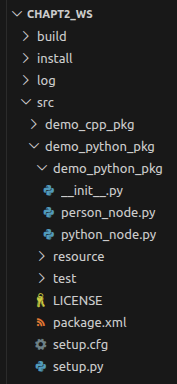
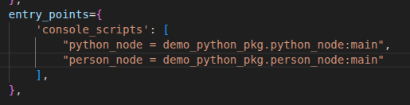
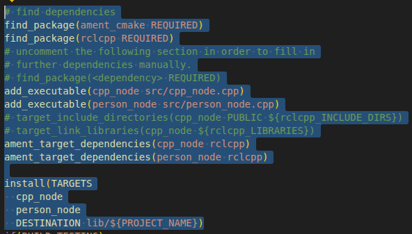
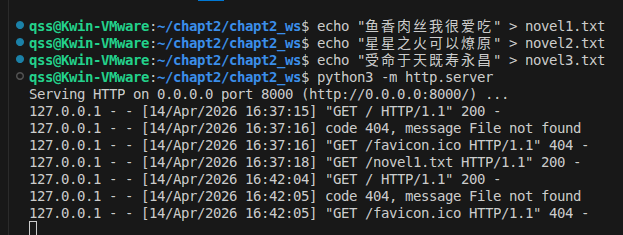

# Linux 的 ros 笔记

## 2.4 多功能包的最佳实践 Workspace

一般在总文件夹里创建一个新的两级文件夹，然后把包mv进这些文件夹中，再进行colcon build。如果有多个包，他们之间有依赖关系，需要在package.yml里写depend
```bash
mkdir -p ws/src
mv demo_cpp_pkg/ chapt2_ws/src/
mv demo_python_pkg/chapt2_ws/src/
```

## 2.5 ROS2基础之编程学习

### 2.5.1 面向对象编程

#### Python

```python
class PersonNode:
    def __init__(self,name_value:str,age_value:int) -> None:
        print("personnode __init__被调用了,添加了两个属性,分别是name和age")
        self.name = name_value
        self.age = age_value

    def eat(self,food_name:str):
        """
        定义一个方法，表示吃东西
        """
        print(f"{self.name},{self.age}正在吃{food_name}")


def main():
    person_node = PersonNode('张三', 25)
    person_node1 = PersonNode('李四', 30)
    person_node.eat('苹果')
    person_node1.eat('香蕉')
```
 在src的对应的python_pkg创建文件，并编写，编写完毕后，在src下的setup.py中填写自己的路径（填写在entry_points）中
 第一个名字是后续colcon生成的节点名字，后面的是路径，：代表要运行的函数
注意，colcon build 命令的使用会产生三个文件，最好在ws的文件夹的这个目录下进行colcon build
关于继承等方面的，python的话建议去chapt2自行查看源码
注意，继承是没办法继承import的文件的，还是得import一下。

#### C++

include <rclcpp/rclcpp.hpp>的原因是在opt/ros/humble/include下，rclcpp.hpp中嵌套了其他的例如node的文件，都在include这个文件夹下，因此如果把路径配置成include/rclcpp，这样确实可以只写 #include <rclcpp.hpp>，但其调用其他文件时会找不到嵌套依赖，仍然会报错。

```Cpp
#include <rclcpp/rclcpp.hpp>

class PersonNode : public rclcpp::Node
{
private:
    // 声明
    std::string name_;
    int age_;

public:
    PersonNode(const std::string &node_name, const std::string &name, const int &age)
        : Node(node_name) // 调用父类的构造函数,传递节点的名字作为参数。等同于python中的super.__init__()
    {
        this->name_ = name;
        this->age_ = age;
    };

    void eat(const std::string &food)
    {
        RCLCPP_INFO(this->get_logger(), "%s , %d age , is eating %s", this->name_.c_str(), this->age_, food.c_str());
    };
};

int main(int argc, char *argv[])
{
    rclcpp::init(argc, argv);
    auto person_node = std::make_shared<PersonNode>("person_node", "Tom", 18);
    person_node->eat("apple");
    rclcpp::spin(person_node);
    rclcpp::shutdown();
    return 0;
}  

```
说一下流程：
1. 首先在src下的demo_cpp_pkg下的src中新建cpp，然后写代码，这个写的就是节点。
2. 然后在cpp里导入rclcpp/rclcpp.hpp的库，写代码。
3. 写完后因为要使用colcon build命令，而colcon build涉及到cmakelist，因此先去cmakelist.txt添加编译的东西这里find_pkg找工具包和核心库，然后添加可执行文件，意味着将把那些带cpp文件生成名字为前面的可执行文件，因为生成的这些可执行文件需要跟ros2链接起来(要用ros2的相关功能)，将生成后的可执行文件与rclcpp相链接，链接完之后把这些编译好的程序安装到install下，这个目录是ros2执行时能找到的路径。
4. 成功后再source install/setup.bash，这步骤是在配置ros2的运行环境，例如将colcon build后的需要的环境变量添加到系统，使得ros2在执行的时候可以找到
5. 最后 ros2 run 找demo_cpp_pkg 再找节点名字进行运行即可。(有必要去回顾一下前面的关于用cmake生成，再用make的流程，这俩被colcon build合并了)

### 2.5.2 用得到的C++新特性

1. 自动类型推导：智能指针代替了new和delete，防止内存泄漏，智能管理内存。
```cpp
#include <iostream>

int main()
{
    auto x = 5;     // x is deduced to be of type int
    auto y = 3.14f; // y is deduced to be of type float
    auto z = 'a';   // z is deduced to be of type char

    std::cout << "x: " << x << ", y: " << y << ", z: " << z << std::endl;
    return 0;
}
```
2. 智能指针
```cpp
#include <iostream>
#include <memory>

int main()
{
    auto p1 = std::make_shared<std::string>("Hello, World!");                                    // std::make_shared<数据类型/类>(参数) 返回值，
                                                                                // 对应类的共享指针 std::shared_ptr<std::string>  可以直接写成auto
    std::cout << "p1的引用计数" << p1.use_count() << ",指向的内存地址" << p1.get() << std::endl; // 输出p1的引用计数 1

    auto p2 = p1;                                                                                // 共享指针p2指向与p1相同的内存地址
    std::cout << "p1的引用计数" << p1.use_count() << ",指向的内存地址" << p1.get() << std::endl; // 输出p1的引用计数 2
    std::cout << "p2的引用计数" << p2.use_count() << ",指向的内存地址" << p2.get() << std::endl; // 输出p2的引用计数 2

    p1.reset();                                                                                  // 释放p1指向的内存，p1不再指向任何对象
    std::cout << "p1的引用计数" << p1.use_count() << ",指向的内存地址" << p1.get() << std::endl; // 输出p1的引用计数 0
    std::cout << "p2的引用计数" << p2.use_count() << ",指向的内存地址" << p2.get() << std::endl; // 输出p2的引用计数 1
    std::cout <<"p2指向的内存地址数据" << p2->c_str() << std::endl; // 输出p2指向的内存地址数据
    return 0;
}
```
3. Lambda 主要用来简化回调函数
```cpp
#include <iostream>
#include <algorithm>

int main()
{
    auto add = [](int a, int b) -> int
    { return a + b; };      // 定义一个lambda表达式，参数为两个整数，返回它们的和
    int sum = add(200, 50); // 调用lambda表达式，传入200和50，得到结果250
    auto print_sum = [sum]() -> void
    { std::cout << "The sum is: " << sum << std::endl; }; // 定义一个lambda表达式，捕获sum变量，打印结果
    print_sum();                                          // 调用lambda表达式，打印结果
    return 0;
}
``` 
函数分为自由函数 成员函数(定义到类的内部，也叫做实现方法，如果要调用，得用对应的对象，加上.函数名(参数))   和Lambda函数


4. 函数包装器 可以统一函数的调用方式
```cpp
#include <iostream>
#include <functional> //函数包装器头文件

// 自由函数

void save_with_free_fun(const std::string &filename)
{
    std::cout << "自由函数: " << filename << std::endl;
}

// 成员函数

class FileSave
{
private:
    /* data */
public:

    void save_with_member_fun(const std::string &filename)
    {
        std::cout << "成员函数: " << filename << std::endl;
    }
};

int main()
{
    FileSave file_save; // 创建FileSave对象

    // Lambda函数

    auto save_with_lambda = [](const std::string &filename) -> void
    {
        std::cout << "Lambda函数: " << filename << std::endl;
    };

    save_with_free_fun("1.txt");             // 调用自由函数
    file_save.save_with_member_fun("3.txt"); // 调用成员函数
    save_with_lambda("2.txt");

    std::function<void(const std::string &)> save2 = save_with_lambda; // 将Lambda函数赋值给函数包装器
    std::function<void(const std::string &)> save1 = save_with_free_fun; // 将自由函数赋值给函数包装器
    std::function<void(const std::string &)> save3 = std::bind(&FileSave::save_with_member_fun, &file_save, std::placeholders::_1); // 将成员函数赋值给函数包装器
    
    save1("a.txt"); // 调用函数包装器，实际调用的是自由函数
    save2("b.txt"); // 调用函数包装器，实际调用的是Lambda函数
    save3("c.txt"); // 调用函数包装器，实际调用的是成员函数
    return 0;
}
```
函数包装器可以将成员函数单独进行包装，其他地方在调用成员函数时可以直接使用，不用将对象传递，一般都用在回调函数里 类似于C里的函数指针进行回调

#### 2.5.3 多线程与回调函数
1. Python

Python写好后 记得添加到 setup.py里,然后colcon build 再soruce改变环境变量
这里是打开服务器并下载其中内容的方法，类似于爬虫

```python
import threading
import requests
class download:
    def download(self,url,callback_word_count):
        print(f"线程{threading.get_ident()}开始下载:{url}")
        """
        模拟下载，实际是请求url并获取文本内容
        """
        response = requests.get(url)
        response.encoding = 'utf-8'
        callback_word_count(url,response.text)

    def start_download(self,url,callback_word_count):
        thread = threading.Thread(target=self.download,args=(url,callback_word_count))
        thread.start()


def world_count(url,result):
    """
    普通函数，后续用于回调
    """
    print(f"{url}:{len(result)}->{result[:]}")

def main():
    downloader = download()
    downloader.start_download("http://0.0.0.0:8000/novel1.txt", world_count)
    downloader.start_download("http://0.0.0.0:8000/novel2.txt", world_count)
    downloader.start_download("http://0.0.0.0:8000/novel3.txt", world_count)
    ```
    
